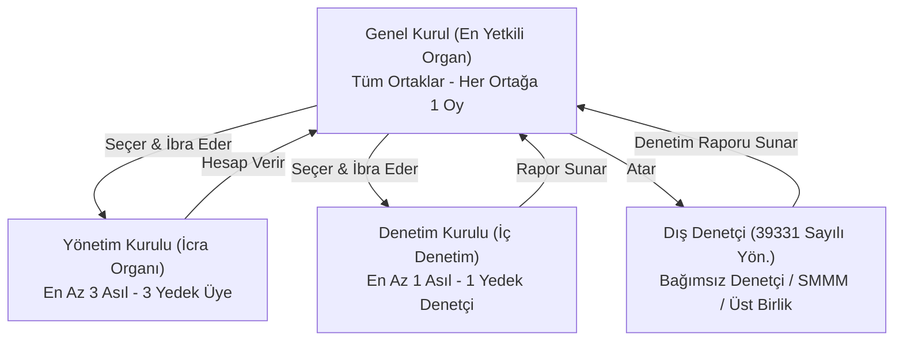

# 1163 Sayılı Kooperatifler Kanunu

  
1163 Sayılı Kooperatifler Kanunu

  <table>
    <tr><th>Kabul Tarihi</th><td>24 Nisan 1969</td></tr>
    <tr><th>Resmî Gazete</th><td>10 Mayıs 1969 / Sayı: 13195</td></tr>
    <tr><th>Mevzuat Türü</th><td>Temel Kanun (Genel Hüküm)</td></tr>
    <tr><th>Madde Sayısı</th><td>101 Asıl, 6 Ek, Geçici Maddeler</td></tr>
    <tr><th>Temel Değişiklikler</th><td>3476 SK (1988), 4916 SK (2003), KHK/700 (2018), 7339 SK (2021), 7579 SK (2024)</td></tr>
    <tr><th>Görevli Bakanlıklar</th><td>Ticaret Bakanlığı / Tarım ve Orman Bakanlığı / Çevre, Şehircilik ve İklim Değişikliği Bakanlığı</td></tr>
  </table>

**1163 sayılı Kooperatifler Kanunu**, Türkiye'de kooperatiflerin kuruluşunu, işleyişini, organlarını, ortaklık ilişkilerini, üst teşkilatlanmalarını, kamu denetimini ve tasfiyelerini düzenleyen ana mevzuat kaynağıdır. Özel kanunlarında (1581 ve 4572 sayılı Kanunlar) açık hüküm bulunmayan hallerde tüm kooperatif türlerine doğrudan uygulanır.

---

## İçindekiler
1. [Hukuki Tanım ve Ticaret Şirketi Niteliği](#1-hukuki-tanım-ve-ticaret-şirketi-niteliği)
2. [Kuruluş, Anasözleşme ve Tescil](#2-kuruluş-anasözleşme-ve-tescil)
3. [Ortaklık Hukuku: Haklar, Borçlar ve İhraç](#3-ortaklık-hukuku-haklar-borçlar-ve-ihraç)
4. [Kooperatif Organları](#4-kooperatif-organları)
   - [Genel Kurul](#41-genel-kurul)
   - [Yönetim Kurulu](#42-yönetim-kurulu)
   - [Denetim Kurulu ve Dış Denetim](#43-denetim-kurulu-ve-dış-denetim)
5. [Üst Kuruluşlar ve Milli Birlik](#5-üst-kuruluşlar-ve-milli-birlik)
6. [Dağılma, İnfisah ve Tasfiye](#6-dağılma-infisah-ve-tasfiye)
7. [Cezai Sorumluluklar ve Güvenceler](#7-cezai-sorumluluklar-ve-güvenceler)
8. [Kaynakça ve Notlar](#8-kaynakça-ve-notlar)

---

## 1. Hukuki Tanım ve Ticaret Şirketi Niteliği

Kanunun 1. maddesi kooperatifi şu şekilde tanımlamaktadır:
> *"Tüzel kişiliği haiz olmak üzere, ortaklarının belirli ekonomik menfaatlerini ve özellikle meslek veya geçimlerine ait ihtiyaçlarını işgücü ve parasal katkılarıyla karşılıklı yardım, dayanışma ve kefalet suretiyle sağlayıp korumak amacıyla gerçek ve tüzel kişiler tarafından kurulan değişir sermayeli ve değişir ortaklı teşekküllere kooperatif denir."*

* **6102 sayılı TTK m. 124 İlişkisi:** Kooperatifler ticaret şirketi olarak kabul edilmekle birlikte, şahıs unsurlarının ağırlığı ve risturn temelli yapıları nedeniyle klasik sermaye şirketlerinden (A.Ş. ve Ltd. Şti.) ayrılır.
* **700 Sayılı KHK İntibakı:** Kanunun 19. ve 80. maddelerinde yer alan yürütme yetkileri, Cumhurbaşkanlığı Hükümet Sistemi gereğince doğrudan **Cumhurbaşkanı** makamına devredilmiştir.

---

## 2. Kuruluş, Anasözleşme ve Tescil

* **Kurucu Ortak Sayısı (Madde 2):** Bir kooperatif en az **7 ortak** tarafından imzalanan anasözleşme ile kurulur.
* **Bakanlık İzni ve Sicil:** Hazırlanan anasözleşme faaliyet konusuna göre ilgili Bakanlığa (Ticaret, Tarım ve Orman veya Çevre ve Şehircilik) tevdi edilir. İznin alınmasını müteakip kooperatif merkezinin bulunduğu yer **Ticaret Sicili Memurluğu'na** tescil ve ilan ettirilir. Kooperatif, tescil ile tüzel kişilik kazanır (Madde 7).
* **Unvan Koruması (Madde 2):** Kooperatif unvanında kamu kurumlarının adı izinsiz kullanılamaz; unvanda kooperatifin faaliyet konusu açıkça belirtilir.

---

## 3. Ortaklık Hukuku: Haklar, Borçlar ve İhraç

* **Açık Kapı (Giriş Serbestisi) İlkesi (Madde 8):** Anasözleşmede gösterilen şartları taşıyan herkes kooperatife ortak olabilir. Haklı bir neden olmaksızın ortaklığa kabulden kaçınılamaz.
* **Ortaklıktan Çıkma (Madde 10-15):** Her ortak kooperatiften çıkma hakkına sahiptir. Çıkma hakkı anasözleşme ile en çok **5 yıl** için sınırlandırılabilir.
* **Ortaklıktan Çıkarma (Madde 16):** Ortaklar ancak anasözleşmede açıkça belirtilen haklı sebeplerle (örneğin parasal edimlerini süresinde ödememek, taahhütlerini yerine getirmemek) çıkarılabilir. Çıkarma kararı yönetim kurulunun teklifi ve genel kurulun onayı ile alınır. Ortak, tebliğden itibaren **3 ay içinde** mahkemeye itiraz davası açabilir.
* **Sermaye Payı ve Sorumluluk:** Her ortak en az 1 pay taahhüt etmek zorundadır. Ortakların sorumluluğu anasözleşmeye göre sınırlı veya sınırsız olarak belirlenebilir; aksi kararlaştırılmadıkça ortaklar sadece taahhüt ettikleri pay miktarıyla sorumludur.

---

## 4. Kooperatif Organları

### 4.1. Genel Kurul (Madde 42-54)
* **Zaman:** Olağan genel kurul toplantıları her hesap devresinin sonundan itibaren **6 ay içinde** (yılın ilk 6 ayı) yapılmak zorundadır.
* **Bakanlık Temsilcisi (Madde 87):** Genel kurullarda Bakanlık temsilcisinin bulunması kuraldır. Toplantıdan en az 15 gün önce usulünce başvurulduğu halde temsilci gelmezse toplantı yapılabilir; ancak usulsüz temsilcisiz yapılan genel kurullar hükümsüzdür.
* **Eşit Oy Hakkı (Madde 48):** Pay sayısına bakılmaksızın her ortağın genel kurulda **yalnızca 1 oy** hakkı vardır.

### 4.2. Yönetim Kurulu (Madde 55-64)
* En az **3 asıl ve 3 yedek üyeden** oluşur, görev süresi en çok 4 yıldır.
* Üyelerin Türk vatandaşı olması ve yüz kızartıcı suçlardan mahkûm olmaması şarttır.
* **Zorunlu Eğitim:** 7339 sayılı Kanun ile yönetim kurulu üyelerine 40 saatlik akredite kooperatifçilik eğitimi zorunluluğu getirilmiştir.

### 4.3. Denetim Kurulu ve Dış Denetim (Madde 65-69)
* Denetçiler ortaklar arasından veya dışarıdan en az 1 yıl için seçilir.
* **Madde 69 Reformu:** Belirlenen aktif toplamı, net satış veya ortak sayısı eşiklerini aşan kooperatifler Kamu Gözetimi Kurumu onaylı bağımsız denetçiler veya yetkilendirilmiş üst birliklerce **dış denetime** tabi tutulur.

---

## 5. Üst Kuruluşlar ve Milli Birlik (Madde 70-77)
Kooperatifler ekonomik güçlerini artırmak amacıyla piramidal bir yapıda örgütlenir:
1. **Kooperatif Birlikleri:** Aynı veya benzer konuda faaliyet gösteren en az 7 kooperatif bir araya gelerek birlik kurabilir.
2. **Merkez Birlikleri:** En az 3 kooperatif birliği merkez birliğini oluşturabilir.
3. **Türkiye Milli Kooperatifler Birliği:** Ülke çapında en üst temsili kuruluştur.

---

## 6. Dağılma, İnfisah ve Tasfiye (Madde 81-85)
* Kooperatif; anasözleşmede yazılı sürenin bitmesi, amacın gerçekleşmesi, genel kurul kararı, iflas veya mahkeme kararıyla sona erer.
* Tasfiye kurulu en az 2 kişiden oluşur; alacaklılara 3 defa ilanla çağrı yapılır ve borçlar ödendikten sonra kalan tasfiye artığı anasözleşmede hüküm yoksa ortaklar arasında sermaye paylarına göre paylaştırılır.
* **6552 Sayılı Kanun:** Gayrifaal kalan münfesih kooperatifler için basitleştirilmiş ve hızlı tasfiye imkânı tanınmıştır.

---

## 7. Cezai Sorumluluklar ve Güvenceler
* **Ek Madde 2 & Madde 62:** Kooperatif yönetim ve denetim kurulu üyeleri, görevleri sebebiyle işledikleri suçlardan ötürü **kamu görevlisi** gibi cezalandırılır.
* **Ek Madde 5:** KOOPBİS sistemine süresinde veri girişi yapmayan, yanıltıcı bilgi aktaran veya ortakların bilgi edinme hakkını engelleyen yöneticilere adli para cezası uygulanır.
* **7579 Sayılı Kanun (Ek Madde 6):** Yapı kooperatiflerinde iskan alınmadan bireysel mülkiyet devri yapılması kanunla kesin surette yasaklanmış ve cezai yaptırıma bağlanmıştır.

---

## 8. Kaynakça ve Notlar
1. 1163 Sayılı Kooperatifler Kanunu Gerekçesi ve Madde Metinleri, T.C. Adalet Bakanlığı Mevzuat Bilgi Sistemi.
2. Poroy, R., Tekinalp, Ü., Çamoğlu, E. (2021). *Ortaklıklar Hukuku II: Kooperatifler*, Vedat Kitapçılık, İstanbul.
3. Ticaret Bakanlığı Esnaf, Sanatkârlar ve Kooperatifçilik Genel Müdürlüğü Uygulama Genelgeleri.

---
*Ayrıca bakınız:* [[01_turkiye_kooperatifcilik_hukuku_ve_tarihcesi]], [[06_yonetim_denetim_ve_dijitallesme_koopbis]], [[04_tarim_disi_kooperatifler]]
