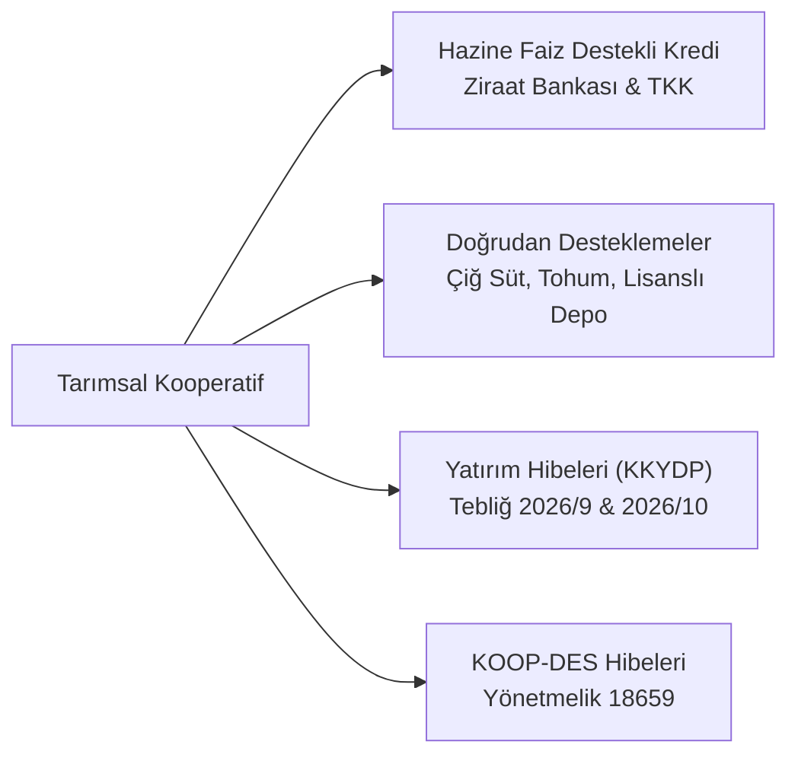

# Tarım Kooperatifleri ve Birlikleri

  
Tarım Kooperatifleri ve Birlikleri

  <table>
    <tr><th>Temel Kanunlar</th><td>1581 SK (TKK), 4572 SK (TSKB), 1163 SK, 5488 SK (Tarım K.)</td></tr>
    <tr><th>Özel Kanunlar</th><td>6172 SK (Sulama), 1380 SK (Su Ürünleri), 6831 SK (Orman), 3083 SK (Reform)</td></tr>
    <tr><th>Yetkili Bakanlık</th><td>T.C. Tarım ve Orman Bakanlığı</td></tr>
    <tr><th>Finansman Kanalları</th><td>T.C. Ziraat Bankası, TKK, Ziraat Katılım, KKYDP Hibeleri</td></tr>
    <tr><th>Sektörel Derece</th><td>Yönetmelik 40451 (A - B - C Sınıfı Örgüt)</td></tr>
  </table>

**Türkiye'de tarım kooperatifleri**, tarımsal üreticilerin girdi temininden finansmana, ürünlerin depolanması ve işlenmesinden ulusal ve uluslararası pazarlara ulaştırılmasına kadar uzanan değer zincirini örgütleyen ve 5488 sayılı Tarım Kanunu kapsamında devletçe öncelikli olarak desteklenen üretici teşekkülleridir.

---

## İçindekiler
1. [Hukuki Tipoloji ve Teşkilat Yapısı](#1-hukuki-tipoloji-ve-teşkilat-yapısı)
   - [Tarım Kredi Kooperatifleri (1581 Sayılı Kanun)](#11-tarım-kredi-kooperatifleri-1581-sayılı-kanun)
   - [Tarım Satış Kooperatif ve Birlikleri (4572 Sayılı Kanun)](#12-tarım-satış-kooperatif-ve-birlikleri-4572-sayılı-kanun)
   - [Tarımsal Amaçlı Kalkınma ve Üretim Kooperatifleri](#13-tarımsal-amaçlı-kalkınma-ve-üretim-kooperatifleri)
2. [Sektörel ve Özel İhtisas Kooperatifleri](#2-sektörel-ve-özel-ihtisas-kooperatifleri)
   - [Sulama Kooperatifleri (6172 ve 6200 SK)](#21-sulama-kooperatifleri-6172-ve-6200-sk)
   - [Su Ürünleri Kooperatifleri (1380 SK)](#22-su-ürünleri-kooperatifleri-1380-sk)
   - [Orman Köyleri Kalkındırma Kooperatifleri (ORKÖY - 6831 SK)](#23-orman-köyleri-kalkındırma-kooperatifleri-orköy---6831-sk)
3. [Devlet Destekleri, Hibe ve Sübvansiyonlu Krediler](#3-devlet-destekleri-hibe-ve-sübvansiyonlu-krediler)
4. [Tarımsal Amaçlı Örgütlerin Derecelendirilmesi (Yönetmelik 40451)](#4-tarımsal-amaçlı-örgütlerin-derecelendirilmesi-yönetmelik-40451)
5. [Mali Kolaylıklar, Borç Yapılandırmaları ve Afet Ertelemeleri](#5-mali-kolaylıklar-borç-yapılandırmaları-ve-afet-ertelemeleri)
6. [Taşınmaz Kullanımı ve Pazar Hakları](#6-taşınmaz-kullanımı-ve-pazar-hakları)
7. [Kaynakça ve Notlar](#7-kaynakça-ve-notlar)

---

## 1. Hukuki Tipoloji ve Teşkilat Yapısı

### 1.1. Tarım Kredi Kooperatifleri (1581 Sayılı Kanun)
* **Teşkilat:** Kooperatif, Bölge Birliği ve Merkez Birliği olmak üzere 3 kademeli dikey bir örgütlenmeye sahiptir.
* **Girdi Temini ve Finansman:** Çiftçilere tohum, gübre, karma yem, mazot, zirai mücadele ilaçları ve tarım aletleri temin eder; ayni ve nakdi kredi kullandırır.
* **Hukuki Ayrıcalıklar (Tapu Kanunu m. 26):** TKK lehine tesis edilecek ipoteklerde resmi senet aranmaz; kooperatifin tescil istem belgesi doğrudan tapu tescili için yeterlidir. 5661 sayılı Kanun ile eski toplu köy ikrazatı kefalet borçları tasfiye edilerek çiftçiler üzerindeki müteselsil kefalet zincirleri kaldırılmıştır.

### 1.2. Tarım Satış Kooperatif ve Birlikleri (4572 Sayılı Kanun)
* Üreticilerin ürünlerini işleyip sanayi mamulü haline getirmek, depolamak ve pazarlamak amacıyla kurulan birliklerdir (Örn: Trakya Birlik, Marmarabirlik, Tariş, Fiskobirlik, Çukobirlik).
* **Örnek Anasözleşme İntibakı (Tebliğ 23231):** Yasal düzenlemeler doğrultusunda birlikler örnek anasözleşmelere uyum sağlamak zorundadır.
* **Bağımsız Denetim (Tebliğ 18480):** Belirli ciroyu ve alım hacmini aşan tarım satış birlikleri bağımsız denetime tabidir.
* **Borç Terkinleri:** Faaliyetini yürütemeyen birliklerin kamu borçları muhtelif Cumhurbaşkanı Kararları (CBK 5139, 3289, 2491) ve 5335 SK m. 19/1-a çerçevesinde terkin edilmiştir.

### 1.3. Tarımsal Amaçlı Kalkınma ve Üretim Kooperatifleri
* **1163 SK & 5488 SK:** Tarım ve Orman Bakanlığı'nın kuruluş ve denetim yetkisindedir. Bitkisel üretim, süt sığırcılığı, seracılık ve hayvancılık alanlarında faaliyet gösterirler.

---

## 2. Sektörel ve Özel İhtisas Kooperatifleri

### 2.1. Sulama Kooperatifleri (6172 ve 6200 SK)
* Su kullanıcı teşkilatı statüsündedir. Devlet Su İşleri (DSİ) tarafından inşa edilen baraj, gölet ve sulama şebekesi tesislerini devralarak işletirler (6200 SK m. 2; Yönetmelik 15239 & 23333). Su Kurulları Yönetmeliği (40929) kapsamında su yönetimi kurullarında temsil edilirler.

### 2.2. Su Ürünleri Kooperatifleri (1380 SK)
* Deniz ve içsularda avcılık ve yetiştiricilik yapan balıkçıların örgütüdür.
* **Devlet İhale Kanunu İstisnası (2886 SK):** Avlak sahaları ve balıkçı barınakları (Yönetmelik 4997), ihalede açık teklif yerine su ürünleri kooperatiflerine **pazarlık usulüyle** doğrudan kiralanabilir.

### 2.3. Orman Köyleri Kalkındırma Kooperatifleri (ORKÖY - 6831 SK)
* Orman Kanunu’nun 34. ve 40. maddeleri uyarınca, ormanların bakım, kesim, taşıma ve ağaçlandırma işleri öncelikle civar orman köylerini kalkındırma kooperatiflerine verilir.
* **Kamu İhale İstisnası (4734 SK Madde 3):** Kamu kurum ve kuruluşları, orman köyleri kalkındırma kooperatiflerinden doğrudan mal ve hizmet alımı yapabilirler.

---

## 3. Devlet Destekleri, Hibe ve Sübvansiyonlu Krediler

* **Düşük Faizli Krediler (CBK 8038, 8039, 2015, Tebliğ 2024/15):** Ziraat Bankası ve TKK üzerinden faizinin %100'e varan kısmı Hazinece karşılanan yatırım ve işletme kredileri.
* **Çiğ Süt Örgütlülük Primi (Tebliğ 2024/53 - 41309):** Sütünü kooperatif aracılığıyla satan üreticilere ilave teşvik ödemesi.
* **Kırsal Kalkınma Yatırımları (KKYDP):**
  * *Tebliğ 2026/9:* Tarımsal işleme ve paketleme tesislerine %50-%70 hibe.
  * *Tebliğ 2026/10:* Güneş enerjili ve tasarruflu basınçlı sulama sistemleri yatırımlarına hibe desteği.

---

## 4. Tarımsal Amaçlı Örgütlerin Derecelendirilmesi (Yönetmelik 40451)

  

    
    
<strong>Şekil:</strong> Tarım kooperatiflerinde 40 saatlik zorunlu eğitim, KOOPBİS veri akışı, dış denetim ve borçsuzluk esasına dayalı derecelendirme standartları.

  

Tarım ve Orman Bakanlığı tarafından yürürlüğe konulan yönetmelik uyarınca kooperatifler derecelendirilmektedir:
* **Ön Şart:** Kooperatifin vadesi geçmiş vergi ve SGK borcunun bulunmaması.
* **Kriterler:** Yıllık ciro, ortakların ürünlerini kooperatife teslim oranı, soğuk hava ve lisanslı depo varlığı, KOOPBİS veri girişinin güncelliği ve dış denetimden geçmiş olma.
* **Dereceler:** **A, B ve C Grubu**. A ve B grubu kooperatif ortakları ilave destekleme primi ve hibe başvurularında öncelik puanı kazanır.

---

## 5. Mali Kolaylıklar, Borç Yapılandırmaları ve Afet Ertelemeleri

* **Bakanlık Borç Yapılandırmaları:**
  * **6736 Sayılı Kanun (m. 11/11):** Tarımsal amaçlı kooperatiflerin Bakanlığa olan kredi borçları 5 yıl süreyle faizsiz taksitlendirilmiştir.
  * **7020 Sayılı Kanun (m. 4/2):** Borçların 10 yıla yayılarak yapılandırılması imkânı tanınmıştır.
* **Afet ve Deprem Ertelemeleri (2090 SK & CB Kararları 6816, 6920, 2481):** Deprem, sel ve kuraklıktan etkilenen çiftçilerin ve TKK kredi borçlarının 1 yıl süreyle faizsiz ertelenmesi ve yeniden vadelendirilmesi.

---

## 6. Taşınmaz Kullanımı ve Pazar Hakları

* **Hazine Taşınmazı Kiralama (4706 SK m. 7/B):** Tarımsal kooperatiflere üretim ve tesis kurma amacıyla Hazine arazilerinin indirimli veya doğrudan kiralanması.
* **Üretici Örgütü Hal Hakları (5957 Sayılı Kanun):** Toptancı hallerindeki işyerlerinin en az **%20'si** üretici örgütlerine ayrılır; hal rüsumu indirimli uygulanır.
* **Tarım Arazilerinde Mülkiyet Kısıtlaması (5403 SK m. 23 & 7584 SK):** Kooperatif ortaklık payı satışı yoluyla tarım arazilerinin fiilen bölünmesi, hisseli parselasyon yapılması ve hobi bahçesi adı altında tarım arazisinin bozulması kanunen yasaklanmış olup ağır idari ve cezai yaptırımlara tabi kılınmıştır.

---

## 7. Kaynakça ve Notlar
1. 1581 Sayılı Tarım Kredi Kooperatifleri Kanunu Metni ve Değişiklikleri.
2. 4572 Sayılı Tarım Satış Kooperatif ve Birlikleri Hakkında Kanun.
3. Tarım ve Orman Bakanlığı, *Tarımsal Amaçlı Örgütlerin Derecelendirilmesi Kılavuzu*, 2024.
4. Resmî Gazete: 40451 Sayılı Yönetmelik ve 41309 Sayılı Çiğ Süt Tebliği.

---
*Ayrıca bakınız:* [[02_1163_sayili_kooperatifler_kanunu]], [[05_kooperatif_mali_ve_vergi_hukuku]], [[06_yonetim_denetim_ve_dijitallesme_koopbis]]
