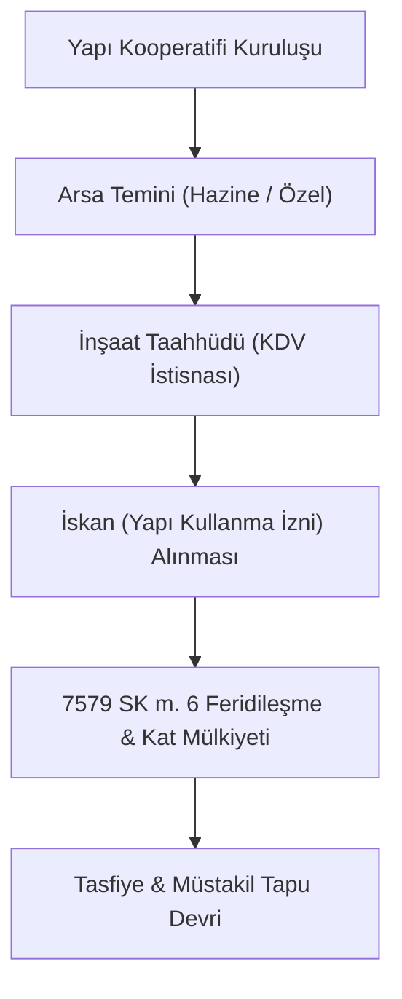

# Tarım Dışı Kooperatifler

  
Tarım Dışı Kooperatifler

  <table>
    <tr><th>Ana Türler</th><td>Konut Yapı, ESKKK, Tedarik/Dağıtım, Kadın Girişimi, Taşıyıcılar, Tüketim</td></tr>
    <tr><th>Temel Kanun</th><td>1163 Sayılı Kooperatifler Kanunu</td></tr>
    <tr><th>Özel Kanunlar</th><td>7579 SK (Yapı Kısıtı), 5362 SK & 4603 SK (ESKKK), 6585 SK (Tedarik)</td></tr>
    <tr><th>Yetkili Bakanlıklar</th><td>Ticaret Bakanlığı / Çevre, Şehircilik ve İklim Değişikliği Bakanlığı</td></tr>
    <tr><th>Finansman & Destek</th><td>Halkbank (ESKKK), TOKİ Kredileri, KOOP-DES Hibeleri</td></tr>
  </table>

**Tarım dışı kooperatifler**, kentsel ve sanayi alanlarında barınma ihtiyacından esnafın finansmana erişimine, kadın girişimciliğinin desteklenmesinden lojistik ve toptan mal tedarikine kadar geniş bir iktisadi alanda faaliyet gösteren ticaret teşekkülleridir.

  

    
    
<strong>Şekil:</strong> Yapı, ESKKK ve Kadın kooperatiflerine tanınan yasal muafiyetler ve tüm kooperatifler için geçerli KOOPBİS/eğitim zorunlulukları.

  

---

## İçindekiler
1. [Yapı ve Konut Kooperatifleri](#1-yapı-ve-konut-kooperatifleri)
   - [Mülkiyet Devri Kısıtlamaları (7579 Sayılı Kanun)](#11-mülkiyet-devri-kısıtlamaları-7579-sayılı-kanun)
   - [Hazine Taşınmazı Satışı ve TOKİ Kredileri](#12-hazine-taşınmazı-satışı-ve-toki-kredileri)
   - [Vergisel İstisnalar ve Katılım Payları](#13-vergisel-istisnalar-ve-katılım-payları)
2. [Esnaf, Sanatkâr ve Ticari İşletme Kooperatifleri](#2-esnaf-sanatkâr-ve-ticari-işletme-kooperatifleri)
   - [Esnaf ve Sanatkâr Kredi Kefalet Kooperatifleri (ESKKK)](#21-esnaf-ve-sanatkâr-kredi-kefalet-kooperatifleri-eskkk)
   - [Tedarik ve Dağıtım Kooperatifleri (6585 SK)](#22-tedarik-ve-dağıtım-kooperatifleri-6585-sk)
   - [Motorlu Taşıyıcılar ve OSB İştirakçiliği](#23-motorlu-taşıyıcılar-ve-osb-iştirakçiliği)
3. [Kadın Girişimi, Tüketim ve Hizmet Kooperatifleri](#3-kadın-girişimi-tüketim-ve-hizmet-kooperatifleri)
   - [Kadın Kooperatifleri ve Belediye İş Birlikleri (5393 SK)](#31-kadın-kooperatifleri-ve-belediye-iş-birlikleri-5393-sk)
   - [KOOP-DES Hibe Finansmanı (Yönetmelik 18659)](#32-koop-des-hibe-finansmanı-yönetmelik-18659)
   - [Tüketim Kooperatifleri ve Tüketici Hukuku (6502 SK)](#33-tüketim-kooperatifleri-ve-tüketici-hukuku-6502-sk)
4. [Karşılaştırmalı Sektörel Tablo](#4-karşılaştırmalı-sektörel-tablo)
5. [Kaynakça ve Notlar](#5-kaynakça-ve-notlar)

---

## 1. Yapı ve Konut Kooperatifleri

### 1.1. Mülkiyet Devri Kısıtlamaları (7579 Sayılı Kanun)
* **1163 SK Ek Madde 6 Düzenlemesi:** Yapı kooperatiflerinde şeffaflığı sağlamak ve suiistimalleri önlemek amacıyla bireysel mülkiyet devrine (hisse devri/daire tahsisi) kısıtlamalar getirilmiştir. Ana binanın inşaatı tamamlanıp yapı kullanma izin belgesi (iskan) alınmadan bağımsız bölümlerin ortaklar adına müstakil devri yapılamaz.
* **Mahalli İdare İzni:** Belediyeler ve il özel idarelerinin doğrudan yapı kooperatifi kurması veya kurulu kooperatiflere iştirak etmesi **Cumhurbaşkanı iznine** bağlanmıştır.

### 1.2. Hazine Taşınmazı Satışı ve TOKİ Kredileri
* **Hazine Arazisi Satışı (4706 SK Madde 7/B):** Hazineye ait taşınmazlar, arsa üretimi ve konut yapımı maksadıyla konut yapı kooperatiflerine ve bunların üst birliklerine doğrudan satılabilir veya devredilebilir.
* **Göçmen Kooperatifleri (5228 SK):** Bulgaristan'dan Türkiye'ye göç eden soydaşlarımızın kurduğu konut ve kalkınma kooperatiflerine imtiyazlı arsa tahsisi sağlanmıştır.
* **TOKİ Kredileri (Yönetmelik 20023888 m. 6 & 4375):** Toplu Konut İdaresi kaynaklarından kooperatiflere ve üst birliklerine toplu konut yapımcısı sıfatıyla uzun vadeli, düşük faizli kredi imkânı tanınır.

### 1.3. Vergisel İstisnalar ve Katılım Payları
* **Emlak Vergisi (1319 SK):** Kooperatif adına kayıtlı arsa ve binalar inşaat sürecinde emlak vergisinden muaftır.
* **KDV İstisnası (3065 SK Geçici m. 15):** 29.07.1998 tarihinden önce inşaat ruhsatı almış olan konut yapı kooperatiflerine yapılan inşaat taahhüt işleri KDV’den tamamen muaftır.
* **Altyapı Yapılandırması (6111 SK):** Kooperatiflerin belediyelere olan yol, su ve kanalizasyon katılım payı borçları yapılandırma kapsamına alınmıştır.

---

## 2. Esnaf, Sanatkâr ve Ticari İşletme Kooperatifleri

### 2.1. Esnaf ve Sanatkâr Kredi Kefalet Kooperatifleri (ESKKK)
* **Kredi ve Kefalet Sistemi (5362 ve 4603 Sayılı Kanunlar):** Esnaf ve sanatkârların finansmana erişimini kolaylaştırmak amacıyla Türkiye Halk Bankası A.Ş. tarafından açılan kredilere kefalet sağlayan özel dayanışma kuruluşlarıdır. Hazine faiz sübvansiyonu ile piyasa faizinin çok altında finansman sağlanır.
* **Doğrudan İpotek Tesis Kolaylığı (Tapu Kanunu m. 26):** ESKKK lehine açılan kredilerin teminatı olarak gayrimenkul ipoteği tesis edilirken resmi senet aranmaz; kooperatifin tescil istem belgesiyle doğrudan tescil yapılır.
* **Temsiliyet (16302 Sayılı Yönetmelik):** Ulusal Esnaf ve Sanatkârlar Şûrası'nda doğrudan temsil hakkına sahiptirler.

### 2.2. Tedarik ve Dağıtım Kooperatifleri (6585 SK)
* Perakende Ticaretin Düzenlenmesi Hakkında Kanun m. 12 uyarınca, esnaf ve sanatkârların zincir marketler karşısında rekabet güçlerini korumaları ve toptan mal temininde ölçek ekonomisinden yararlanmaları amacıyla kurulur.

### 2.3. Motorlu Taşıyıcılar ve OSB İştirakçiliği
* **Motorlu Taşıyıcılar Kooperatifleri:** Yolcu ve yük taşıma hatlarında çalışan esnafın ortak akaryakıt, bakım, sigorta ve hat düzenlemesi yapmasını sağlar.
* **OSB İştirakçiliği (4562 SK Madde 4):** İmalat, sanayi ve tedarik alanında faaliyet gösteren kooperatifler, Organize Sanayi Bölgeleri (OSB) kurucu ortaklığına katılabilir ve müteşebbis heyetlerinde yer alabilirler (Yönetmelik 31245).

---

## 3. Kadın Girişimi, Tüketim ve Hizmet Kooperatifleri

### 3.1. Kadın Kooperatifleri ve Belediye İş Birlikleri (5393 SK)
* Belediye Kanunu m. 75 uyarınca yerel yönetimler kadın kooperatifleri ile ortak hizmet projeleri gerçekleştirebilir, stant, satış mağazası ve atölye tahsis edebilir.

### 3.2. KOOP-DES Hibe Finansmanı (Yönetmelik 18659)
* Ticaret Bakanlığı tarafından yürütülen KOOP-DES programı kapsamında:
  * Ortaklarının en az %90'ı kadınlardan oluşan kooperatiflerin makine ve ekipman alımlarına **%70 - %90 hibe**,
  * Yıllık 2 kişiye kadar nitelikli personel brüt maaş gideri karşılıksız ödenir.
* **E-İhracat Desteği (CBK 5973 & 5986):** Kooperatif şirketlerine dijital pazaryeri açma, fuar ve küresel lojistik destekleri sağlanır.

### 3.3. Tüketim Kooperatifleri ve Tüketici Hukuku (6502 SK)
* Ortaklarının gıda ve temel tüketim maddelerini aracısız ve toptan maliyetine temin eder. Mal alımlarında "tüketici" statüsünü korur ve Tüketici Hakem Heyetleri ile mahkemeler nezdinde korunur.

---

## 4. Karşılaştırmalı Sektörel Tablo

| Kooperatif Türü | İlgili Mevzuat | Önemli Avantaj | Kritik Hukuki Şart |
| :--- | :--- | :--- | :--- |
| **Konut Yapı** | 7579 SK, 4706 SK, 3065 SK | TOKİ kredisi, Emlak vergisi muafiyeti | İskansız mülkiyet devri yasağı |
| **ESKKK** | 5362 SK, 4603 SK, Tapu K. 26 | Düşük faizli Halkbank kredisi, tapu kolaylığı | Esnaf sicili kaydı |
| **Tedarik & Dağıtım** | 6585 SK m. 12 | Toplu alım indirimi, lojistik merkez | Münhasıran ortak içi alım |
| **Kadın Girişimi** | Yönetmelik 18659, 5393 SK | KOOP-DES %90 hibe, belediye tahsisi | En az %90 kadın ortak oranı |
| **Motorlu Taşıyıcılar** | 1163 SK, 4562 SK | OSB iştirak hakkı, akaryakıt iskontosu | Taşıma yetki belgesi |
| **Tüketim** | 1163 SK, 6502 SK | Aracısız gıda temini, risturn iadesi | Ortak dışı işlem yapmama |

---

## 5. Kaynakça ve Notlar
1. 7579 Sayılı Tapu Kanunu ile Bazı Kanunlarda Değişiklik Yapılmasına Dair Kanun Metni (2024).
2. 5362 Sayılı Esnaf ve Sanatkârlar Meslek Kuruluşları Kanunu.
3. 18659 Sayılı Kooperatifçilik Proje Destek Yönetmeliği, Resmî Gazete.
4. GİB (Gelir İdaresi Başkanlığı) Konut Yapı Kooperatiflerinde KDV Uygulamaları Rehberi.

---
*Ayrıca bakınız:* [[02_1163_sayili_kooperatifler_kanunu]], [[05_kooperatif_mali_ve_vergi_hukuku]], [[06_yonetim_denetim_ve_dijitallesme_koopbis]]
