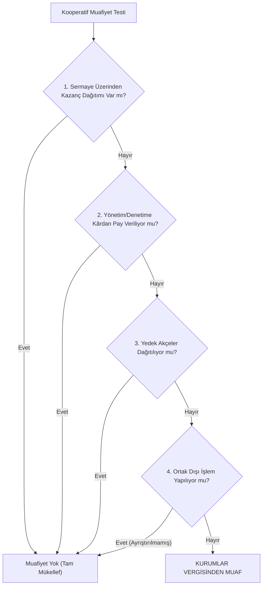

# Kooperatif Mali ve Vergi Hukuku

  
Kooperatif Mali ve Vergi Hukuku

  <table>
    <tr><th>Temel Vergi Kanunları</th><td>5520 SK (KVK), 193 SK (GVK), 3065 SK (KDV), 1319 SK (Emlak), 488 SK (Damga)</td></tr>
    <tr><th>KVK Muafiyet Maddesi</th><td>5520 Sayılı Kanun Madde 4/1-k</td></tr>
    <tr><th>Kritik Kavram</th><td>Risturn (Müsbet Gelir-Gider Farkı İadesi)</td></tr>
    <tr><th>SPK Eşiği</th><td>6362 SK m. 16 (500+ Ortak Halka Açık Statü)</td></tr>
    <tr><th>Vergi İdaresi</th><td>T.C. Hazine ve Maliye Bakanlığı / Gelir İdaresi Başkanlığı</td></tr>
  </table>

**Kooperatif mali ve vergi hukuku**, kâr amacı gütmeyen, karşılıklı yardım ve dayanışma esasına dayanan kooperatiflerin vergilendirilmesini, muafiyet şartlarını, risturn rejimini ve sermaye piyasası yükümlülüklerini düzenleyen özel bir ticaret ve mali hukuk disiplinidir.

---

## İçindekiler
1. [Kurumlar Vergisi Mükellefiyeti ve Temel Kural](#1-kurumlar-vergisi-mükellefiyeti-ve-temel-kural)
2. [Kurumlar Vergisi Muafiyetinin Dört Altın Şartı](#2-kurumlar-vergisi-muafiyetinin-dört-altın-şartı)
3. [Risturn Müessesesi ve Kâr Payı Ayrımı](#3-risturn-müessesesi-ve-kâr-payı-ayrımı)
4. [Ortak Dışı İşlemler ve İktisadi İşletme Modeli (7061 SK)](#4-ortak-dışı-işlemler-ve-iktisadi-işletme-modeli-7061-sk)
5. [Katma Değer Vergisi (KDV) ve Damga Vergisi İstisnaları](#5-katma-değer-vergisi-kdv-ve-damga-vergisi-istisnaları)
6. [Emlak Vergisi ve Harç Muafiyetleri](#6-emlak-vergisi-ve-harç-muafiyetleri)
7. [Sermaye Piyasası Rejimi (500 Ortak Kuralı - 6362 SK)](#7-sermaye-piyasası-rejimi-500-ortak-kuralı---6362-sk)
8. [Kaynakça ve Notlar](#8-kaynakça-ve-notlar)

---

## 1. Kurumlar Vergisi Mükellefiyeti ve Temel Kural

5520 sayılı Kurumlar Vergisi Kanunu'nun (KVK) 2. maddesi uyarınca kooperatifler, ticaret şirketi nitelikleri gereğince **aslen kurumlar vergisi mükellefidir**. Ancak kanun koyucu, kooperatiflerin sosyo-ekonomik işlevlerini gözeterek, KVK’nın 4. maddesinin 1. fıkrasının (k) bendi ile belirli şartları taşıyan kooperatifleri kurumlar vergisinden **muaf** tutmuştur.

---

## 2. Kurumlar Vergisi Muafiyetinin Dört Altın Şartı

Bir kooperatifin muafiyetten yararlanabilmesi için hem **anasözleşmesinde** hüküm bulunması hem de **fiili uygulamada** aşağıdaki şartların tamamına eksiksiz uyulması şarttır:

1. **Sermaye Üzerinden Kazanç Dağıtılmaması:** Ortakların taahhüt ettikleri sermaye paylarına faiz, temettü veya kâr adı altında hiçbir ödeme yapılamaz.
2. **Yönetim ve Denetim Kurullarına Kazançtan Hisse Verilmemesi:** Yöneticilere organ sıfatları sebebiyle net fazladan hisse veya kâr primi verilemez (huzur hakkı bu kapsamda değildir).
3. **İhtiyat Akçelerinin Ortaklara Dağıtılmaması:** Kooperatif bünyesinde biriken yedek akçeler ve fonlar ortaklara paylaştırılamaz.
4. **Münhasıran Ortaklarla İş Görülmesi (Ortak Dışı İşlem Yasağı):** Kooperatif faaliyetlerini yalnızca kendi ortakları ile yürütmelidir.

---

## 3. Risturn Müessesesi ve Kâr Payı Ayrımı

Kooperatifler hukukunda en çok tartışılan ve vergi idaresince incelenen kavram **"risturn"**dur:
* **Hukuki Niteliği:** Risturn, ortakların yıl boyunca kooperatifle yaptıkları muamelelerin hacmi oranında hesaplanan ve dönem sonunda ortaya çıkan müsbet gelir-gider farkının ortaklara iadesidir. 
* **Kâr Değildir:** Risturn sermayenin getirisi değil, ortak lehine gerçekleşen bir **maliyet düzeltmesi / harcama iadesidir**.
* **Vergilendirme (193 SK Madde 75/2):** Münhasıran ortaklarla yapılan işlemlerden doğan risturnların ortaklara dağıtılması kâr payı dağıtımı sayılmaz ve gelir/kurumlar stopajına tabi tutulmaz. Ortak dışı işlemlerden doğan fazlalıkların ortaklara aktarılması ise muafiyeti doğrudan ortadan kaldırır.

---

## 4. Ortak Dışı İşlemler ve İktisadi İşletme Modeli (7061 SK)

7061 sayılı Kanun'un 88. maddesi ile 5520 sayılı KVK m. 4/1-k bendinde yapılan tarihi düzenleme (yürürlük: 01.01.2018) öncesinde, tek bir ortak dışı işlem dahi kooperatifin tüm muafiyetini sona erdirmekteydi. 
* **Güncel Uygulama:** Ortak dışı işlemler yapan kooperatiflerin muafiyeti toptan sona ermez; yalnızca ortak dışı işlemler nedeniyle kooperatif tüzel kişiliğine bağlı ayrı bir **iktisadi işletme** oluşmuş kabul edilir.
* Kooperatif bünyesinde kurulan **iktisadi işletme**, ortak dışı satış veya hizmetleri faturalandırır ve yalnızca bu işletme üzerinden kurumlar vergisi mükellefi olur; kooperatifin ortak içi ana faaliyetlerinin muafiyeti korunur.

---

## 5. Katma Değer Vergisi (KDV) ve Damga Vergisi İstisnaları

* **KDV İstisnası (3065 SK Geçici Madde 15):** 29.07.1998 tarihinden önce inşaat ruhsatı almış olan konut yapı kooperatiflerine ifa edilen inşaat taahhüt işleri KDV’den tamamen müstesnadır. Bu tarihten sonra alınan ruhsatlarda konutun net alanı ve emlak vergisi rayici bazında indirimli oranlar (%1 veya %10) uygulanır.
* **Damga Vergisi Muafiyeti (488 SK Tablo II):**
  * Kooperatiflerin kuruluş mukavelenameleri,
  * Anasözleşme tanzim ve tescil işlemleri,
  * Sermaye artırımları ve pay devir senetleri damga vergisinden istisnadır.

---

## 6. Emlak Vergisi ve Harç Muafiyetleri

* **Emlak Vergisi (1319 SK Madde 4 & 14):** Konut yapı kooperatiflerinin mülkiyetindeki arsa ve inşa halindeki yapılar, inşaat süresince ve fiili kullanım başlayana kadar emlak vergisinden muaftır.
* **Harç İstisnaları (492 Sayılı Harçlar Kanunu):** Kooperatif kuruluş ve sermaye artırım tescilleri ticaret sicili harcından; ESKKK ve TKK kredilerinden doğan tapu ipotek tescilleri tapu harcından müstesnadır.

---

## 7. Sermaye Piyasası Rejimi (500 Ortak Kuralı - 6362 SK)

6362 sayılı Sermaye Piyasası Kanunu’nun 16. maddesi uyarınca:
* Pay sahibi (ortak) sayısı **500'ü aşan kooperatifler**, kanunen **halka açık ortaklık** statüsü kazanır.
* Bu kooperatifler Sermaye Piyasası Kurulu’nun (SPK) kamuyu aydınlatma, finansal raporlama ve bağımsız denetim standartlarına tabi olur.
* **SPK Tebliği II-16.2 (24820 Sayılı Tebliğ):** Kooperatiflerin veya üst birliklerinin yönetim kontrolüne sahip olduğu anonim ortaklıkların işleyiş esasları SPK'nın özel gözetimindedir.

---

## 8. Kaynakça ve Notlar
1. 5520 Sayılı Kurumlar Vergisi Kanunu ve 1 Seri No.lu Kurumlar Vergisi Genel Tebliği.
2. Danıştay Vergi Dava Daireleri Kurulu Risturn ve Muafiyet Kararları (E. 2019/412, K. 2020/115).
3. Gelir İdaresi Başkanlığı, *Kooperatiflerin Vergilendirilmesi Rehberi*, Yayın No: 418.
4. 6362 Sayılı Sermaye Piyasası Kanunu m. 16.

---
*Ayrıca bakınız:* [[02_1163_sayili_kooperatifler_kanunu]], [[04_tarim_disi_kooperatifler]], [[06_yonetim_denetim_ve_dijitallesme_koopbis]]
