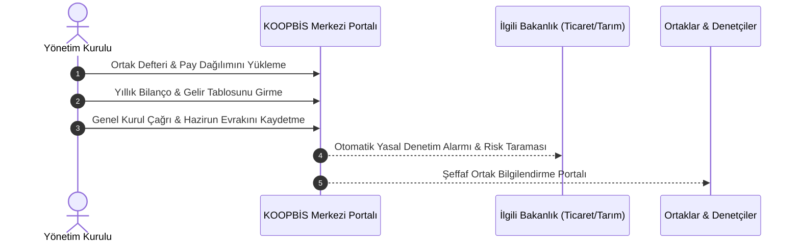

# Yönetim, Denetim ve Dijitalleşme: KOOPBİS Rejimi

  
Kooperatiflerde Yönetim, Denetim ve Dijitalleşme

  <table>
    <tr><th>Merkezi Veri Portalı</th><td>KOOPBİS (14.01.2022 / 31719 RG - Mevzuat No: 39276)</td></tr>
    <tr><th>Zorunlu Eğitim</th><td>40 Ders Saati (14.01.2022 / 31719 RG - Mevzuat No: 39278)</td></tr>
    <tr><th>Dış Denetim Standartları</th><td>1 Şubat 2022 / 31737 RG (Mevzuat No: 39331) & CBK 6434</td></tr>
    <tr><th>E-Genel Kurul</th><td>14.01.2022 / 31719 RG (Mevzuat No: 39279)</td></tr>
    <tr><th>Mal Bildirimi</th><td>3628 Sayılı Kanun & Tebliğ 2010/1</td></tr>
    <tr><th>Yetkili Makam</th><td>Ticaret Bakanlığı / Bilgi Teknolojileri Genel Müdürlüğü</td></tr>
  </table>

**Kooperatiflerde yönetim, denetim ve dijitalleşme rejimi**, 1163 sayılı Kooperatifler Kanunu'na 7339 sayılı Kanun ile eklenen hükümler doğrultusunda hayata geçirilen, geleneksel fiziki kooperatif yönetimini şeffaf, hesap verebilir, merkezi veri tabanına bağlı (KOOPBİS) ve bağımsız denetime açık hale getiren modern idari ve hukuki yapıdır.

---

## İçindekiler
1. [Kooperatif Bilgi Sistemi (KOOPBİS - 31719 Sayılı RG)](#1-kooperatif-bilgi-sistemi-koopbis---31719-sayılı-rg)
2. [Yöneticiler İçin 40 Saatlik Zorunlu Eğitim ve Muafiyet Sınırları](#2-yöneticiler-için-40-saatlik-zorunlu-eğitim-ve-muafiyet-sınırları)
3. [Dış Denetim ve Bağımsız Denetim Sistemi](#3-dış-denetim-ve-bağımsız-denetim-sistemi)
4. [Bağdaşmayan Görevler ve Çıkar Çatışması Yasakları](#4-bağdaşmayan-görevler-ve-çıkar-çatışması-yasakları)
5. [Elektronik Genel Kurul (e-Genel Kurul - 31719 Sayılı RG)](#5-elektronik-genel-kurul-e-genel-kurul---31719-sayılı-rg)
6. [Bakanlık Temsilcisi Bulundurma Zorunluluğu](#6-bakanlık-temsilcisi-bulundurma-zorunluluğu)
7. [Mal Bildiriminde Bulunulması (3628 Sayılı Kanun)](#7-mal-bildiriminde-bulunulması-3628-sayılı-kanun)
8. [Kaynakça ve Notlar](#8-kaynakça-ve-notlar)

---

## 1. Kooperatif Bilgi Sistemi (KOOPBİS - 31719 Sayılı RG)

KOOPBİS, Türkiye genelindeki tüm kooperatiflerin ve üst kuruluşlarının idari, mali ve hukuki verilerinin tek bir merkezi ağ üzerinden izlendiği ulusal veri tabanıdır (14 Ocak 2022 tarihli ve 31719 sayılı R.G., Mevzuat No: 39276).

* **Yasal Dayanak:** 1163 SK Ek Madde 5.
* **Yönetim Kurulunun Sorumluluğu:** Ortak kayıtları, finansal tablolar, gayrimenkuller, genel kurul kararları ve hazirun cetvellerinin sisteme işlenmesinden **Yönetim Kurulu asıl üyeleri müteselsilen sorumludur**.
* **Yaptırım:** Belirlenen sürelerde veri girişi yapmayan veya yanıltıcı bilgi giren yöneticiler hakkında adli para cezası ve idari yaptırımlar uygulanır.

---

## 2. Yöneticiler İçin 40 Saatlik Zorunlu Eğitim ve Muafiyet Sınırları

  

    
    
<strong>Şekil:</strong> Yönetim kurulunun 40 saatlik zorunlu eğitimi, KOOPBİS veri girişi ve dış denetim mekanizması.

  

Yönetim ve denetim organlarında görev alan üyelerin kurumsal yönetim kabiliyetlerini artırmak amacıyla **en az 40 ders saatlik** (30 saat temel + 10 saat destekleyici) eğitim mecburiyeti getirilmiştir.

* **Zorunlu Olduğu Kooperatifler:** Tüm kooperatifler değil; yıllık cirosu **20 Milyon TL ve üzeri** olanlar, **1.000 ve üzeri ortağı** bulunanlar, 50+ ortaklı ruhsatlı yapı ve taşıma kooperatifleri ile ESKKK, Tarım Kredi, Tarım Satış ve Pancar Ekicileri kooperatifleri.
* **Muafiyet Yanılgısı:** Hukuk, iktisat, işletme mezuniyeti veya mali müşavirlik (SMMM/YMM) ruhsatı zorunlu eğitimden **muafiyet sağlamaz**. Kapsamdaki kooperatif yöneticileri seçilmelerinden itibaren **9 ay içinde** eğitimi tamamlamak zorundadır.
* **Hukuki Sonuç (Görevin Düşmesi):** Eğitimi süresinde tamamlamayan üyelerin organ üyelikleri **kanun gereği kendiliğinden sona erer**.

---

## 3. Dış Denetim ve Bağımsız Denetim Sistemi

Geleneksel iç denetimin yetersiz kalması sebebiyle 7339 sayılı Kanun ve 1 Şubat 2022 tarihli ve 31737 sayılı R.G.'de yayımlanan Yönetmelik (Mevzuat No: 39331) ile **profesyonel dış denetim** yasal zorunluluk haline getirilmiştir.

* **Dış Denetim Şartları (Yön. m. 15):** Aşağıdaki şartlardan **herhangi birini** taşıyan kooperatifler dış denetime tabidir:
  1. Faaliyet konusuna bakılmaksızın yıllık net satış hasılatı **100 Milyon TL ve üstü** olanlar,
  2. Faaliyet konusuna bakılmaksızın **2.000 ve üzeri ortağı** bulunanlar,
  3. Yapı ruhsatı alınmış ve ortak sayısı **100 veya daha fazla** olan yapı, turizm ve gayrimenkul işletme kooperatifleri,
  4. Tarım satış, tarım kredi, ESKKK ve pancar ekicileri kooperatifleri.
* **Denetçilerin Nitelikleri:** Bağımsız denetçiler, YMM veya SMMM unvanlı meslek mensupları ya da Bakanlıkça yetkilendirilmiş üst birlikler.
* **Bağımsız Denetim (CB Kararı 6434):** KGK standartlarına göre belirlenen büyük ölçekli kooperatifler ise tam bağımsız denetime tabidir.

---

## 4. Bağdaşmayan Görevler ve Çıkar Çatışması Yasakları

**Tebliğ No: TGM-2011/01 (15071 Sayılı Tebliğ)** uyarınca kooperatif yöneticileri ve denetçileri için katı menfaat çatışması yasakları getirilmiştir:
* Yöneticiler ve denetçiler; kendileri, eşleri ve **üçüncü dereceye kadar (bu derece dahil) kan ve kayın hısımları** ile kooperatif arasında herhangi bir ticari alım-satım, ihale veya kiralama ilişkisine giremezler.
* Kooperatif ile aynı alanda faaliyet gösteren rakip işletmelerde yönetim veya ortaklık görevinde bulunamazlar.

---

## 5. Elektronik Genel Kurul (e-Genel Kurul - Yönetmelik 39279)

Merkezi Kayıt Kuruluşu veya Bakanlıkça onaylı güvenli elektronik altyapılar üzerinden yürütülen genel kurullardır.
1. Toplantı çağrısı ve hazirun listesi Elektronik Genel Kurul Sistemi’ne (EGKS) tanımlanır.
2. Ortaklar, güvenli elektronik imza veya iki faktörlü doğrulama ile sisteme bağlanır.
3. Toplantı esnasında eşzamanlı söz alma, yazılı önerge verme ve güvenli oy kullanma imkânı sunulur.
4. Tutanaklar elektronik ortamda imzalanarak doğrudan KOOPBİS portalına arşivlenir.

---

## 6. Bakanlık Temsilcisi Bulundurma Zorunluluğu

* **Mevzuat Dayanağı:** 39277 sayılı Yönetmelik, 77522 sayılı Tüzük ve 12817 sayılı Tebliğ.
* **Başvuru:** Genel kurul tarihinden en az **15 gün önce** yetkili Bakanlık İl Müdürlüğü'ne yazılı talepte bulunulur.
* **Hukuki Hüküm:** Temsilci talep edilmeksizin veya usulsüzce temsilcisiz yapılan genel kurullarda alınan kararlar **yok hükmündedir (butlan)**.

---

## 7. Mal Bildiriminde Bulunulması (3628 Sayılı Kanun)

Kooperatiflerde şeffaflığı temin etmek amacıyla çıkarılan **3628 sayılı Kanun** ve ilgili Tebliğler (13715, 11801, 6071) uyarınca:
* Yönetim ve denetim kurulu üyeleri göreve seçildikleri tarihten itibaren **1 ay içinde**,
* Görevden ayrıldıkları tarihten itibaren **1 ay içinde**,
* Görev süreleri boyunca sonu **(0) ve (5)** ile biten yılların Şubat ayı sonuna kadar kapalı zarf usulüyle mal bildiriminde bulunmak zorundadır.

---

## 8. Kaynakça ve Notlar
1. Kooperatif Bilgi Sistemi Yönetmeliği (14 Ocak 2022 tarihli ve 31719 sayılı Resmî Gazete, Mevzuat No: 39276).
2. Kooperatifçilik Eğitimi Yönetmeliği (14 Ocak 2022 tarihli ve 31719 sayılı Resmî Gazete, Mevzuat No: 39278).
3. Kooperatif ve Üst Kuruluşlarının Denetimine Dair Yönetmelik (1 Şubat 2022 tarihli ve 31737 sayılı Resmî Gazete, Mevzuat No: 39331).
4. 3628 Sayılı Mal Bildiriminde Bulunulması, Rüşvet ve Yolsuzluklarla Mücadele Kanunu.

---
*Ayrıca bakınız:* [[02_1163_sayili_kooperatifler_kanunu]], [[05_kooperatif_mali_ve_vergi_hukuku]], [[08_mevzuat_kulliyati_ve_dizin]]
