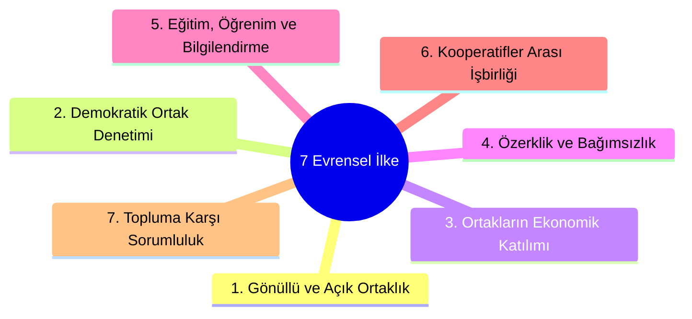

# Uluslararası Kooperatifçilik İlkeleri (ICA) ve Karşılaştırmalı Hukuk

  
Uluslararası Kooperatifçilik İlkeleri

  <table>
    <tr><th>Yetkili Çatı Örgüt</th><td>Uluslararası Kooperatifler Birliği (ICA)</td></tr>
    <tr><th>Tarihsel Köken</th><td>Rochdale İlkeleri (1844, İngiltere)</td></tr>
    <tr><th>Güncel Bildirge</th><td>1995 Manchester Kongresi Bildirgesi</td></tr>
    <tr><th>İlke Sayısı</th><td>7 Evrensel İlke</td></tr>
    <tr><th>Uluslararası Standart</th><td>ILO 193 Sayılı Tavsiye Kararı (2002)</td></tr>
    <tr><th>AB Modeli</th><td>SCE (Societas Cooperativa Europaea)</td></tr>
  </table>

**Uluslararası kooperatifçilik ilkeleri**, 1895 yılında kurulan Uluslararası Kooperatifler Birliği (ICA - International Co-operative Alliance) tarafından tanımlanan, kooperatiflerin kimliğini, değerlerini ve operasyonel felsefesini belirleyen evrensel ilkeler bütünüdür. Türk Kooperatifler Kanunu da doğrudan bu ilkelerin pozitif hukuktaki yansımasıdır.

---

## İçindekiler
1. [Rochdale Öncüleri ve Tarihsel Köken (1844)](#1-rochdale-öncüleri-ve-tarihsel-köken-1844)
2. [1995 Manchester Bildirgesi: Evrensel 7 Kooperatif İlkesi](#2-1995-manchester-bildirgesi-evrensel-7-kooperatif-ilkesi)
3. [ICA İlkelerinin Türk Hukuku (1163 SK) ile Mukayesesi](#3-ica-ilkelerinin-türk-hukuku-1163-sk-ile-mukayesesi)
4. [Uluslararası Çalışma Örgütü (ILO) 193 Sayılı Tavsiye Kararı](#4-uluslararası-çalışma-örgütü-ilo-193-sayılı-tavsiye-kararı)
5. [Avrupa Kooperatif Şirketi (SCE) Modeli](#5-avrupa-kooperatif-şirketi-sce-modeli)
6. [Kaynakça ve Notlar](#6-kaynakça-ve-notlar)

---

## 1. Rochdale Öncüleri ve Tarihsel Köken (1844)

Modern kooperatifçiliğin doğum yeri, 1844 yılında İngiltere'nin Rochdale kasabasında 28 dokuma işçisi tarafından kurulan **Rochdale Adil Öncüler Kooperatifi** (Rochdale Equitable Pioneers Society) kabul edilir. 

Rochdale öncülerinin benimsediği kurallar (katkısız ve saf mal satışı, peşin ödeme kuralı, sermayeye sabit faiz, demokratik yönetim ve kazancın harcama oranında iadesi [risturn]), dünya genelinde kooperatif mevzuatlarının anayasasını oluşturmuştur.

---

## 2. 1995 Manchester Bildirgesi: Evrensel 7 Kooperatif İlkesi

ICA'nın 1995 Manchester Genel Kurulu'nda kabul edilen **"Kooperatif Kimlik Bildirgesi"**ne göre kooperatifler şu 7 ilke etrafında şekillenir:

1. **Gönüllü ve Açık Ortaklık (Voluntary and Open Membership):** Kooperatifler, cinsiyet, ırk, inanç veya siyasi ayrım gözetmeksizin, hizmetlerinden yararlanabilecek ve ortaklık sorumluluklarını üstlenebilecek herkese açıktır.
2. **Ortaklar Tarafından Demokratik Denetim (Democratic Member Control):** Kooperatifler ortakları tarafından yönetilir. Birincil kooperatiflerde her ortağın sermaye miktarına bakılmaksızın **bir oy hakkı** vardır (*"Tek ortak, tek oy"*).
3. **Ortakların Ekonomik Katılımı (Member Economic Participation):** Ortaklar kooperatifin sermayesine adil biçimde katkıda bulunur. Sermayeye kısıtlı faiz verilebilir; faaliyet fazlası ortakların işlemlerine göre (risturn) veya ortak hizmet fonlarına aktarılır.
4. **Özerklik ve Bağımsızlık (Autonomy and Independence):** Kooperatifler ortaklarının denetiminde özerk kuruluşlardır. Hükümetlerle veya dış kaynaklarla anlaşmalar yapsalar dahi bağımsızlıklarını korumak zorundadırlar.
5. **Eğitim, Öğrenim ve Bilgilendirme (Education, Training, and Information):** Ortakların, yöneticilerin ve personelin gelişimine yönelik sürekli eğitim sağlanması kooperatifin asli görevidir.
6. **Kooperatifler Arası İşbirliği (Cooperation among Cooperatives):** Yerel, ulusal, bölgesel ve uluslararası düzeylerde birlikte çalışarak kooperatif hareketinin güçlendirilmesi esastır.
7. **Topluma Karşı Sorumluluk (Concern for Community):** Kooperatifler ortaklarının onayladığı politikalar yoluyla çevrelerinin sürdürülebilir kalkınması için çalışırlar.

---

## 3. ICA İlkelerinin Türk Hukuku (1163 SK) ile Mukayesesi

| ICA İlkesi | 1163 Sayılı Kanun Hükmü | Uygulama Notu |
| :--- | :--- | :--- |
| **1. Açık Ortaklık** | Madde 8 (Giriş Serbestisi) | Haklı sebep olmaksızın ortaklığa kabulden kaçınılamaz. |
| **2. Demokratik Denetim** | Madde 48 (Oy Hakkı) | Sermaye payı ne olursa olsun genel kurulda her ortağa 1 oy tanınmıştır. |
| **3. Ekonomik Katılım** | Madde 38, 5520 SK m. 4 | Sermayeye kazanç dağıtımı yasaklanmış; risturn esası kabul edilmiştir. |
| **4. Özerklik** | Madde 1 (Tüzel Kişilik) | Kooperatif genel kurulunun organ iradesi bağımsızdır. |
| **5. Eğitim** | Yönetmelik 39278 & m. 94 | Yöneticilere 40 saatlik zorunlu eğitim ve Kooperatifçilik Tanıtma Fonu. |
| **6. İşbirliği** | Madde 70-77 (Üst Kuruluşlar) | Birlikler, Merkez Birlikleri ve Milli Birlik teşkilatlanması. |
| **7. Topluma Sorumluluk** | 5488 SK & 5393 SK | Kırsal kalkınma, kadın istihdamı ve yerel ekonomi destekleri. |

---

## 4. Uluslararası Çalışma Örgütü (ILO) 193 Sayılı Tavsiye Kararı

2002 yılında kabul edilen **193 sayılı Kooperatiflerin Teşvikine İlişkin Tavsiye Kararı**, devletlerin kooperatiflere yönelik mevzuat oluştururken uyması gereken uluslararası rehber belgedir.
* ILO 193 Kararı; hükümetlerin kooperatiflerin özerkliğine saygı göstermesini, onları diğer şirket türleri karşısında dezavantajlı kılmayacak dengeli bir vergi ve mali mevzuat oluşturmasını tavsiye eder.

---

## 5. Avrupa Kooperatif Şirketi (SCE) Modeli

Avrupa Birliği, 2003 yılında çıkardığı 1435/2003 sayılı Tüzük ile **Avrupa Kooperatif Şirketi (Societas Cooperativa Europaea - SCE)** statüsünü tesis etmiştir.
* SCE modeli; en az iki farklı AB üyesi devlette mukim ortakların ortaklaşa sınır ötesi kooperatif kurabilmesine, tek bir tüzel kişilik altında Avrupa Tek Pazarı'nda faaliyet gösterebilmesine imkân sağlamaktadır.

---

## 6. Kaynakça ve Notlar
1. International Co-operative Alliance (ICA), *Guidance Notes to the Co-operative Principles*, Brussels, 2015.
2. ILO Recommendation No. 193: *Promotion of Cooperatives Recommendation*, Geneva, 2002.
3. Council Regulation (EC) No 1435/2003 of 22 July 2003 on the Statute for a European Cooperative Society (SCE).
4. Mülayim, Z. G. (2018). *Kooperatifçilik*, Yetkin Yayınları, Ankara.

---
*Ayrıca bakınız:* [[01_turkiye_kooperatifcilik_hukuku_ve_tarihcesi]], [[02_1163_sayili_kooperatifler_kanunu]], [[08_mevzuat_kulliyati_ve_dizin]]
