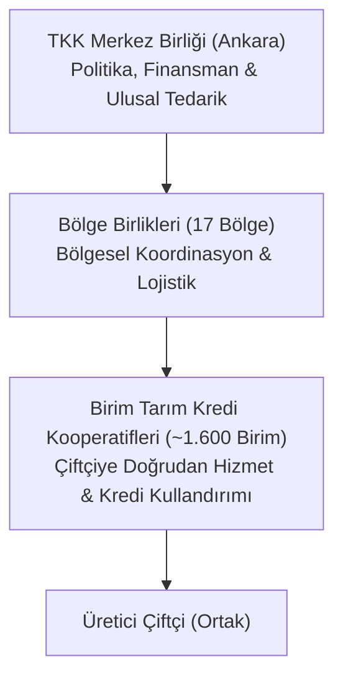

# Tarım Kredi Kooperatifleri ve Birlikleri (1581 Sayılı Kanun)

  
Tarım Kredi Kooperatifleri (TKK)

  <table>
    <tr><th>Kanun Numarası</th><td>1581 Sayılı Kanun</td></tr>
    <tr><th>Kabul Tarihi</th><td>18 Nisan 1972</td></tr>
    <tr><th>Mevzuat Türü</th><td>Özel İhtisas Kanunu</td></tr>
    <tr><th>Örgütlenme Kademeleri</th><td>Kooperatif - Bölge Birliği - Merkez Birliği</td></tr>
    <tr><th>Finansman & Kredi</th><td>T.C. Ziraat Bankası, Ziraat Katılım, Hazine Faiz Desteği</td></tr>
    <tr><th>Teminat Ayrıcalığı</th><td>Tapu Kanunu m. 26 (Doğrudan İpotek Tescili)</td></tr>
    <tr><th>İlgili Düzenlemeler</th><td>5661 SK (Köy İkrazatı), 5570 SK, 4876 SK</td></tr>
  </table>

**Tarım Kredi Kooperatifleri (TKK)**, 1581 sayılı Kanun kapsamında kurulan, Türkiye'deki çiftçilerin tohum, gübre, karma yem, tarımsal ilaç, akaryakıt ve mekanizasyon gibi temel ayni ve nakdi girdi ihtiyaçlarını karşılayan, ürünlerini değerlendiren ve Hazine faiz sübvansiyonlu kredilere aracılık eden en köklü tarımsal finansman ve kooperatif örgütüdür.

---

## İçindekiler
1. [Hukuki Statü ve Kuruluş Esasları](#1-hukuki-statü-ve-kuruluş-esasları)
2. [Örgütlenme Yapısı: Üç Kademeli Sistem](#2-örgütlenme-yapısı-üç-kademeli-sistem)
3. [Çalışma Konuları ve Ayni/Nakdi Kredi Mekanizması](#3-çalışma-konuları-ve-ayninakdi-kredi-mekanizması)
4. [Hukuki Ayrıcalıklar, Rehin ve Tapu İpotek Kolaylığı](#4-hukuki-ayrıcalıklar-rehin-ve-tapu-ipotek-kolaylığı)
5. [Toplu Köy İkrazatı ve Borç Tasfiyeleri (5661 Sayılı Kanun)](#5-toplu-köy-ikrazatı-ve-borç-tasfiyeleri-5661-sayılı-kanun)
6. [Doğal Afet Ertelemeleri ve Faiz Terkinleri](#6-doğal-afet-ertelemeleri-ve-faiz-terkinleri)
7. [Kaynakça ve Notlar](#7-kaynakça-ve-notlar)

---

## 1. Hukuki Statü ve Kuruluş Esasları

1581 sayılı Kanun’un 1. maddesi uyarınca Tarım Kredi Kooperatifleri; karşılıklı yardım ve dayanışma esasına dayanan, tüzel kişiliğe sahip, değişir sermayeli ve kamu yararı niteliği taşıyan özel teşekküllerdir.
* **Genel Kanun ile İlişki:** 1581 sayılı Kanun’da hüküm bulunmayan hallerde **1163 sayılı Kooperatifler Kanunu** hükümleri kıyasen uygulanır (Madde 20).
* **Ortaklık Şartları:** Fiilen tarımsal üretimle iştigal etmek, kooperatifin çalışma bölgesi sınırları içinde ikamet etmek veya arazisi bulunmak ve medeni hakları kullanma ehliyetine sahip olmak şarttır.

---

## 2. Örgütlenme Yapısı: Üç Kademeli Sistem

* **Birim Kooperatifler:** Köy veya belde düzeyinde çiftçilerle doğrudan temas kuran, kredi taleplerini toplayan ve girdi dağıtan temel birimdir.
* **Bölge Birlikleri:** Yetki alanındaki birim kooperatiflerin faaliyetlerini koordine eden, mali denetimini yapan ve lojistik merkezleri yöneten ara kademedir.
* **Merkez Birliği:** TKK teşkilatının en üst karar ve icra organıdır; kamu kurumları, Hazine ve bankalar ile sözleşmeler akdeder.

---

## 3. Çalışma Konuları ve Ayni/Nakdi Kredi Mekanizması

* **Ayni Girdi Temini:** Sertifikalı tohumluk, kimyevi ve organik gübre, zirai mücadele aletleri, karma hayvan yemi ve motorin gibi stratejik girdilerin ortaklara vadeli temini.
* **Hazine Faiz Destekli Krediler (CBK 8039 & Tebliğ 2024/15):** Üreticilerin üretim maliyetlerini düşürmek amacıyla Hazine ve Maliye Bakanlığı tarafından faizinin %25 ila %100'ü sübvanse edilen tarımsal işletme ve yatırım kredileri kullandırılır.
* **Sözleşmeli Tarım:** Üreticinin yetiştirdiği ürünlerin (buğday, mısır, ayçiçeği, zeytin vb.) piyasa fiyatları üzerinden satın alınarak TKK iştirakleri (Tarım Kredi Pazarlama ve Marketçilik A.Ş.) aracılığıyla tüketiciye ulaştırılması.

---

## 4. Hukuki Ayrıcalıklar, Rehin ve Tapu İpotek Kolaylığı

* **Doğrudan İpotek Tescili (2644 Sayılı Tapu Kanunu Madde 26):**
  > *"Tarım Kredi Kooperatiflerince açılan kredilerin teminatı olarak gösterilen gayrimenkullerin ipotek işlemlerinde resmi senet tanzim edilmez; kooperatif yetkililerinin tescil istem belgesi üzerine tapu sicil müdürlüklerince doğrudan ipotek tescil edilir."*
* **Resmi Senet Niteliği (1581 SK Madde 12):** Kooperatif alacakları için ortaklardan ve kefillerden alınan borç senetleri ve taahhütnameler, İcra ve İflas Kanunu bakımından ilam niteliğinde resmi senet sayılır ve doğrudan ilamlı icra takibine konu edilebilir.
* **Vergi ve Harç Muafiyeti (1581 SK Madde 19):** Kooperatiflerin açtıkları krediler, yaptıkları sözleşmeler, düzenledikleri senetler Damga Vergisi ve harçlardan müstesnadır.

---

## 5. Toplu Köy İkrazatı ve Borç Tasfiyeleri (5661 Sayılı Kanun)

Geçmiş dönemlerde uygulanan ve tüm köy sakinlerinin birbirine müteselsil kefil olmasını öngören "toplu köy ikrazatı" uygulaması, üreticiler arasında zincirleme mağduriyetlere yol açmıştı.
* **5661 sayılı Kanun** ile bu toplu kefaletler tamamen feshedilmiş; asıl borçlu ile kefillerin sorumlulukları bireyselleştirilerek yapılandırılmıştır.
* **4876 sayılı Kanun:** Sorunlu ve donuk tarımsal kredilerin faizlerinin silinerek taksitlendirilmesi sağlanmıştır.

---

## 6. Doğal Afet Ertelemeleri ve Faiz Terkinleri

Kuraklık, don, dolu, sel veya deprem gibi afetlerden zarar gören çiftçilerin TKK nezdindeki kredi borçları, **2090 sayılı Kanun** ve özel Cumhurbaşkanı Kararları (CBK 6816, 6920) çerçevesinde:
1. Vadesi gelen borçlar **1 yıl süreyle faizsiz** ertelenir.
2. Vadesi geçmiş borçlar uzun vadeli taksitlendirmeye tabi tutulur.
3. Afetzede üreticiye yeni üretim sezonu için indirimli faizli ilave tohum ve gübre kredisi açılır.

---

## 7. Kaynakça ve Notlar
1. 1581 Sayılı Tarım Kredi Kooperatifleri ve Birlikleri Kanunu Metni.
2. 2644 Sayılı Tapu Kanunu m. 26 Uygulama Genelgesi, Tapu ve Kadastro Genel Müdürlüğü.
3. Resmî Gazete: 8039 Sayılı Cumhurbaşkanı Kararı (Tarımsal Üretime Dair Faiz Destekli Kredi Kararı).
4. Tarım Kredi Kooperatifleri Merkez Birliği Mevzuat Külliyatı.

---
*Ayrıca bakınız:* [[03_tarim_kooperatifleri_ve_birlikleri]], [[08_mevzuat_kulliyati_ve_dizin]], [[05_kooperatif_mali_ve_vergi_hukuku]]
