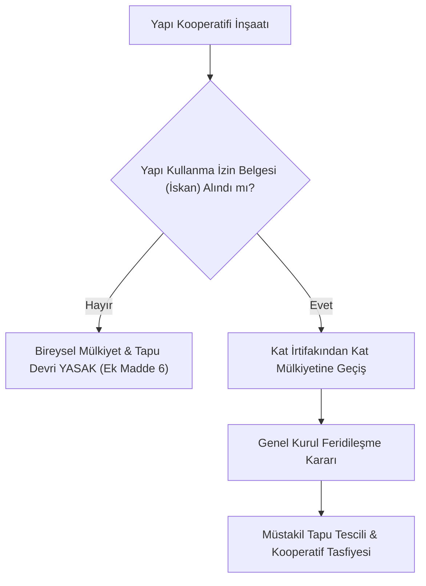

# Konut Yapı Kooperatifleri ve Tapu Mevzuatı

  
Konut Yapı Kooperatifleri

  <table>
    <tr><th>Temel Kanun</th><td>1163 Sayılı Kooperatifler Kanunu</td></tr>
    <tr><th>Kritik Reform</th><td>7579 Sayılı Kanun (Ek Madde 6)</td></tr>
    <tr><th>Yetkili Bakanlık</th><td>T.C. Çevre, Şehircilik ve İklim Değişikliği Bakanlığı</td></tr>
    <tr><th>Arsa Tahsisi</th><td>4706 SK Madde 7/B (Hazine Taşınmazı Satışı)</td></tr>
    <tr><th>Kredi Kaynağı</th><td>TOKİ (Toplu Konut İdaresi) Kredileri</td></tr>
    <tr><th>Vergi İstisnaları</th><td>1319 SK (Emlak Vergisi), 3065 SK (KDV Geçici 15)</td></tr>
  </table>

**Konut yapı kooperatifleri**, ortaklarının mesken (konut) veya işyeri ihtiyaçlarını karşılıklı yardım, işbirliği ve tasarrufların birleştirilmesi suretiyle en uygun maliyetle inşa etmek ve mülkiyet sahibi kılmak amacıyla kurulan değişir sermayeli kooperatif türüdür. Türkiye'de kentleşme sürecinde kritik rol oynamış, son yıllarda ise şeffaflık ve mülkiyet devri kısıtlamaları ile sıkı yasal denetim altına alınmıştır.

---

## İçindekiler
1. [Hukuki Çerçeve ve Kuruluş Şartları](#1-hukuki-çerçeve-ve-kuruluş-şartları)
2. [7579 Sayılı Kanun Reformu: Bireysel Mülkiyet Devri Kısıtlamaları](#2-7579-sayılı-kanun-reformu-bireysel-mülkiyet-devri-kısıtlamaları)
3. [Mahalli İdarelerin Yapı Kooperatifi Kurma Yetkisi](#3-mahalli-idarelerin-yapı-kooperatifi-kurma-yetkisi)
4. [Hazine Taşınmazı Satışı ve TOKİ Kredilendirmesi](#4-hazine-taşınmazı-satışı-ve-toki-kredilendirmesi)
5. [Mali ve Vergisel Boyut: Emlak, KDV ve Katılım Payları](#5-mali-ve-vergisel-boyut-emlak-kdv-ve-katılım-payları)
6. [Feridileşme (Mülkiyetin Bireyselleşmesi) ve Tasfiye Süreci](#6-feridileşme-mülkiyetin-bireyselleşmesi-ve-tasfiye-süreci)
7. [Kaynakça ve Notlar](#7-kaynakça-ve-notlar)

---

## 1. Hukuki Çerçeve ve Kuruluş Şartları

Konut yapı kooperatifleri 1163 sayılı Kanun hükümlerine tabi olup, kuruluş ve anasözleşme onay yetkisi **Çevre, Şehircilik ve İklim Değişikliği Bakanlığı'na** aittir.
* En az 7 kurucu ortak ile kurulur.
* Anasözleşmede konut sayısı, arsa temin yöntemi ve inşaat yapım taahhütleri ayrıntılı olarak düzenlenir.

---

## 2. 7579 Sayılı Kanun Reformu: Bireysel Mülkiyet Devri Kısıtlamaları

1163 sayılı Kanun'a 7579 sayılı Kanun ile eklenen **Ek Madde 6**, yapı kooperatiflerinde uzun yıllardır yaşanan suistimalleri ve hak kayıplarını engellemek amacıyla devrim niteliğinde kısıtlamalar getirmiştir:

* **İskan Zorunluluğu:** Kooperatife ait yapılar fiilen tamamlanıp ilgili belediyesinden **Yapı Kullanma İzin Belgesi (İskan)** alınmadıkça, ortaklar adına bağımsız bölüm tapusu tescil edilemez ve bireysel hisse devri yapılamaz.
* **Gölge Rantın Önlenmesi:** Kooperatif üyeliği veya noter satış vaadi sözleşmeleri üzerinden kaçak ve projesiz yapıların üçüncü kişilere devredilmesi kanunen geçersiz kılınmış ve cezai sorumluluk getirilmiştir.

---

## 3. Mahalli İdarelerin Yapı Kooperatifi Kurma Yetkisi

Yine 7579 sayılı Kanun ile getirilen düzenlemeye göre;
* Büyükşehir belediyeleri, il/ilçe belediyeleri ve il özel idarelerinin doğrudan yapı kooperatifi kurması veya kurulu yapı kooperatiflerine ortak/iştirakçi olması **Cumhurbaşkanı'nın iznine** bağlanmıştır.
* Bu düzenlemenin amacı, kamu kaynaklarının denetimsiz kooperatif şirketlerine aktarılmasını ve yerel yönetimlerin kooperatifler üzerinden borçlanmasını engellemektir.

---

## 4. Hazine Taşınmazı Satışı ve TOKİ Kredilendirmesi

* **4706 Sayılı Kanun (Madde 7/B):** Hazineye ait taşınmazlar, konut yapı kooperatifleri ile kooperatif birliklerine arsa üretimi ve konut yapımı amacıyla rayiç bedel üzerinden doğrudan satılabilir veya vadeli olarak taksitlendirilebilir.
* **Bulgaristan Göçmenleri İstisnası (5228 SK):** Zorunlu göçe tabi tutularak Türkiye'ye yerleşen vatandaşlarımızın kurduğu konut kooperatiflerine Hazine arazileri imtiyazlı şartlarla devredilmiştir.
* **TOKİ Finansmanı (Yönetmelik 20023888 Madde 6 & 4375):** Toplu Konut İdaresi (TOKİ), konut yapı kooperatiflerini "toplu konut yapımcısı" kabul ederek, dar ve orta gelirli ortakların ev sahibi olması için düşük faizli uzun vadeli inşaat tamamlama kredisi kullandırabilir.
* **Afetzede Konut Hak Sahipliği (7269 SK Geçici m. 21):** Deprem veya tabii afetlerde konutları yıkılan kooperatif ortakları devlet eliyle inşa edilen afet konutlarına doğrudan hak sahibi kılınır.

---

## 5. Mali ve Vergisel Boyut: Emlak, KDV ve Katılım Payları

* **Emlak Vergisi Muafiyeti (1319 SK Madde 4 & 14):** Konut yapı kooperatiflerinin arsaları ve inşa halindeki binaları, inşaat süresince ve fiilen kullanılmaya başlanıncaya kadar emlak vergisinden muaftır.
* **KDV İstisnası (3065 SK Geçici Madde 15):** 29.07.1998 tarihinden önce inşaat ruhsatı almış olan konut yapı kooperatiflerine yapılan inşaat taahhüt işleri KDV'den istisnadır. Bu tarihten sonra alınan ruhsatlarda arsa rayiç bedeli ve net alana göre indirimli oranlar uygulanır.
* **Katılım Payı Yapılandırması (6111 SK):** Kooperatiflerin belediyelere olan yol, su ve kanalizasyon harcamalarına katılma payları kamu borç yapılandırması kapsamına alınmıştır.

---

## 6. Feridileşme (Mülkiyetin Bireyselleşmesi) ve Tasfiye Süreci

İnşaatın tamamlanıp iskanın alınmasının ardından kooperatifin ana amacı gerçekleşmiş olur:
1. **Kat Mülkiyetinin Kurulması:** Tapu sicil müdürlüğünde kat irtifakı kat mülkiyetine çevrilir.
2. **Kura ve Tahsis Tescili:** Genel kurulda kabul edilen kura cetveline göre her ortağın bağımsız bölümü adına tescil edilir.
3. **Tasfiye Kararı:** Amacı gerçekleşen yapı kooperatifi, genel kurul kararıyla tasfiyeye girer ve tasfiye memurları aracılığıyla sicilden terkin edilir.

---

## 7. Kaynakça ve Notlar
1. 7579 Sayılı Tapu Kanunu ile Bazı Kanunlarda Değişiklik Yapılmasına Dair Kanun Metni (22 Mayıs 2026 tarihli ve 33261 sayılı Resmî Gazete).
2. 4706 Sayılı Hazineye Ait Taşınmaz Malların Değerlendirilmesi Hakkında Kanun.
3. 20023888 Sayılı Toplu Konut İdaresi Kaynaklarının Kullanım Şekline İlişkin Yönetmelik.
4. Çevre, Şehircilik ve İklim Değişikliği Bakanlığı Yapı Kooperatifleri Rehberi.

---
*Ayrıca bakınız:* [[04_tarim_disi_kooperatifler]], [[02_1163_sayili_kooperatifler_kanunu]], [[05_kooperatif_mali_ve_vergi_hukuku]]
