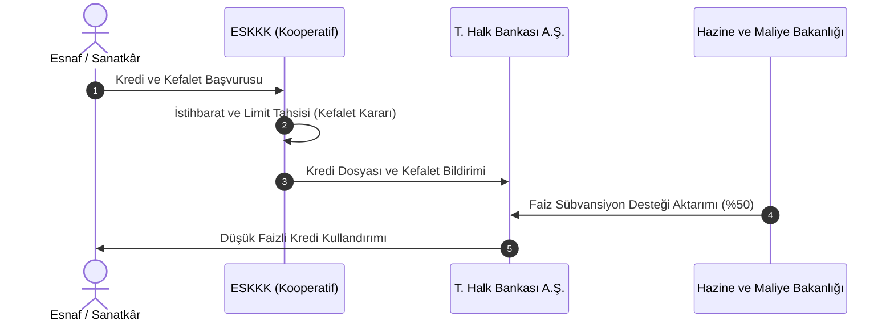

# Esnaf ve Sanatkârlar Kredi ve Kefalet Kooperatifleri (ESKKK)

  
ESKKK

  <table>
    <tr><th>Temel Kanunlar</th><td>1163 SK, 5362 SK (Esnaf K.), 4603 SK</td></tr>
    <tr><th>Üst Çatı Kuruluş</th><td>TESKOMB (Türkiye Esnaf ve Sanatkârlar Kredi ve Kefalet Kooperatifleri Birlikleri Merkez Birliği)</td></tr>
    <tr><th>Kredi Kullandıran Banka</th><td>Türkiye Halk Bankası A.Ş.</td></tr>
    <tr><th>Devlet Desteği</th><td>Hazine ve Maliye Bakanlığı Faiz Sübvansiyonu</td></tr>
    <tr><th>İpotek Ayrıcalığı</th><td>2644 Sayılı Tapu Kanunu Madde 26</td></tr>
    <tr><th>Ulusal Temsil</th><td>Esnaf ve Sanatkârlar Şûrası (Yön. 16302)</td></tr>
  </table>

**Esnaf ve Sanatkârlar Kredi ve Kefalet Kooperatifleri (ESKKK)**; esnaf ve sanatkârların hammadde, makine-ekipman alımı ve işletme sermayesi ihtiyaçlarını karşılamak üzere Türkiye Halk Bankası A.Ş. kaynaklarından kullandırılan düşük faizli kredilere kurumsal kefalet sağlayan özel finansal dayanışma kuruluşlarıdır.

---

## İçindekiler
1. [Hukuki Statü ve TESKOMB Teşkilatlanması](#1-hukuki-statü-ve-teskomb-teşkilatlanması)
2. [Hazine Faiz Destekli Kredi Mekanizması](#2-hazine-faiz-destekli-kredi-mekanizması)
3. [Kefalet Sistemi ve Risk Takibi](#3-kefalet-sistemi-ve-risk-takibi)
4. [Tapu Kanunu Madde 26 İpotek Ayrıcalığı](#4-tapu-kanunu-madde-26-ipotek-ayrıcalığı)
5. [Ulusal Esnaf ve Sanatkârlar Şûrası Rolü](#5-ulusal-esnaf-ve-sanatkârlar-şûrası-rolü)
6. [Kaynakça ve Notlar](#6-kaynakça-ve-notlar)

---

## 1. Hukuki Statü ve TESKOMB Teşkilatlanması

ESKKK’lar, **1163 sayılı Kooperatifler Kanunu** hükümlerine göre kurulur ve **Ticaret Bakanlığı'nın** denetimindedir.
* Ülke genelinde 1000'e yakın birim ESKKK faaliyet göstermektedir.
* Birim kooperatifler 32 Bölge Birliği ve en üstte **TESKOMB** (Merkez Birliği) çatısı altında piramidal olarak örgütlenmiştir.
* Ortak olabilmek için esnaf ve sanatkârlar siciline ve meslek odasına kayıtlı fiili esnaf olmak şarttır (5362 SK).

---

## 2. Hazine Faiz Destekli Kredi Mekanizması

* **4603 Sayılı Kanun ve Cumhurbaşkanı Kararları:** Her yıl yayımlanan Cumhurbaşkanı Kararları ile (örneğin CBK 8039, 6251) Türkiye Halk Bankası A.Ş. tarafından esnafa kullandırılacak kredilerin faiz oranının önemli bir kısmı (genellikle %50'si) Hazine tarafından karşılanır.
* **Kredi Türleri:** İşletme kredisi, yatırım kredisi, ticari taşıt edinme kredisi ve işyeri edindirme kredisi.

---

## 3. Kefalet Sistemi ve Risk Takibi

ESKKK, bankaya karşı borçlu esnafın **müteselsil kefili** konumundadır:
* Borçlu esnaf taksitini ödemediğinde, kredi borcu öncelikle kooperatifin bloke sermaye ve risk fonlarından bankaya ödenir.
* Kooperatif, ödediği meblağ için kendi ortağına rücu ederek yasal icra takip işlemlerini başlatır.
* Kooperatiflerin kredi plasman limitleri, geri ödeme başarı oranlarına (takip rasyolarına) göre 1. gruptan 5. gruba kadar derecelendirilir.

---

## 4. Tapu Kanunu Madde 26 İpotek Ayrıcalığı

ESKKK kefaletiyle açılan kredilerde esnafın gayrimenkul teminatı vermesi durumunda bürokratik işlemler en aza indirilmiştir:
* **2644 sayılı Tapu Kanunu’nun 26. maddesi** uyarınca:
  > *"Esnaf ve Sanatkârlar Kredi ve Kefalet Kooperatiflerince açılan veya kefalet olunan kredilerin teminatı için tesis edilecek ipotek işlemlerinde resmi senet tanzim edilmez; kooperatifin tescil istem belgesi üzerine tapu müdürlüğünce doğrudan tescil yapılır."*
* Bu istisna esnafı noter ve resmi senet harçlarından muaf tutarak maliyet avantajı sağlar.

---

## 5. Ulusal Esnaf ve Sanatkârlar Şûrası Rolü

16302 sayılı Esnaf ve Sanatkârlar Şûrası Yönetmeliği uyarınca TESKOMB ve ESKKK temsilcileri, Türkiye'deki esnaf politikalarının, faiz oranlarının ve mesleki teşviklerin belirlendiği en üst danışma organı olan Şûra'nın daimi ve tabii üyeleridir.

---

## 6. Kaynakça ve Notlar
1. 5362 Sayılı Esnaf ve Sanatkârlar Meslek Kuruluşları Kanunu.
2. 4603 Sayılı Kamu Bankaları Kanunu ve İlgili Cumhurbaşkanı Kararları.
3. 2644 Sayılı Tapu Kanunu Madde 26 Hükmü ve Tapu Dairesi Genelgeleri.
4. TESKOMB Kredi ve Kefalet İşlemleri Talimatnamesi, 2024.

---
*Ayrıca bakınız:* [[04_tarim_disi_kooperatifler]], [[02_1163_sayili_kooperatifler_kanunu]], [[05_kooperatif_mali_ve_vergi_hukuku]]
