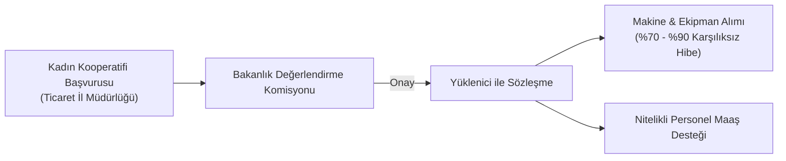

# Kadın Girişimi Kooperatifleri ve KOOP-DES Programı

  
Kadın Girişimi Kooperatifleri

  <table>
    <tr><th>Temel Kanun</th><td>1163 Sayılı Kooperatifler Kanunu</td></tr>
    <tr><th>Destek Programı</th><td>KOOP-DES (Yönetmelik 18659)</td></tr>
    <tr><th>Ortaklık Şartı</th><td>En az %90 Kadın Ortak Oranı</td></tr>
    <tr><th>Hibe Oranı</th><td>%70 - %90 Karşılıksız Destek</td></tr>
    <tr><th>Yerel Yönetim Desteği</th><td>5393 Sayılı Belediye Kanunu Madde 75</td></tr>
    <tr><th>Yetkili Bakanlık</th><td>T.C. Ticaret Bakanlığı</td></tr>
  </table>

**Kadın Girişimi Üretim ve İşletme Kooperatifleri**; kadınların ekonomik ve toplumsal hayata katılımlarını artırmak, el emeği ve yöresel ürünlerini katma değerli çıktılara dönüştürerek pazarlamak amacıyla kurulan ve devlet tarafından hem hibe programlarıyla (KOOP-DES) hem de yerel yönetim protokolleriyle imtiyazlı olarak desteklenen kooperatif modelidir.

---

## İçindekiler
1. [Hukuki Çerçeve ve Kuruluş Modeli](#1-hukuki-çerçeve-ve-kuruluş-modeli)
2. [KOOP-DES (Kooperatifçilik Proje Destek) Hibe Programı](#2-koop-des-kooperatifçilik-proje-destek-hibe-programı)
3. [Nitelikli Personel İstihdam Desteği](#3-nitelikli-personel-istihdam-desteği)
4. [Belediyelerle Ortak Proje ve Yer Tahsisi (5393 SK Madde 75)](#4-belediyelerle-ortak-proje-ve-yer-tahsisi-5393-sk-madde-75)
5. [E-Ticaret ve E-İhracat Açılımları (CBK 5973 & 5986)](#5-e-ticaret-ve-e-ihracat-açılımları-cbk-5973--5986)
6. [Kaynakça ve Notlar](#6-kaynakça-ve-notlar)

---

## 1. Hukuki Çerçeve ve Kuruluş Modeli

Kadın kooperatifleri, 1163 sayılı Kanun kapsamında **"Üretim ve İşletme Kooperatifi"** türü altında faaliyet gösterir.
* En az 7 kadın kurucu ortak tarafından Ticaret Bakanlığı onaylı tip anasözleşme ile kurulur.
* Ticaret Bakanlığı tarafından kadın kooperatiflerinin kuruluşunda ticaret sicil harcı ve tescil giderlerinde kolaylaştırıcı idari uygulamalar benimsenmiştir.

---

## 2. KOOP-DES (Kooperatifçilik Proje Destek) Hibe Programı

18659 sayılı Kooperatifçilik Proje Destek Yönetmeliği kapsamında uygulanan KOOP-DES, kadın kooperatiflerinin yatırım kapasitesini artıran temel hibe kaynağıdır:

* **Hibe Oranları:**
  * Normal yörelerde yatırım tutarının **%70'i**,
  * Kalkınmada öncelikli yörelerde ise **%90'ı** Ticaret Bakanlığı bütçesinden karşılıksız hibe olarak aktarılır.
* **Desteklenen Kalemler:** Üretim makineleri, ambalajlama ve paketleme teçhizatı, soğuk hava depoları, e-ticaret yazılımları, sergi ve fuar katılım giderleri.

---

## 3. Nitelikli Personel İstihdam Desteği

Yönetmelik 18659'un 25. maddesi uyarınca;
* Kadın kooperatiflerinin kurumsal kapasitesini artırmak, gıda mühendisi, tekstil uzmanı, muhasebeci veya pazarlama uzmanı gibi profesyonel personeli istihdam edebilmelerini sağlamak amacıyla **yıllık azami 2 personel** için net brüt asgari ücret tutarında maaş desteği hibe olarak ödenir.

---

## 4. Belediyelerle Ortak Proje ve Yer Tahsisi (5393 SK Madde 75)

5393 sayılı Belediye Kanunu’nun 75. maddesi, yerel yönetimlerin kooperatiflerle iş birliği yapabilmesinin yasal dayanağını oluşturur:
* Belediyeler, kadın kooperatifleri ile ortak eğitim, üretim ve sosyal sorumluluk projeleri geliştirebilir.
* Mülkiyeti belediyeye ait olan dükkân, stant, atölye veya satış reyonları meclis kararıyla kadın kooperatiflerine bedelsiz veya sembolik kira ile tahsis edilebilir.

---

## 5. E-Ticaret ve E-İhracat Açılımları (CBK 5973 & 5986)

Cumhurbaşkanlığı Kararları ile kooperatif şirketlerinin sınır ötesi pazarlara açılması teşvik edilmektedir:
* **CBK 5973 & 5986:** Kadın kooperatiflerinin Amazon, Trendyol, Etsy vb. pazar yerlerinde mağaza açma giderleri, dijital reklam bütçeleri ve yurt dışı numune kargo masrafları devlet teşvikleri kapsamındadır.

---

## 6. Kaynakça ve Notlar
1. 18659 Sayılı Kooperatifçilik Proje Destek Yönetmeliği, Resmî Gazete.
2. 5393 Sayılı Belediye Kanunu Madde 75 Metni.
3. Ticaret Bakanlığı, *Kadın Kooperatifleri Rehberi ve KOOP-DES Başvuru Kılavuzu*, 2025.
4. Resmî Gazete: 5973 ve 5986 Sayılı İhracat ve E-İhracat Destek Kararları.

---
*Ayrıca bakınız:* [[04_tarim_disi_kooperatifler]], [[02_1163_sayili_kooperatifler_kanunu]], [[08_mevzuat_kulliyati_ve_dizin]]
