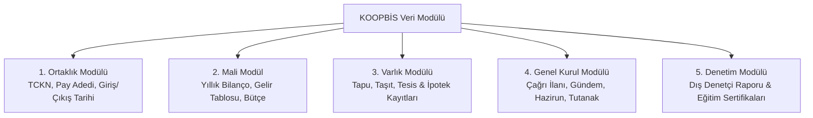

# Kooperatif Bilgi Sistemi (KOOPBİS) Uygulama Rehberi

  
KOOPBİS Portalı

  <table>
    <tr><th>Yasal Dayanak</th><td>1163 Sayılı Kanun Ek Madde 5</td></tr>
    <tr><th>Uygulama Yönetmeliği</th><td>39276 Sayılı Yönetmelik</td></tr>
    <tr><th>Yürürlük Tarihi</th><td>21 Ekim 2021 (7339 SK)</td></tr>
    <tr><th>Sorumlu Organ</th><td>Yönetim Kurulu Asıl Üyeleri</td></tr>
    <tr><th>Sistem Yöneticisi</th><td>Ticaret Bakanlığı Bilgi Teknolojileri GM</td></tr>
    <tr><th>Yaptırım Türü</th><td>Adli Para Cezası & İdari Sorumluluk</td></tr>
  </table>

**Kooperatif Bilgi Sistemi (KOOPBİS)**; Türkiye'deki tüm kooperatiflerin ve üst kuruluşlarının sicil bilgilerinin, ortaklık pay defterlerinin, yıllık finansal tablolarının, gayrimenkul kayıtlarının ve genel kurul kararlarının elektronik ortamda tutulduğu, güncellendiği ve denetlendiği merkezi e-Devlet entegrasyonlu veri tabanı sistemidir.

---

## İçindekiler
1. [Yasal Dayanak ve Kurulma Amacı](#1-yasal-dayanak-ve-kurulma-amacı)
2. [Sisteme Kaydı Zorunlu Bilgi ve Belgeler](#2-sisteme-kaydı-zorunlu-bilgi-ve-belgeler)
3. [Yönetim Kurulunun Doğrudan Sorumluluğu](#3-yönetim-kurulunun-doğrudan-sorumluluğu)
4. [Kronolojik Veri Giriş ve Güncelleme Takvimi](#4-kronolojik-veri-giriş-ve-güncelleme-takvimi)
5. [Yasal Yaptırımlar ve Adli Sorumluluk](#5-yasal-yaptırımlar-ve-adli-sorumluluk)
6. [Kaynakça ve Notlar](#6-kaynakça-ve-notlar)

---

## 1. Yasal Dayanak ve Kurulma Amacı

1163 sayılı Kooperatifler Kanunu'na 7339 sayılı Kanun ile eklenen **Ek Madde 5** ve **39276 sayılı Kooperatif Bilgi Sistemi Yönetmeliği** uyarınca:
* Kooperatifçilik sektöründe şeffaflık, hesap verebilirlik ve kamu güvenini tesis etmek,
* Ortakların kendi kooperatiflerinin finansal durumunu ve yönetim kararlarını e-Devlet kapısı üzerinden şeffafça görebilmesini sağlamak,
* Bakanlık müfettişlerinin ve denetçilerin uzaktan risk analizleri yapabilmesine imkân tanımak amaçlanmıştır.

---

## 2. Sisteme Kaydı Zorunlu Bilgi ve Belgeler

1. **Ortaklar Pay Defteri:** Tüm ortakların kimlik, iletişim, hisse adedi ve ortaklığa kabul/ihraç kararları.
2. **Finansal Raporlar:** Her hesap dönemine ait bilanço, gelir-gider farkı hesapları ve yönetim kurulu yıllık faaliyet raporu.
3. **Gayrimenkul ve Araç Bilgileri:** Kooperatif adına tescilli tüm arsa, bina, makine ve ticari araçların mülkiyet ve şerh kayıtları.
4. **Genel Kurul Evrakı:** Toplantı çağrı mektupları, gazete ilanları, hazirun cetveli ve divan toplantı tutanakları.
5. **Yönetim/Denetim Kurulu Bilgileri:** Seçilen üyelerin kimlik bilgileri, görev dağılım kararları ve **40 saatlik zorunlu eğitim sertifikaları**.

---

## 3. Yönetim Kurulunun Doğrudan Sorumluluğu

Yönetmelik 39276’nın 5. maddesi uyarınca;
* KOOPBİS yetkilendirmesi doğrudan **Yönetim Kurulu asıl üyelerine** aittir.
* Verilerin doğruluğundan, eksiksizliğinden ve mevzuatta belirlenen takvime uygun olarak sisteme işlenmesinden yönetim kurulu üyeleri **müteselsilen sorumludur**. Bu sorumluluk devredilemez.

---

## 4. Kronolojik Veri Giriş ve Güncelleme Takvimi

* **Ortaklık Değişiklikleri:** Ortaklığa giriş veya çıkış kararını takip eden **15 gün içinde**,
* **Genel Kurul Kararları:** Genel kurul toplantısının yapıldığı tarihi takip eden **15 gün içinde**,
* **Finansal Tablolar:** Hesap döneminin bitimini takip eden ve genel kuruldan önceki yasal süre zarfında sisteme yüklenmek zorundadır.

---

## 5. Yasal Yaptırımlar ve Adli Sorumluluk

* **Adli Para Cezası (Ek Madde 5 Fıkra 3):** KOOPBİS sistemine süresinde kayıt yaptırmayan, gerçeğe aykırı veri giren veya ortakların bilgi edinme hakkını kısıtlayan yönetim kurulu üyeleri hakkında Cumhuriyet Başsavcılıklarına suç duyurusunda bulunulur ve adli para cezası tatbik edilir.
* **Kamu Görevlisi Sıfatı (Madde 62):** KOOPBİS üzerindeki tahrifat ve usulsüzlükler, kamu evrakında sahtecilik ve görevi kötüye kullanma suçları kapsamında yargılanır.

---

## 6. Kaynakça ve Notlar
1. 1163 Sayılı Kooperatifler Kanunu Ek Madde 5 Metni.
2. 39276 Sayılı Kooperatif Bilgi Sistemi Yönetmeliği, Resmî Gazete.
3. Ticaret Bakanlığı KOOPBİS Kullanım Kılavuzu ve Teknik Parametreler Dokümanı.

---
*Ayrıca bakınız:* [[06_yonetim_denetim_ve_dijitallesme_koopbis]], [[02_1163_sayili_kooperatifler_kanunu]], [[16_zorunlu_kooperatifcilik_egitimi_rehberi]]
