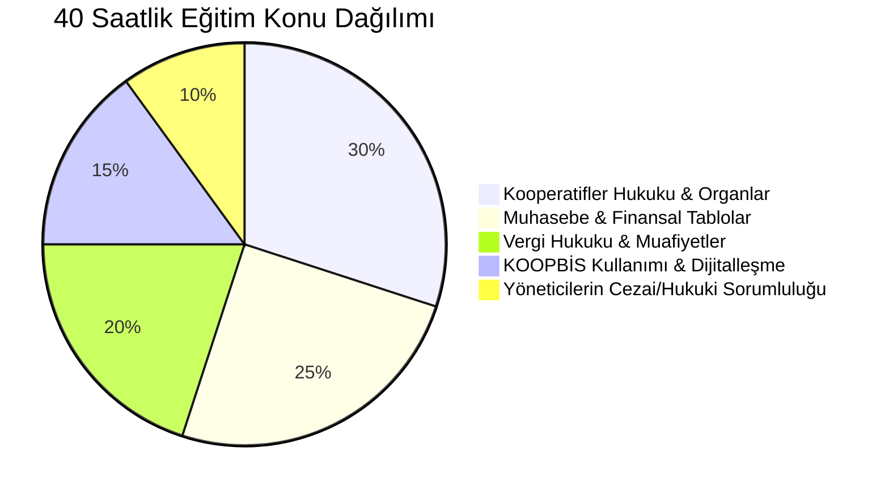

# Zorunlu Kooperatifçilik Eğitimi Rehberi (40 Saat)

  
Zorunlu Kooperatifçilik Eğitimi

  <table>
    <tr><th>Yasal Dayanak</th><td>1163 Sayılı Kanun & Kooperatifçilik Eğitimi Yönetmeliği</td></tr>
    <tr><th>Resmî Gazete</th><td>14 Ocak 2022 / Sayı: 31719 (Mevzuat No: 39278)</td></tr>
    <tr><th>Asgari Eğitim Süresi</th><td>40 Ders Saati (30 Saat Temel + 10 Saat Destekleyici)</td></tr>
    <tr><th>Kapsam</th><td>Eşikleri Aşan Kooperatiflerin Yönetim & Denetim Kurulları</td></tr>
    <tr><th>Yetkili Kurumlar</th><td>Bakanlıkça Yetkilendirilen Üniversiteler ve Kuruluşlar</td></tr>
    <tr><th>Yaptırım</th><td>9 Ayda Alınmazsa Üyeliğin Kendiliğinden Düşmesi</td></tr>
    <tr><th>Sistem Kaydı</th><td>KOOPBİS Portalına Belge Yükleme (Geçerlilik 8 Yıl)</td></tr>
  </table>

**Zorunlu Kooperatifçilik Eğitimi**, 7339 sayılı Kanun ve 14 Ocak 2022 tarihli ve 31719 sayılı Resmî Gazete'de yayımlanan Kooperatifçilik Eğitimi Yönetmeliği (Mevzuat No: 39278) uyarınca; belirlenen yasal eşikleri aşan kooperatiflerin ve üst kuruluşlarının yönetim ve denetim kurullarında görev alan kişilerin yönetsel, hukuki ve mali yetkinliklerini artırmak amacıyla başarıyla tamamlamaları kanunen mecburi kılınan 40 ders saatlik akredite eğitim programıdır.

---

## İçindekiler
1. [Yasal Çerçeve ve Getirilme Gerekçesi](#1-yasal-çerçeve-ve-getirilme-gerekçesi)
2. [Eğitim Yükümlüsü Olan Kooperatifler ve Muafiyet Koşulları](#2-eğitim-yükümlüsü-olan-kooperatifler-ve-muafiyet-koşulları)
3. [40 Ders Saatlik Eğitim Müfredatı](#3-40-ders-saatlik-eğitim-müfredatı)
4. [Yetkili Eğitim Sağlayıcıları ve Akreditasyon](#4-yetkili-eğitim-sağlayıcıları-ve-akreditasyon)
5. [KOOPBİS Entegrasyonu ve Görevin Düşmesi Hükmü](#5-koopbis-entegrasyonu-ve-görevin-düşmesi-hükmü)
6. [Kaynakça ve Notlar](#6-kaynakça-ve-notlar)

---

## 1. Yasal Çerçeve ve Getirilme Gerekçesi

Geçmiş dönemlerde kooperatif organlarına seçilen yöneticilerin mevzuat, muhasebe ve vergi kurallarını yeterince bilmemesi nedeniyle oluşan suistimalleri, idari para cezalarını ve iflasları önlemek amacıyla 2021 yılında zorunlu eğitim kuralı ihdas edilmiştir. Üyelerin seçildikleri tarihten itibaren **en geç 9 ay içinde** bu eğitimi tamamlamaları emredicidir.

---

## 2. Eğitim Yükümlüsü Olan Kooperatifler ve Muafiyet Koşulları

Yönetmeliğin 5. maddesi uyarınca eğitim, **tüm kooperatifler için değil, yalnızca aşağıdaki kriterleri taşıyan kooperatif ve üst kuruluşlarının** yönetim ve denetim kurulu asıl ve yedek üyeleri için zorunludur:

1. **Faaliyet Konusuna Göre Doğrudan Kapsamda Olanlar:**
   * Esnaf ve sanatkârlar kredi ve kefalet kooperatifleri (ESKKK),
   * Tarım satış kooperatifleri (4572 SK),
   * Tarım kredi kooperatifleri (1581 SK),
   * Pancar ekicileri kooperatifleri.
2. **Ciro Kriteri:** Faaliyet konusuna bakılmaksızın yıllık net satış hasılatı **20 Milyon TL ve üstü** olan kooperatifler.
3. **Ortak Sayısı Kriteri:** Faaliyet konusuna bakılmaksızın **1.000 ve daha fazla ortağı** bulunan kooperatifler.
4. **Yapı ve Taşıma Sektörü Kriteri:**
   * İnşaat ruhsatı alınmış ve ortak sayısı **50 veya daha fazla** olan yapı, turizm geliştirme ve gayrimenkul işletme kooperatifleri,
   * Ortak sayısı **50 veya daha fazla** olan motorlu taşıyıcılar / taşıma kooperatifleri.

> *Not: Bu kriterlerin altında kalan küçük ölçekli kooperatiflerin (örneğin 7-10 ortaklı kadın girişim veya üretim kooperatifleri) yöneticileri için eğitim zorunluluğu bulunmamaktadır.*

### Muafiyet Durumu ve Yaygın Hukuki Yanılgı:
* ⚠️ **Hukuk / İşletme / SMMM Mezuniyeti Muafiyet SAĞLAMAZ:** Uygulamada sıkça düşülen *"Ben avukatım, mali müşavirim veya iktisat mezunuyum, eğitime katılmama gerek yok"* inancı **tamamen yanlıştır**. Yönetmelikte üniversite diploması veya meslek unvanına dayalı hiçbir muafiyet tanınmamıştır. Kapsama giren bir kooperatife seçilen hukukçu veya mali müşavir üye de eğitimi süresinde tamamlamak zorundadır; aksi halde görevi kanun gereği düşer.
* **Yasal Muafiyet Halleri (Yön. m. 6):**
  * Yönetmeliğin yürürlüğe girdiği tarihten önce Bakanlıkça yürütülen **KOOP-ES (Kooperatifçilik E-Sertifika Programı)** katılım belgesi almış olanlar (belge tarihinden itibaren 8 yıl süreyle),
  * Bakanlık teşkilatında kooperatifçilik alanında en az 5 yıl süreyle müfettiş, denetmen, uzman veya şube müdürü olarak görev yapanlar,
  * Kooperatif üst kuruluşlarında denetim ve yönetim hizmetlerinde en az 8 yıl profesyonel çalışmış olanlar.

---

## 3. 40 Ders Saatlik Eğitim Müfredatı

Eğitim programı aşağıdaki temel modüllerden oluşur:
1. **Temel Kooperatifler Hukuku (12 Saat):** 1163 SK, ortaklık hakları, genel kurul usulü, anasözleşme değişiklikleri.
2. **Finans ve Muhasebe (10 Saat):** Bilanço okuma, gelir-gider farkı hesapları, yedek akçeler ve fon yönetimi.
3. **Mali Mevzuat ve Vergilendirme (8 Saat):** 5520 SK m. 4/1-k şartları, risturn muhasebesi, KDV istisnaları.
4. **KOOPBİS Uygulaması (6 Saat):** Sisteme veri girişi, hazirun yükleme, ortak kayıt yönetimi.
5. **Yöneticilerin Hukuki ve Cezai Sorumluluğu (4 Saat):** Türk Ceza Kanunu m. 62 kamu görevlisi statüsü, tazminat davaları ve bağdaşmayan görevler.

---

## 4. Yetkili Eğitim Sağlayıcıları ve Akreditasyon

Eğitimler yalnızca Ticaret Bakanlığı tarafından onaylanan ve akredite edilen kurumlarca verilebilir:
* Üniversitelerin Sürekli Eğitim Merkezleri (SEM),
* Türkiye Odalar ve Borsalar Birliği (TOBB),
* Türkiye Esnaf ve Sanatkârları Konfederasyonu (TESK),
* Türkiye Milli Kooperatifler Birliği ve yetkili üst birlikler.

---

## 5. KOOPBİS Entegrasyonu ve Görevin Düşmesi Hükmü

* **Süre Kuralı:** Seçilen veya atanan üyeler, göreve başladıkları tarihi izleyen yasal süre içerisinde eğitim belgesini tamamlayıp **KOOPBİS sistemine** yüklemek zorundadır.
* **Görevin Kendiliğinden Düşmesi (İnfalik):** Eğitimi süresi içinde tamamlamayan veya geçerli belgesini sisteme işletmeyen yönetim ve denetim kurulu üyelerinin **görevleri kanun gereği kendiliğinden sona erer**.
* Görevi düşen üyelerin imza yetkileri ticaret sicilinden re'sen silinir; yerlerine sıradaki yedek üyeler davet edilir.

---

## 6. Kaynakça ve Notlar
1. 39278 Sayılı Kooperatifçilik Eğitimi Yönetmeliği, Resmî Gazete.
2. Ticaret Bakanlığı Esnaf, Sanatkârlar ve Kooperatifçilik Genel Müdürlüğü Eğitim Rehberi.
3. Danıştay 10. Dairesi'nin Kooperatif Yöneticiliği Yeterlilik Kararları.

---
*Ayrıca bakınız:* [[15_koopbis_uygulama_rehberi]], [[06_yonetim_denetim_ve_dijitallesme_koopbis]], [[02_1163_sayili_kooperatifler_kanunu]]
