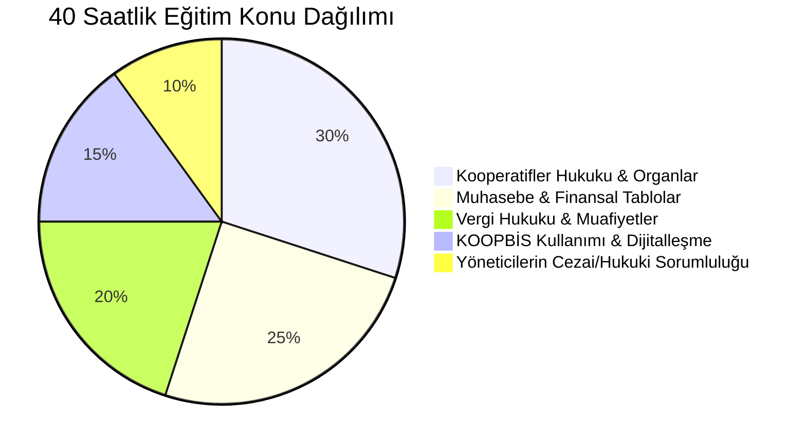

# Zorunlu Kooperatifçilik Eğitimi Rehberi (40 Saat)

  
Zorunlu Kooperatifçilik Eğitimi

  <table>
    <tr><th>Yasal Dayanak</th><td>1163 Sayılı Kanun & Yönetmelik 39278</td></tr>
    <tr><th>Asgari Eğitim Süresi</th><td>40 Ders Saati</td></tr>
    <tr><th>Kapsam</th><td>Yönetim ve Denetim Kurulu Üyeleri</td></tr>
    <tr><th>Yetkili Kurumlar</th><td>Bakanlıkça Yetkilendirilen Üniversiteler ve Kuruluşlar</td></tr>
    <tr><th>Yaptırım</th><td>Üyeliğin Kanun Gereği Kendiliğinden Düşmesi</td></tr>
    <tr><th>Sistem Kaydı</th><td>KOOPBİS Portalına Belge Yükleme</td></tr>
  </table>

**Zorunlu Kooperatifçilik Eğitimi**, 7339 sayılı Kanun ve 39278 sayılı Kooperatifçilik Eğitimi Yönetmeliği uyarınca; kooperatiflerin ve üst kuruluşlarının yönetim ve denetim kurullarında görev alan kişilerin yönetsel, hukuki ve mali yetkinliklerini artırmak amacıyla başarıyla tamamlamaları kanunen mecburi kılınan 40 ders saatlik akredite eğitim programıdır.

---

## İçindekiler
1. [Yasal Çerçeve ve Getirilme Gerekçesi](#1-yasal-çerçeve-ve-getirilme-gerekçesi)
2. [Eğitim Yükümlüsü Olan Kişiler ve Muafiyet Koşulları](#2-eğitim-yükümlüsü-olan-kişiler-ve-muafiyet-koşulları)
3. [40 Ders Saatlik Eğitim Müfredatı](#3-40-ders-saatlik-eğitim-müfredatı)
4. [Yetkili Eğitim Sağlayıcıları ve Akreditasyon](#4-yetkili-eğitim-sağlayıcıları-ve-akreditasyon)
5. [KOOPBİS Entegrasyonu ve Görevin Düşmesi Hükmü](#5-koopbis-entegrasyonu-ve-görevin-düşmesi-hükmü)
6. [Kaynakça ve Notlar](#6-kaynakça-ve-notlar)

---

## 1. Yasal Çerçeve ve Getirilme Gerekçesi

Geçmiş dönemlerde kooperatif organlarına seçilen yöneticilerin mevzuat, muhasebe ve vergi kurallarını yeterince bilmemesi nedeniyle oluşan suistimalleri, idari para cezalarını ve iflasları önlemek amacıyla 2021 yılında zorunlu eğitim kuralı ihdas edilmiştir.

---

## 2. Eğitim Yükümlüsü Olan Kişiler ve Muafiyet Koşulları

* **Yükümlüler:** 1163 sayılı Kooperatifler Kanunu, 1581 sayılı Tarım Kredi Kooperatifleri Kanunu ve 4572 sayılı Tarım Satış Kooperatifleri Kanunu kapsamındaki kooperatif ve birliklerin yönetim ve denetim kurulu **asıl ve yedek üyeleri**.
* **Muafiyet Şartları:**
  * Üniversitelerin Hukuk, İktisat, İşletme, Maliye ve Kooperatifçilik lisans programlarından mezun olanlar,
  * SMMM ve YMM unvanına sahip olanlar,
  * Belirli süre kamuda kooperatif denetçisi/müfettişi olarak görev yapmış olanlar eğitim programından muaftır; ancak muafiyet belgelerini KOOPBİS'e ibraz etmekle yükümlüdürler.

---

## 3. 40 Ders Saatlik Eğitim Müfredatı

Eğitim programı aşağıdaki temel modüllerden oluşur:
1. **Temel Kooperatifler Hukuku (12 Saat):** 1163 SK, ortaklık hakları, genel kurul usulü, anasözleşme değişiklikleri.
2. **Finans ve Muhasebe (10 Saat):** Bilanço okuma, gelir-gider farkı hesapları, yedek akçeler ve fon yönetimi.
3. **Mali Mevzuat ve Vergilendirme (8 Saat):** 5520 SK m. 4/1-k şartları, risturn muhasebesi, KDV istisnaları.
4. **KOOPBİS Uygulaması (6 Saat):** Sisteme veri girişi, hazirun yükleme, ortak kayıt yönetimi.
5. **Yöneticilerin Hukuki ve Cezai Sorumluluğu (4 Saat):** Türk Ceza Kanunu m. 62 kamu görevlisi statüsü, tazminat davaları ve bağdaşmayan görevler.

---

## 4. Yetkili Eğitim Sağlayıcıları ve Akreditasyon

Eğitimler yalnızca Ticaret Bakanlığı tarafından onaylanan ve akredite edilen kurumlarca verilebilir:
* Üniversitelerin Sürekli Eğitim Merkezleri (SEM),
* Türkiye Odalar ve Borsalar Birliği (TOBB),
* Türkiye Esnaf ve Sanatkârları Konfederasyonu (TESK),
* Türkiye Milli Kooperatifler Birliği ve yetkili üst birlikler.

---

## 5. KOOPBİS Entegrasyonu ve Görevin Düşmesi Hükmü

* **Süre Kuralı:** Seçilen veya atanan üyeler, göreve başladıkları tarihi izleyen yasal süre içerisinde eğitim belgesini tamamlayıp **KOOPBİS sistemine** yüklemek zorundadır.
* **Görevin Kendiliğinden Düşmesi (İnfalik):** Eğitimi süresi içinde tamamlamayan veya geçerli belgesini sisteme işletmeyen yönetim ve denetim kurulu üyelerinin **görevleri kanun gereği kendiliğinden sona erer**.
* Görevi düşen üyelerin imza yetkileri ticaret sicilinden re'sen silinir; yerlerine sıradaki yedek üyeler davet edilir.

---

## 6. Kaynakça ve Notlar
1. 39278 Sayılı Kooperatifçilik Eğitimi Yönetmeliği, Resmî Gazete.
2. Ticaret Bakanlığı Esnaf, Sanatkârlar ve Kooperatifçilik Genel Müdürlüğü Eğitim Rehberi.
3. Danıştay 10. Dairesi'nin Kooperatif Yöneticiliği Yeterlilik Kararları.

---
*Ayrıca bakınız:* [[15_koopbis_uygulama_rehberi]], [[06_yonetim_denetim_ve_dijitallesme_koopbis]], [[02_1163_sayili_kooperatifler_kanunu]]
