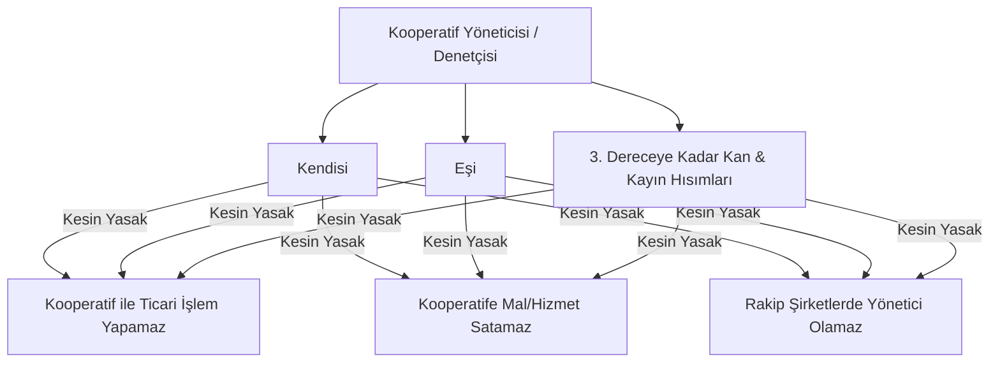

# Dış Denetim ve Bağımsız Denetim Standartları

  
Kooperatiflerde Dış Denetim

  <table>
    <tr><th>Temel Kanun Maddesi</th><td>1163 Sayılı Kanun Madde 69</td></tr>
    <tr><th>Uygulama Yönetmeliği</th><td>Kooperatif ve Üst Kuruluşlarının Denetimine Dair Yönetmelik</td></tr>
    <tr><th>Resmî Gazete</th><td>1 Şubat 2022 / Sayı: 31737 (Mevzuat No: 39331)</td></tr>
    <tr><th>Büyük Ölçekli Denetim</th><td>6434 Sayılı Cumhurbaşkanı Kararı (KGK)</td></tr>
    <tr><th>Denetim Yetkilileri</th><td>Bağımsız Denetçiler, SMMM/YMM, Yetkili Birlikler</td></tr>
    <tr><th>Çıkar Çatışması Yasağı</th><td>Tebliğ No: TGM-2011/01 (15071 Sayılı Tebliğ)</td></tr>
    <tr><th>Genel Kurul Şartı</th><td>Rapor Olmaksızın İbra Edilememe (Butlan)</td></tr>
  </table>

**Kooperatiflerde dış denetim ve bağımsız denetim**, 1163 sayılı Kooperatifler Kanunu'nun 69. maddesi ve 1 Şubat 2022 tarihli ve 31737 sayılı Resmî Gazete'de yayımlanan Yönetmelik ile hayata geçirilen; kooperatiflerin finansal tablolarının, gelir-gider hesaplarının ve yönetim kurulu faaliyetlerinin tarafsız, mesleki unvan sahibi bağımsız denetçiler, SMMM/YMM meslek mensupları veya akredite üst kuruluşlar tarafından incelenmesini zorunlu kılan kurumsal denetim rejimidir.

---

## İçindekiler
1. [Geleneksel İç Denetimden Dış Denetime Geçiş](#1-geleneksel-iç-denetimden-dış-denetime-geçiş)
2. [Dış Denetim Kapsamına Girme Eşikleri ve Kriterler](#2-dış-denetim-kapsamına-girme-eşikleri-ve-kriterler)
3. [Dış Denetçilerin Nitelikleri ve Yetkilendirilmiş Birlikler](#3-dış-denetçilerin-nitelikleri-ve-yetkilendirilmiş-birlikler)
4. [Kamu Gözetimi Kurumu (KGK) Bağımsız Denetimi (CBK 6434)](#4-kamu-gözetimi-kurumu-kgk-bağımsız-denetimi-cbk-6434)
5. [Bağdaşmayan Görevler ve Akrabalık Yasakları (Tebliğ 15071)](#5-bağdaşmayan-görevler-ve-akrabalık-yasakları-tebliğ-15071)
6. [Genel Kurul İbra Sürecinde Dış Denetim Raporunun Rolü](#6-genel-kurul-ibra-sürecinde-dış-denetim-raporunun-rolü)
7. [Kaynakça ve Notlar](#7-kaynakça-ve-notlar)

---

## 1. Geleneksel İç Denetimden Dış Denetime Geçiş

7339 sayılı Kanun öncesinde kooperatiflerde denetim faaliyeti, yalnızca genel kurul tarafından ortaklar arasından seçilen ve çoğunlukla muhasebe uzmanlığı bulunmayan amatör denetçiler eliyle yürütülmekteydi. 

Bu durum mali suiistimallerin zamanında tespit edilememesine yol açtığından, Kanun’un 69. maddesi yeniden düzenlenmiş ve **profesyonel dış denetim** yasal zorunluluk haline getirilmiştir.

---

## 2. Dış Denetim Kapsamına Girme Eşikleri ve Kriterler

Yönetmeliğin 15. maddesi uyarınca, aşağıdaki şartlardan **herhangi birini sağlayan faal kooperatifler doğrudan dış denetime tabidir**:

1. **Faaliyet Konusuna Göre Doğrudan Kapsamda Olanlar:**
   * Tarım satış, tarım kredi, esnaf ve sanatkârlar kredi ve kefalet (ESKKK) ile pancar ekicileri kooperatifleri.
2. **Yapı ve Gayrimenkul Sektörü:**
   * Yapı ruhsatı alınmış ve ortak sayısı **100 veya daha fazla** olan yapı, turizm geliştirme ve gayrimenkul işletme kooperatifleri.
3. **Ciro Kriteri:**
   * Faaliyet konusuna bakılmaksızın yıllık net satış hasılatı **100 Milyon Türk Lirası ve üstü** olan kooperatifler *(Ticaret Bakanlığı güncel eşiği)*.
4. **Ortak Sayısı Kriteri:**
   * Faaliyet konusuna bakılmaksızın **2.000 ve daha fazla ortağı** bulunan kooperatifler.

> 💡 **Kritik Hukuki Not:** Kooperatif dış denetiminde TTK'daki sermaye şirketleri için uygulanan "üç ölçütten en az ikisi" veya "aktif büyüklüğü" kuralı aranmaz. Yukarıda sayılan ölçütlerden yalnızca birinin gerçekleşmesi dış denetim zorunluluğunun doğması için yeterlidir.

---

## 3. Dış Denetçilerin Nitelikleri ve Yetkilendirilmiş Birlikler

Dış denetim yalnızca şu yetkili kişi ve kurumlarca icra edilebilir:
* 660 sayılı KHK kapsamında Kamu Gözetimi Kurumu’nca (KGK) yetkilendirilmiş **Bağımsız Denetçiler**,
* 3568 sayılı Kanun’a göre ruhsat almış **Yeminli Mali Müşavirler (YMM)** ve **Serbest Muhasebeci Mali Müşavirler (SMMM)**,
* Ticaret Bakanlığı veya Tarım ve Orman Bakanlığı tarafından denetim yetkisi verilen **Kooperatif Birlikleri ve Merkez Birlikleri**.

---

## 4. Kamu Gözetimi Kurumu (KGK) Bağımsız Denetimi (CBK 6434)

6434 sayılı Cumhurbaşkanı Kararı (Bağımsız Denetime Tabi Şirketlerin Belirlenmesine Dair Karar) kapsamında belirlenen ulusal eşikleri aşan büyük ölçekli kooperatifler, üst birlikler ve tarım satış birlikleri Türkiye Muhasebe Standartları (TMS/TFRS) çerçevesinde **tam bağımsız denetime** tabi tutulur.

---

## 5. Bağdaşmayan Görevler ve Akrabalık Yasakları (Tebliğ 15071)

Kooperatiflerde çıkar çatışmasını ve nepotizmi önlemek amacıyla **Tebliğ No: TGM-2011/01 (15071 Sayılı Tebliğ)** ile ağır yasaklar getirilmiştir:

* Yönetim ve denetim kurulu üyeleri; kendileri, eşleri ve üçüncü dereceye kadar (bu derece dahil) kan ve kayın hısımlarıyla kooperatif arasında doğrudan veya dolaylı ticari sözleşme yapamazlar.
* Bu yasağa aykırı davranan üyelerin işlemleri hükümsüzdür ve haksız kazançlar kooperatife iade ettirilir.

---

## 6. Genel Kurul İbra Sürecinde Dış Denetim Raporunun Rolü

* Dış denetime tabi kooperatiflerde denetim raporu genel kurul toplantı tarihinden en az **20 gün önce** kooperatif merkezinde ve **KOOPBİS sisteminde** ortakların incelemesine sunulmalıdır.
* Dış denetim raporu genel kurula okunmadan ve müzakere edilmeden yönetim ve denetim kurullarının ibrası hususunda oylama yapılamaz. Bu kurala aykırı alınan ibra kararları **yok hükmündedir**.

---

## 7. Kaynakça ve Notlar
1. 1163 Sayılı Kooperatifler Kanunu Madde 69 Metni.
2. 39331 Sayılı Kooperatif ve Üst Kuruluşlarının Denetimine Dair Yönetmelik.
3. 6434 Sayılı Cumhurbaşkanı Kararı (Bağımsız Denetime Tabi Şirketler).
4. Tebliğ No: TGM-2011/01 (Bağdaşmayan Görevler Hakkında Tebliğ).

---
*Ayrıca bakınız:* [[06_yonetim_denetim_ve_dijitallesme_koopbis]], [[15_koopbis_uygulama_rehberi]], [[05_kooperatif_mali_ve_vergi_hukuku]]
