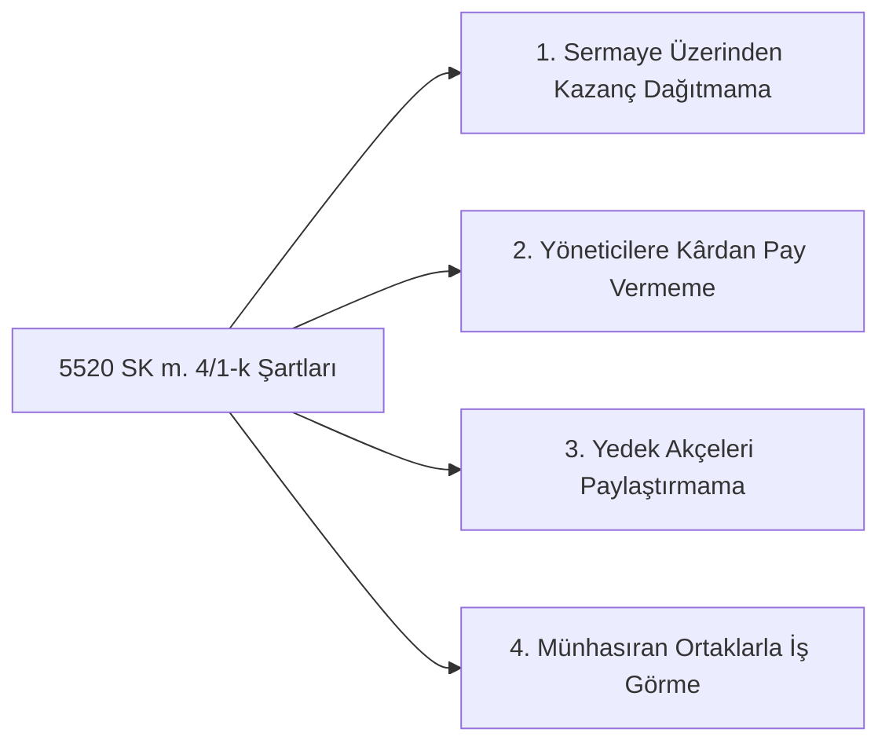

# Kurumlar Vergisi Muafiyeti ve Risturn Müessesesi

  
Kooperatif Vergi Muafiyeti & Risturn

  <table>
    <tr><th>Temel Yasa</th><td>5520 Sayılı Kurumlar Vergisi Kanunu</td></tr>
    <tr><th>Muafiyet Maddesi</th><td>Madde 4, Fıkra 1, Bent (k)</td></tr>
    <tr><th>Gelir Vergisi Dayanağı</th><td>193 Sayılı GVK Madde 75/2 (Risturn)</td></tr>
    <tr><th>Esnetme Yasası</th><td>6327 Sayılı Kanun (İktisadi İşletme Ayrımı)</td></tr>
    <tr><th>Ana İlke</th><td>Münhasıran Ortaklarla İş Görme</td></tr>
    <tr><th>Denetim Mercii</th><td>T.C. Hazine ve Maliye Bakanlığı / GİB</td></tr>
  </table>

**Kooperatiflerde kurumlar vergisi muafiyeti ve risturn müessesesi**, kooperatiflerin kâr dağıtma amacı taşımayan, ortaklarının ekonomik çıkarlarını karşılıklı dayanışma ile koruyan yapılarını vergilendirme rejiminde koruma altına alan, Türk mali hukukunun en temel ve teknik düzenleme alanlarından biridir.

---

## İçindekiler
1. [Hukuki Dayanak ve Kurumlar Vergisi Genel Kuralı](#1-hukuki-dayanak-ve-kurumlar-vergisi-genel-kuralı)
2. [Kurumlar Vergisi Muafiyetinin Dört Altın Şartı](#2-kurumlar-vergisi-muafiyetinin-dört-altın-şartı)
3. [Risturn Kavramı ve Kâr Payından Hukuki Ayrımı](#3-risturn-kavramı-ve-kâr-payından-hukuki-ayrımı)
4. [6327 Sayılı Kanun ve İktisadi İşletme Rejimi](#4-6327-sayılı-kanun-ve-iktisadi-işletme-rejimi)
5. [Danıştay ve Maliye Uygulamasında Emsal Kriterler](#5-danıştay-ve-maliye-uygulamasında-emsal-kriterler)
6. [Kaynakça ve Notlar](#6-kaynakça-ve-notlar)

---

## 1. Hukuki Dayanak ve Kurumlar Vergisi Genel Kuralı

5520 sayılı Kurumlar Vergisi Kanunu’nun 2. maddesi gereğince kooperatifler **tüzel kişilikleri itibarıyla ticaret şirketi sayıldıklarından kural olarak kurumlar vergisi mükellefidir**. 

Ancak aynı Kanun’un 4. maddesinin 1. fıkrasının (k) bendi ile anasözleşmesinde ve fiili icraatında belirli şartları eksiksiz taşıyan kooperatifler kurumlar vergisinden muaf tutulmuştur.

---

## 2. Kurumlar Vergisi Muafiyetinin Dört Altın Şartı

Bir kooperatifin muafiyet statüsünü koruyabilmesi için aşağıdaki dört şartın tamamını bir arada taşıması zorunludur:

1. **Sermaye Üzerinden Kazanç Dağıtılmaması:** Ortakların koydukları sermaye paylarına faiz veya temettü ödenemez.
2. **Yönetim ve Denetim Kurullarına Pay Verilmemesi:** Organ üyelerine dönem net kazancından hisse, prim veya kâr payı aktarılması yasaktır.
3. **Yedek Akçelerin Ortaklara Dağıtılmaması:** Kooperatif bünyesinde biriken ihtiyat akçeleri ve yasal fonlar tasfiye halinde dahi ortaklara intikal ettirilemez.
4. **Münhasıran Ortaklarla İş Görülmesi (Ortak Dışı İşlem Yasağı):** Kooperatif faaliyetlerini yalnızca kendi ortakları ile yürütmelidir.

---

## 3. Risturn Kavramı ve Kâr Payından Hukuki Ayrımı

* **Tanım:** Risturn; ortakların kooperatifle yıl boyunca gerçekleştirdikleri alış, satış veya hizmet işlemlerinin hacmi oranında dönem sonunda hesaplanan ve ortaklara iade edilen **müsbet gelir-gider farkıdır**.
* **Hukuki Mahiyeti (GVK Madde 75/2):**
  > Risturn sermayenin getirisi olan bir kâr payı veya temettü değildir; ortak adına peşin ödenen masrafların düzeltilmesi niteliğinde bir **"fiyat intibakı / harcama iadesi"**dir.
* Münhasıran ortaklarla yapılan muamelelerden doğan risturnların dağıtılması kurumlar vergisi muafiyetini bozmaz ve stopaja tabi tutulmaz.

---

## 4. 6327 Sayılı Kanun ve İktisadi İşletme Rejimi

6327 sayılı Kanun ile yapılan tarihi reformdan önce, kooperatifin tek bir ortak dışı fatura kesmesi dahi tüm tüzel kişiliğin vergi muafiyetini tamamen kaybetmesine yol açmaktaydı.
* **Güncel Rejim:** Ortak dışı işlemler gerçekleştiren kooperatifler, bu faaliyetleri için kooperatife bağlı bir **"İktisadi İşletme"** tescil ettirirler.
* Yalnızca bu iktisadi işletme kurumlar vergisi mükellefi olur ve ortak dışı kârı üzerinden vergilendirilir; kooperatifin ortak içi ana faaliyetlerinin muafiyeti devam eder.

---

## 5. Danıştay ve Maliye Uygulamasında Emsal Kriterler

* **Danıştay İçtihadı:** Kooperatifin atıl paralarını banka mevduatında değerlendirmesi veya devlet tahvili alması ortak dışı işlem sayılmaz; ancak üçüncü kişilere yüksek faizle borç para verilmesi tefecilik ve muafiyetin kaybı sonucunu doğurur.
* **Kira Gelirleri:** Kooperatife ait bir gayrimenkulün üçüncü şahıslara kiraya verilmesi durumunda, kira geliri iktisadi işletme bünyesinde kurumlar vergisine tabi tutulur.

---

## 6. Kaynakça ve Notlar
1. 5520 Sayılı Kurumlar Vergisi Kanunu Madde 4 Metni ve 1 Seri No.lu Genel Tebliği.
2. 193 Sayılı Gelir Vergisi Kanunu Madde 75/2.
3. Danıştay Vergi Dava Daireleri Kurulu E. 2021/892, K. 2022/341 Sayılı Kararı.
4. Gelir İdaresi Başkanlığı, *Kooperatiflerde Risturn Uygulamaları Sirküleri*.

---
*Ayrıca bakınız:* [[05_kooperatif_mali_ve_vergi_hukuku]], [[02_1163_sayili_kooperatifler_kanunu]], [[04_tarim_disi_kooperatifler]]
