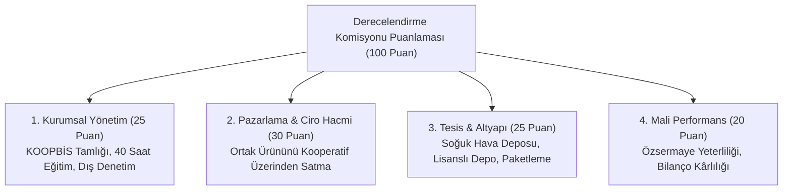

# Tarımsal Amaçlı Örgütlerin Derecelendirilmesi ve Destekler

  
Tarımsal Derecelendirme

  <table>
    <tr><th>Yasal Dayanak</th><td>5488 Sayılı Tarım Kanunu</td></tr>
    <tr><th>Uygulama Yönetmeliği</th><td>40451 Sayılı Derecelendirme Yönetmeliği</td></tr>
    <tr><th>Zorunlu Ön Şart</th><td>Vergi ve SGK Borcu Bulunmama</td></tr>
    <tr><th>Derece Sınıfları</th><td>A Sınıfı, B Sınıfı, C Sınıfı</td></tr>
    <tr><th>Temel Teşvik</th><td>Tarımsal Desteklerde İlave Katsayı & Hibe Puanı</td></tr>
    <tr><th>Yetkili İdare</th><td>Tarım ve Orman Bakanlığı Tarım Reformu GM</td></tr>
  </table>

**Tarımsal amaçlı örgütlerin derecelendirilmesi**, Tarım ve Orman Bakanlığı tarafından yürürlüğe konulan 40451 sayılı Yönetmelik kapsamında; 1163 sayılı Kanun’a tabi tarımsal kooperatifler ile birliklerin kurumsal, mali, operasyonel ve pazarlama kabiliyetlerine göre puanlanarak **A, B ve C sınıfı** olarak belgelendirilmesini ve devlet desteklerinden kademeli olarak yararlandırılmasını sağlayan sistemdir.

---

## İçindekiler
1. [Yasal Çerçeve ve Kurulma Amacı](#1-yasal-çerçeve-ve-kurulma-amacı)
2. [Başvuru Ön Koşulu: Borçsuzluk Şartı](#2-başvuru-ön-koşulu-borçsuzluk-şartı)
3. [Puanlama Kriterleri ve Değerlendirme Alanları](#3-puanlama-kriterleri-ve-değerlendirme-alanları)
4. [Derece Grupları ve Sağlanan Somut Ayrıcalıklar](#4-derece-grupları-ve-sağlanan-somut-ayrıcalıklar)
5. [Kırsal Kalkınma (KKYDP) Projelerinde İlave Puanlama](#5-kırsal-kalkınma-kkydp-projelerinde-ilave-puanlama)
6. [Kaynakça ve Notlar](#6-kaynakça-ve-notlar)

---

## 1. Yasal Çerçeve ve Kurulma Amacı

5488 sayılı Tarım Kanunu ve **40451 sayılı Yönetmelik** ile; etkin çalışan, ortaklarının ürününü piyasaya değerinde sunan, şeffaf ve denetlenen tarımsal kooperatifler ile atıl kalan kooperatiflerin ayrıştırılması ve kamu kaynaklarının verimli örgütlere tahsis edilmesi amaçlanmıştır.

---

## 2. Başvuru Ön Koşulu: Borçsuzluk Şartı

Yönetmelik 40451’in 6. maddesi uyarınca derecelendirme başvurusu yapacak kooperatifin:
* Vergi dairelerine vadesi geçmiş vergi borcunun bulunmaması,
* Sosyal Güvenlik Kurumu'na (SGK) prim ve idari para cezası borcunun bulunmaması şarttır. Borcu bulunan veya yapılandırmasını bozan kooperatiflerin başvuruları komisyonca doğrudan reddedilir.

---

## 3. Puanlama Kriterleri ve Değerlendirme Alanları

1. **Kurumsal Kapasite:** Genel kurul kararlarının KOOPBİS’e aktarımı, dış denetimden geçmiş olma ve yönetim kurulu üyelerinin eğitim belgeleri.
2. **Pazarlama Gücü:** Ortakların ürettiği süt, et, meyve veya hububatın ne kadarının kooperatif tüzel kişiliği üzerinden satıldığı.
3. **Fiziki Altyapı:** Mülkiyeti kooperatife ait süt toplama tankı, selektör binası, soğuk hava deposu veya lisanslı depo varlığı.

---

## 4. Derece Grupları ve Sağlanan Somut Ayrıcalıklar

* **A Grubu (Birinci Derece Tarımsal Örgüt):** 80 ve üzeri puan alan kooperatifler.
  * Çiğ süt ve hayvancılık destekleme ödemelerinde **azami örgütlülük prim katsayısı** uygulanır.
  * Ziraat Bankası ve TKK düşük faizli yatırım ve işletme kredilerinde öncelik sağlanır.
* **B Grubu (İkinci Derece Tarımsal Örgüt):** 60 - 79 puan arası alan kooperatifler. Standart teşviklerin üzerinde ilave destek katsayısı kazanırlar.
* **C Grubu (Üçüncü Derece Tarımsal Örgüt):** 40 - 59 puan alan temel kooperatifler.

---

## 5. Kırsal Kalkınma (KKYDP) Projelerinde İlave Puanlama

Tarım ve Orman Bakanlığı'nın Kırsal Kalkınma Yatırımlarının Desteklenmesi Programı (Tebliğ 2026/9 ve 2026/10) kapsamında:
* A sınıfı derece belgesine sahip kooperatiflerin hibe projelerine değerlendirmede **ilave 10 puan**,
* B sınıfı kooperatiflere ise **ilave 5 puan** verilerek devlet hibelerinden faydalanmaları önceliklendirilir.

---

## 6. Kaynakça ve Notlar
1. 40451 Sayılı Tarımsal Amaçlı Örgütlerin Derecelendirilmesine İlişkin Yönetmelik, Resmî Gazete.
2. 5488 Sayılı Tarım Kanunu Madde 12 ve 15 Hükümleri.
3. Tarım Reformu Genel Müdürlüğü Derecelendirme Kılavuzu, 2024.

---
*Ayrıca bakınız:* [[03_tarim_kooperatifleri_ve_birlikleri]], [[10_1581_tarim_kredi_kooperatifleri]], [[08_mevzuat_kulliyati_ve_dizin]]
