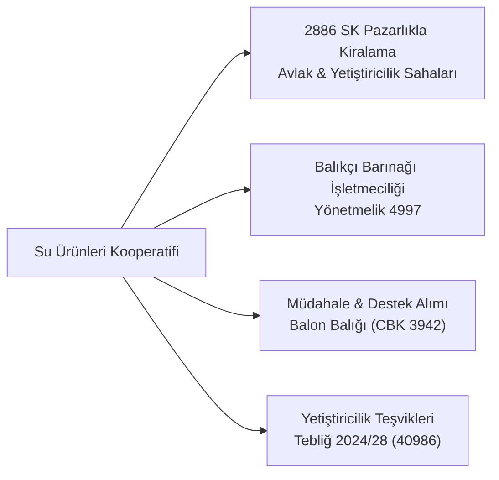

# Sulama, Su Ürünleri ve ORKÖY Kooperatifleri

  
Özel İhtisas Kooperatifleri

  <table>
    <tr><th>Kapsanan Türler</th><td>Sulama, Su Ürünleri, Orman Köyleri (ORKÖY)</td></tr>
    <tr><th>Temel Kanunlar</th><td>6172 SK, 6200 SK, 1380 SK, 6831 SK</td></tr>
    <tr><th>İhale Ayrıcalığı</th><td>2886 SK (Pazarlık) & 4734 SK (İstisna m. 3)</td></tr>
    <tr><th>Özel Haklar</th><td>DSİ Tesis Devri, Barınak Kiralama, Orman İşletme Önceliği</td></tr>
    <tr><th>Yetkili Bakanlık</th><td>T.C. Tarım ve Orman Bakanlığı</td></tr>
  </table>

**Sulama, Su Ürünleri ve Orman Köyleri (ORKÖY) Kooperatifleri**, doğal kaynakların korunması, sürdürülebilir işletilmesi ve yerel halkın refahının temini amacıyla kamu otoriteleri tarafından özel imtiyazlarla donatılmış ihtisas kooperatifleridir.

---

## İçindekiler
1. [Sulama Kooperatifleri (6172 ve 6200 Sayılı Kanunlar)](#1-sulama-kooperatifleri-6172-ve-6200-sayılı-kanunlar)
2. [Su Ürünleri Kooperatifleri (1380 Sayılı Kanun)](#2-su-ürünleri-kooperatifleri-1380-sayılı-kanun)
3. [Orman Köyleri Kalkındırma Kooperatifleri (ORKÖY - 6831 SK)](#3-orman-köyleri-kalkındırma-kooperatifleri-orköy---6831-sk)
4. [Karşılaştırmalı Yasal Haklar ve İhale Ayrıcalıkları](#4-karşılaştırmalı-yasal-haklar-ve-ihale-ayrıcalıkları)
5. [Kaynakça ve Notlar](#5-kaynakça-ve-notlar)

---

## 1. Sulama Kooperatifleri (6172 ve 6200 Sayılı Kanunlar)

Sulama kooperatifleri, tarımsal sulama alanlarında su kaynaklarının verimli dağıtımı ve sulama şebekelerinin ortak yönetimi amacıyla kurulur:
* **Su Kullanıcı Teşkilatı Statüsü (6172 SK):** Sulama alanlarında su dağıtım planlamasını yapar ve su kullanıcı birlikleriyle koordineli çalışır.
* **DSİ Tesislerinin Devri (6200 SK Madde 2):** Devlet Su İşleri (DSİ) tarafından inşa edilen baraj, regülatör, pompa istasyonu ve kapalı borulu sulama şebekesi tesisleri protokol ile doğrudan sulama kooperatiflerine işletilmek üzere devredilebilir (Yönetmelik 15239).
* **Havza ve Su Yönetimi Temsiliyeti (Yönetmelik 40929 & 34021):** Bölgesel su kurullarında ve su tahsis komisyonlarında sulama kooperatifleri temsilci bulundurur.

---

## 2. Su Ürünleri Kooperatifleri (1380 Sayılı Kanun)

Deniz ve içsularda avcılık ve yetiştiricilik yapan balıkçıların haklarını korumak amacıyla kurulan teşekküllerdir:

* **Devlet İhale Kanunu İstisnası (2886 SK):** Avlak sahaları ve su ürünleri üretim alanları, genel açık ihaleye çıkarılmaksızın öncelikle su ürünleri kooperatiflerine **pazarlık usulüyle** kiralanır.
* **Balıkçı Barınakları (Yönetmelik 4997):** Kıyı ve limanlardaki balıkçı barınaklarının bakım, çekek yeri ve palamar hizmetleri kooperatif tüzel kişiliğine devredilir.
* **Özel Teşvikler:** İstilacı türlerle mücadele kapsamında yürütülen balon balığı kuyruk primi ödemeleri (CBK 3942) kooperatif kayıtları üzerinden onaylanır.

---

## 3. Orman Köyleri Kalkındırma Kooperatifleri (ORKÖY - 6831 SK)

Orman köylüsünün yerinde kalkınmasını ve orman tahribatının önlenmesini hedefleyen özel amaçlı kooperatiflerdir:
* **Orman İşletme Önceliği (6831 SK Madde 34 & 40):** Orman Genel Müdürlüğü (OGM) tarafından yapılan üretim, bakım, kesim, tomruk taşıma, istifleme ve ağaçlandırma işleri, ihaleye çıkılmaksızın öncelikle o yöredeki orman köyleri kalkındırma kooperatiflerine pazarlık suretiyle verilir (Yönetmelik 38740).
* **Kamu İhale Kanunu İstisnası (4734 SK Madde 3):** Kamu kurumları, orman köyleri kalkındırma kooperatiflerinden yakacak odun ve orman emvali ihtiyaçlarını doğrudan ihalesiz olarak temin edebilirler.
* **ORKÖY Kredileri ve Hibeleri (Yönetmelik 16226):** Orman köylülerine güneş enerjisi, süt sığırcılığı ve seracılık gibi konularda faizsiz mikro krediler ve hibe aktarılır.

---

## 4. Karşılaştırmalı Yasal Haklar ve İhale Ayrıcalıkları

| Kooperatif Türü | İlgili Kanun | Temel İhale / Kiralama Ayrıcalığı | Kamu Kurum Muhatabı |
| :--- | :--- | :--- | :--- |
| **Sulama Kooperatifi** | 6172 SK, 6200 SK | DSİ sulama şebekesi tesislerinin bedelsiz/protokollü devri | Devlet Su İşleri (DSİ) |
| **Su Ürünleri Kooperatifi** | 1380 SK, 2886 SK | Avlak sahaları ve balıkçı barınaklarının pazarlıkla kiralanması | Balıkçılık ve Su Ürünleri GM |
| **Orman Köyleri (ORKÖY)** | 6831 SK, 4734 SK m. 3 | Kesim/taşıma işlerinde yasal öncelik, Kamu İhale Kanunu istisnası | Orman Genel Müdürlüğü (OGM) |

---

## 5. Kaynakça ve Notlar
1. 6172 Sayılı Sulama Birlikleri Kanunu ve 6200 Sayılı DSİ Kanunu.
2. 1380 Sayılı Su Ürünleri Kanunu ve 2886 Sayılı Devlet İhale Kanunu.
3. 6831 Sayılı Orman Kanunu Madde 34 ve 40 Metinleri.
4. 4734 Sayılı Kamu İhale Kanunu Madde 3 İstisnalar Listesi.

---
*Ayrıca bakınız:* [[03_tarim_kooperatifleri_ve_birlikleri]], [[19_tarimsal_derecelendirme_ve_destekler]], [[08_mevzuat_kulliyati_ve_dizin]]
