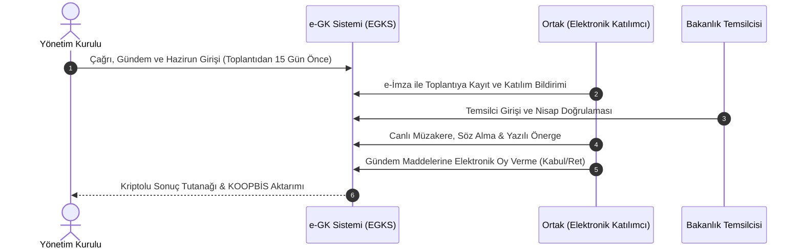

# Elektronik Genel Kurul (e-GK) ve Toplantı Usulleri Rehberi

  
Elektronik Genel Kurul (e-GK)

  <table>
    <tr><th>Temel Yasa</th><td>1163 Sayılı Kooperatifler Kanunu</td></tr>
    <tr><th>Uygulama Yönetmeliği</th><td>39279 Sayılı e-Genel Kurul Yönetmeliği</td></tr>
    <tr><th>Temsilci Yönetmeliği</th><td>39277 Sayılı Bakanlık Temsilcisi Yönetmeliği</td></tr>
    <tr><th>Erişim Yöntemi</th><td>Güvenli Elektronik İmza / İki Faktörlü Doğrulama</td></tr>
    <tr><th>Genel Kurul Birleştirme</th><td>24043 Sayılı Tebliğ (Azami 2 Dönem)</td></tr>
    <tr><th>Yetkili İdare</th><td>Ticaret Bakanlığı / MKK Altyapısı</td></tr>
  </table>

**Kooperatiflerde Elektronik Genel Kurul (e-GK)**; 39279 sayılı Yönetmelik uyarınca ortakların kooperatif genel kurul toplantılarına fiziki olarak salonda bulunmaksızın, güvenli elektronik imza veya iki faktörlü kimlik doğrulama ile uzaktan katılmalarına, müzakereleri canlı izlemelerine, yazılı/sesli görüş bildirmelerine ve anlık güvenli elektronik oy kullanmalarına imkân tanıyan dijital genel kurul sistemidir.

---

## İçindekiler
1. [Yasal Dayanak ve Uygulama Alanı](#1-yasal-dayanak-ve-uygulama-alanı)
2. [Sistem Altyapısı ve Güvenlik Standartları](#2-sistem-altyapısı-ve-güvenlik-standartları)
3. [Kronolojik Toplantı Aşamaları (5 Adım)](#3-kronolojik-toplantı-aşamaları-5-adım)
4. [Bakanlık Temsilcisi Görevlendirilmesi (Yönetmelik 39277)](#4-bakanlık-temsilcisi-görevlendirilmesi-yönetmelik-39277)
5. [Genel Kurulların Birleştirilerek Yapılması (Tebliğ 24043)](#5-genel-kurulların-birleştirilerek-yapılması-tebliğ-24043)
6. [Kaynakça ve Notlar](#6-kaynakça-ve-notlar)

---

## 1. Yasal Dayanak ve Uygulama Alanı

1163 sayılı Kanun ve **39279 sayılı Yönetmelik** uyarınca, anasözleşmesinde hüküm bulunup bulunmadığına bakılmaksızın tüm birincil kooperatifler, birlikler, merkez birlikleri ve Türkiye Milli Kooperatifler Birliği genel kurullarını elektronik ortamda icra edebilir veya fiziki genel kurula eşzamanlı elektronik katılım sağlayabilir.

---

## 2. Sistem Altyapısı ve Güvenlik Standartları

* **Kimlik Doğrulama:** Ortakların ve temsilcilerinin sisteme girişi **5070 sayılı Elektronik İmza Kanunu** uyarınca nitelikli elektronik sertifika (e-İmza) veya e-Devlet iki aşamalı güvenlik protokolleri ile sağlanır.
* **Veri Bütünlüğü:** Toplantı esnasında kullanılan oylar, yapılan teklifler ve divan tutanakları zaman damgasıyla şifrelenir ve doğrudan **KOOPBİS** veri tabanına arşivlenir.

---

## 3. Kronolojik Toplantı Aşamaları (5 Adım)

1. **Ön Hazırlık:** Toplantı ilanı ve gündem maddeleri e-Genel Kurul Sistemi'ne (EGKS) yüklenir.
2. **Katılım Talebi:** Elektronik katılacak ortaklar toplantı saatinden önce sisteme bildirimde bulunur.
3. **Yoklama ve Nisap:** Fiziki salondaki hazirun ile EGKS üzerinden bağlanan ortaklar sistemce otomatik toplanarak toplantı yeter sayısı teyit edilir.
4. **Müzakere ve Görüş:** Ortaklar yazılı veya eşzamanlı sesli görüş bildirebilir; divan başkanı görüşleri okumak zorundadır.
5. **Oylama ve Tutanak:** Her gündem maddesi için butonlarla oy kullanılır. Oylama süresi bitiminde sonuçlar anında divana yansıtılır ve tutanak e-imzalanır.

---

## 4. Bakanlık Temsilcisi Görevlendirilmesi (Yönetmelik 39277)

* **Başvuru:** Genel kurul tarihinden en az **15 gün önce** ilgili Bakanlık İl Müdürlüğü'ne yazılı başvuru yapılır.
* **Toplantıya Katılım:** Bakanlık temsilcisi toplantının hem fiziki hem elektronik seyrini denetler. Temsilcisiz yapılan genel kurul kararları **yok hükmündedir (butlan)**.
* **Ücret:** Temsilci ücreti ilgili yönetmelik tarifesi uyarınca kooperatif bütçesinden karşılanır.

---

## 5. Genel Kurulların Birleştirilerek Yapılması (Tebliğ 24043)

Ekonomik zorunluluk, üye sayısının azlığı veya idari gereklilikler sebebiyle:
* 24043 sayılı Tebliğ uyarınca, üst üste **en fazla iki döneme (yıla)** ait olağan genel kurul toplantıları birleştirilerek tek seferde yapılabilir.
* Her iki dönemin bilanço ve gelir-gider hesapları toplantıda ayrı ayrı oylanır ve ibra edilir.

---

## 6. Kaynakça ve Notlar
1. 39279 Sayılı Kooperatiflerde Elektronik Ortamda Yapılacak Genel Kurullara İlişkin Yönetmelik.
2. 39277 Sayılı Bakanlık Temsilcisi Yönetmeliği.
3. 24043 Sayılı Olağan Genel Kurulların Birleştirilmesi Tebliği.
4. Yargıtay 11. Hukuk Dairesi Genel Kurul İptali Kararları (E. 2022/1154).

---
*Ayrıca bakınız:* [[06_yonetim_denetim_ve_dijitallesme_koopbis]], [[02_1163_sayili_kooperatifler_kanunu]], [[15_koopbis_uygulama_rehberi]]
