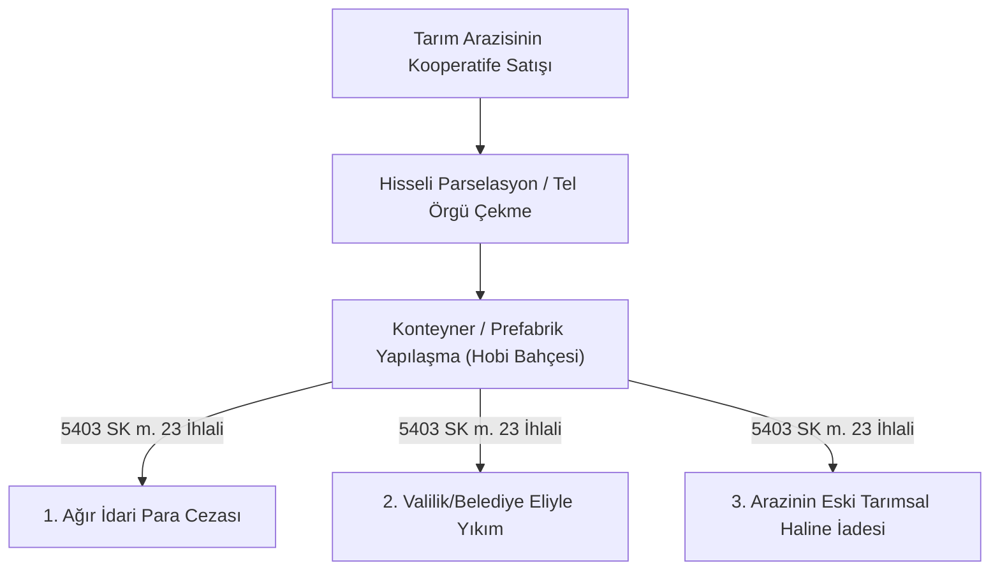

# Tarım Arazilerinde Hisseli Satış ve Hobi Bahçesi Kısıtlamaları

  
Tarım Arazilerinde Kooperatif Kısıtları

  <table>
    <tr><th>Temel Kanun</th><td>5403 Sayılı Toprak Koruma ve Arazi Kullanımı Kanunu</td></tr>
    <tr><th>Kritik Madde</th><td>5403 Sayılı Kanun Madde 20 ve 23</td></tr>
    <tr><th>Son Düzenleme</th><td>7584 Sayılı Kanun Değişiklikleri</td></tr>
    <tr><th>Yasak Fiil</th><td>Kooperatif Hissesiyle Tarım Arazisi Bölme & Hobi Bahçesi</td></tr>
    <tr><th>Yaptırım</th><td>Ağır İdari Para Cezası, Yıkım, Eski Hale Getirme</td></tr>
    <tr><th>Yetkili İdare</th><td>Tarım ve Orman Bakanlığı / Valilikler ve Belediyeler</td></tr>
  </table>

**Tarım arazilerinde hisseli satış ve hobi bahçesi kısıtlamaları**; 5403 sayılı Toprak Koruma ve Arazi Kullanımı Kanunu ile getirilen, verimli tarım arazilerinin kooperatif payı veya hisseli noter sözleşmeleri adı altında bölünmesini, parçalanmasını ve tarımsal vasfını yitirerek kaçak yapılaşmaya açılmasını yasaklayan katı kamu düzeni kurallarıdır.

---

## İçindekiler
1. [Yasal Arka Plan ve Kanuna Karşı Hile Girişimleri](#1-yasal-arka-plan-ve-kanuna-karşı-hile-girişimleri)
2. [5403 Sayılı Kanun Madde 23 ve 7584 Sayılı Kanun Reformu](#2-5403-sayılı-kanun-madde-23-ve-7584-sayılı-kanun-reformu)
3. [Kooperatif Hissesi Devrinin Hukuki Geçersizliği (Butlan)](#3-kooperatif-hissesi-devrinin-hukuki-geçersizliği-butlan)
4. [İdari Para Cezaları, Yıkım ve Eski Hale Getirme Prosedürü](#4-idari-para-cezaları-yıkım-ve-eski-hale-getirme-prosedürü)
5. [Kooperatif Yöneticilerinin Türk Ceza Kanunu Kapsamında Sorumluluğu](#5-kooperatif-yöneticilerinin-türk-ceza-kanunu-kapsamında-sorumluluğu)
6. [Kaynakça ve Notlar](#6-kaynakça-ve-notlar)

---

## 1. Yasal Arka Plan ve Kanuna Karşı Hile Girişimleri

Türkiye'de tarım arazilerinin bölünemez asgari tarımsal büyüklüklerin altına inmesini önlemek amacıyla tapuda hisseli satışlar yasaklanmıştır. 

Ancak bazı girişimciler bu yasağı dolanmak amacıyla gayrimenkul veya tarımsal işletme kooperatifleri kurmuş, tarım arazilerini kooperatif tüzel kişiliği üzerine satın alıp ardından binlerce küçük paya bölerek **"kooperatif ortaklık hissesi"** veya **"hobi bahçesi kullanım hakkı"** adı altında vatandaşlara satmaya başlamıştır.

---

## 2. 5403 Sayılı Kanun Madde 23 ve 7584 Sayılı Kanun Reformu

Kanun koyucu, tarımsal üretimi ve toprak bütünlüğünü tehdit eden bu uygulamayı durdurmak amacıyla 5403 sayılı Kanun'a emredici hükümler eklemiştir:

* **Açık Yasak:** Tarım arazileri kooperatifler veya diğer tüzel kişilikler aracılığıyla hisselere ayrılarak kullanım hakkı satışı veya özel parselasyon yapılamaz.
* **Tarımsal Bütünlük:** Arazinin etrafının çit, tel örgü veya duvarla bölünmesi, üzerine konteyner, karavan, prefabrik yapı konulması kanunen tarım arazisini tahrip edici eylem sayılır.

---

## 3. Kooperatif Hissesi Devrinin Hukuki Geçersizliği (Butlan)

* **Türk Borçlar Kanunu Madde 27:** Kanunun emredici hükümlerine aykırı sözleşmeler kesin olarak hükümsüzdür (mutlak butlan).
* Yargıtay'ın yerleşik içtihatlarına göre; kooperatif üyeliği üzerinden fiilen tarım arazisinde belirli bir parselin mülkiyetinin veya daimi kullanımının vaat edilmesi kanuna karşı hile niteliğinde olup, bu sözleşmelere dayanarak tapu tescili talep edilemez.

---

## 4. İdari Para Cezaları, Yıkım ve Eski Hale Getirme Prosedürü

1. **Tespit ve Tebligat:** İl Tarım ve Orman Müdürlüğü denetçileri izinsiz hobi bahçesi parselasyonunu tespit eder; arazi sahibine ve kooperatife **1 ay süre** verir.
2. **İdari Para Cezası:** Süre sonunda aykırılık giderilmezse arazi metrekaresi başına katlamalı ağır idari para cezaları tatbik edilir.
3. **Re'sen Yıkım:** Valilik veya belediye tarafından arazi üzerindeki tüm kaçak yapılar, tel örgüler ve su/elektrik hatları masrafları ilgilisinden tahsil edilmek üzere yıkılır.

---

## 5. Kooperatif Yöneticilerinin Türk Ceza Kanunu Kapsamında Sorumluluğu

* **İmar Kirliliğine Neden Olma (TCK Madde 184):** Tarım arazisinde ruhsatsız yapılaşmaya öncülük eden kooperatif yönetim kurulu üyeleri hapis cezası istemiyle yargılanır.
* **Dolandırıcılık İddiaları (TCK Madde 158):** Vatandaşlara "tapu sahibi olacaksınız" vaadiyle hisse satan yöneticiler hakkında nitelikli dolandırıcılık suçlamasıyla ceza davaları açılmaktadır.

---

## 6. Kaynakça ve Notlar
1. 5403 Sayılı Toprak Koruma ve Arazi Kullanımı Kanunu Metni ve Değişiklikleri.
2. 7584 Sayılı Bazı Kanunlarda Değişiklik Yapılmasına Dair Kanun Hükümleri.
3. Yargıtay 8. Hukuk Dairesi ve Danıştay 6. Dairesi Hobi Bahçesi Emsal Kararları.
4. Tarım ve Orman Bakanlığı Tarım Arazilerinin Korunması Genelgesi, 2024.

---
*Ayrıca bakınız:* [[03_tarim_kooperatifleri_ve_birlikleri]], [[04_tarim_disi_kooperatifler]], [[02_1163_sayili_kooperatifler_kanunu]]
