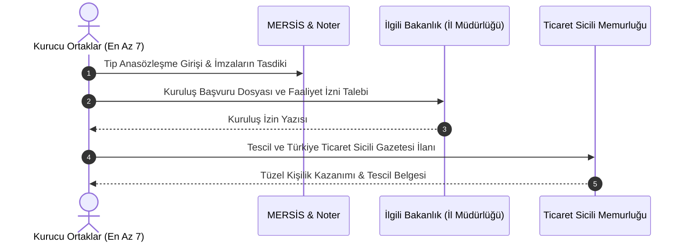

# Kooperatif Kuruluşu ve Anasözleşme İntibak Rehberi

  
Kuruluş ve İntibak İşlemleri

  <table>
    <tr><th>Temel Kanun</th><td>1163 Sayılı Kooperatifler Kanunu</td></tr>
    <tr><th>Kuruluş Tebliği</th><td>24721 Sayılı Tebliğ (Kurucu Sayıları & Alan)</td></tr>
    <tr><th>Asgari Kurucu Ortak</th><td>En Az 7 Ortak</td></tr>
    <tr><th>İntibak Yasal Dayanağı</th><td>7339 SK Geçici m. 9 & 7511 SK</td></tr>
    <tr><th>Kesin İntibak Son Tarihi</th><td>🚨 26 Ekim 2026</td></tr>
    <tr><th>İntibak Yaptırımı</th><td>Münfesih Sayılma ve Kendiliğinden Dağılma (İnfisah)</td></tr>
    <tr><th>Yetkili Bakanlıklar</th><td>Ticaret / Tarım ve Orman / Çevre Bakanlığı</td></tr>
  </table>

**Kooperatif kuruluşu ve anasözleşme intibak işlemleri**; Türkiye'de yeni bir kooperatif tüzel kişiliğinin tescil edilmesi aşamalarını ve 7339 ile 7511 sayılı kanunlar gereğince mevcut tüm kooperatiflerin yürürlükteki yeni tip anasözleşmelere uyum sağlamalarını (intibak) düzenleyen usul ve esaslar bütünüdür.

---

## İçindekiler
1. [Yeni Bir Kooperatifin Kuruluş Aşamaları](#1-yeni-bir-kooperatifin-kuruluş-aşamaları)
2. [Kurucu Ortak Sayıları ve Çalışma Bölgeleri (Tebliğ 24721)](#2-kurucu-ortak-sayıları-ve-çalışma-bölgeleri-tebliğ-24721)
3. [Örnek Anasözleşme İntibak Süreci ve 7511 Sayılı Kanun Uzatımı](#3-örnek-anasözleşme-intibak-süreci-ve-7511-sayılı-kanun-uzatımı)
4. [İntibak Genel Kurulu Toplantı ve Karar Nisapları](#4-intibak-genel-kurulu-toplantı-ve-karar-nisapları)
5. [26 Ekim 2026 Son Tarihi ve İnfisah (Dağılma) Yaptırımı](#5-26-ekim-2026-son-tarihi-ve-infisah-dağılma-yaptırımı)
6. [3628 Sayılı Kanun Uyarınca İlk Mal Bildirimi](#6-3628-sayılı-kanun-uyarınca-ilk-mal-bildirimi)
7. [Kaynakça ve Notlar](#7-kaynakça-ve-notlar)

---

## 1. Yeni Bir Kooperatifin Kuruluş Aşamaları

1. **Hazırlık:** İlgili Bakanlıkça hazırlanmış tip anasözleşme seçilir ve MERSİS sistemi üzerinden doldurulur.
2. **İmza:** En az 7 kurucu ortak ticaret sicili müdürlüğünde veya noterde anasözleşmeyi imzalar.
3. **Bakanlık İzni:** İlgili Bakanlık İl Müdürlüğü'nden faaliyet ve kuruluş izni alınır.
4. **Tescil:** İznin tebliğinden itibaren 30 gün içinde kooperatif merkezinin bulunduğu ticaret siciline tescil ve ilan ettirilir; kooperatif tescille tüzel kişilik kazanır.

---

## 2. Kurucu Ortak Sayıları ve Çalışma Bölgeleri (Tebliğ 24721)

24721 sayılı Tebliğ uyarınca:
* Birincil kooperatiflerin kuruluşunda kurucu ortak sayısı en az **7 kişi**dir.
* Aynı çalışma bölgesinde aynı amaçlı birden fazla kooperatif kurulması ekonomik fizibilite raporuna ve Bakanlık takdirine bağlıdır.

---

## 3. Örnek Anasözleşme İntibak Süreci ve 7511 Sayılı Kanun Uzatımı

7339 sayılı Kanun ile 1163 sayılı Kanun’a eklenen **Geçici Madde 9** uyarınca:
* Kanun’un yürürlüğe girdiği tarihten önce kurulan tüm kooperatifler ve üst kuruluşları, Ticaret Bakanlığı veya Tarım ve Orman Bakanlığı tarafından yayımlanan **yeni örnek anasözleşmelere anasözleşmelerini intibak ettirmek zorundadır**.
* **7511 Sayılı Kanun Düzenlemesi:** İlk etapta 3 yıl olarak öngörülen intibak süresi, **7511 sayılı Kanun** ile kooperatiflerin mağduriyet yaşamaması ve genel kurullarını tamamlayabilmeleri amacıyla 5 yıla uzatılmış ve kesin son tarih **26 Ekim 2026** olarak belirlenmiştir.
* İntibak işlemi, KOOPBİS entegrasyonu, 40 saatlik eğitim yükümlülüğü ve dış denetim standartlarının kooperatif anasözleşmesine bağlayıcı olarak işlenmesini içerir.

---

## 4. İntibak Genel Kurulu Toplantı ve Karar Nisapları

Kanun koyucu intibak sürecini kolaylaştırmak adına genel kurul karar nisabını esnetmiştir:
* İntibak konulu genel kurul toplantılarında 1163 sayılı Kanun'un ağırlaştırılmış çoğunluk şartları aranmaz; **toplantıda hazır bulunan ortakların salt çoğunluğu ile** anasözleşme intibak kararı alınabilir.

---

## 5. 26 Ekim 2026 Son Tarihi ve İnfisah (Dağılma) Yaptırımı

Geçici Madde 9 fıkra 2 hükmü emredicidir:
> *"Belirlenen yasal süre içinde anasözleşmelerini yürürlükteki tip anasözleşmeye intibak ettirmeyen kooperatif ve üst kuruluşları **kanun gereği infisah etmiş (dağılmış) sayılır**."*

* ⚠️ **Münfesih Duruma Düşme:** **26 Ekim 2026** tarihine kadar intibak işlemlerini (Genel Kurul Kararı -> Bakanlık İzni -> Ticaret Sicili Tescili) tamamlamayan kooperatifler tüzel kişiliklerini kaybeder; hiçbir yeni ticari işlem yapamazlar.
* İnfisah eden kooperatif yalnızca tasfiye amaçlı işlemler yürütebilir. Bakanlık veya ortaklar tarafından tasfiye memurları atanması talep edilerek kooperatif sicilden terkin edilir.

---

## 6. 3628 Sayılı Kanun Uyarınca İlk Mal Bildirimi

Kooperatifin tescil edilmesini veya genel kurulda yeni yöneticilerin seçilmesini takip eden **1 ay içinde**, tüm yönetim ve denetim kurulu üyeleri 3628 sayılı Kanun ve Tebliğler (13715, 11801, 6071) gereğince ilgili Bakanlık il müdürlüğüne kapalı zarf içinde ilk mal bildirimini vermekle yükümlüdür.

---

## 7. Kaynakça ve Notlar
1. 1163 Sayılı Kooperatifler Kanunu Geçici Madde 9 Metni.
2. 24721 Sayılı Kooperatiflerin Kuruluş ve Anasözleşme Değişiklik İşlemleri Tebliği.
3. Ticaret Bakanlığı Tip Anasözleşme İntibak Rehberi ve Genelgesi.
4. 3628 Sayılı Mal Bildiriminde Bulunulması Hakkında Kanun.

---
*Ayrıca bakınız:* [[02_1163_sayili_kooperatifler_kanunu]], [[15_koopbis_uygulama_rehberi]], [[16_zorunlu_kooperatifcilik_egitimi_rehberi]]
