# Örnek Anasözleşmeler ve Sektörel Standartlar Kütüphanesi

**Örnek Anasözleşmeler Kütüphanesi**, 1163 sayılı Kooperatifler Kanunu, 1581 sayılı Tarım Kredi Kooperatifleri Kanunu, 4572 sayılı Tarım Satış Kooperatif ve Birlikleri Kanunu ve ilgili bakanlık tebliğleri doğrultusunda hazırlanan, kooperatiflerin kuruluş ve intibak süreçlerinde kullanılması zorunlu veya tavsiye edilen resmi tip sözleşmelerin sistematik külliyatıdır.

Türkiye'de kooperatif anasözleşmeleri; **Ticaret Bakanlığı** (Esnaf, Sanatkârlar ve Kooperatifçilik Genel Müdürlüğü) ile **Tarım ve Orman Bakanlığı** (Tarım Reformu Genel Müdürlüğü) tarafından tanzim edilmekte ve MERSİS (Merkezi Sicil Kayıt Sistemi) üzerinden elektronik ortamda yürütülmektedir.

---

  
İçindekiler

  <ol>
    <li><a href="#1-yasal-cerceve-ve-ornek-anasozlesme-zorunlulugu">Yasal Çerçeve ve Örnek Anasözleşme Zorunluluğu</a></li>
    <li><a href="#2-tarim-ve-orman-bakanligi-gorev-alanindaki-ornek-anasozlesmeler">Tarım ve Orman Bakanlığı Görev Alanındaki Örnek Anasözleşmeler</a></li>
    <li><a href="#3-ticaret-bakanligi-gorev-alanindaki-tarim-disi-ornek-anasozlesmeler">Ticaret Bakanlığı Görev Alanındaki (Tarım Dışı) Örnek Anasözleşmeler</a></li>
    <li><a href="#4-birlik-ve-merkez-birligi-anasozlesme-standartlari">Birlik ve Merkez Birliği Anasözleşme Standartları</a></li>
    <li><a href="#5-mersis-uzerinden-kurulus-ve-duzeltme-beyani-proseduru">MERSİS Üzerinden Kuruluş ve Düzeltme Beyanı Prosedürü</a></li>
    <li><a href="#6-kaynakca-ve-resmi-baglantilar">Kaynakça ve Resmî Bağlantılar</a></li>
  </ol>

---

## 1. Yasal Çerçeve ve Örnek Anasözleşme Zorunluluğu

1163 sayılı Kanun'un 88. maddesi uyarınca, ilgili bakanlıklar kooperatif türleri için "Örnek Anasözleşmeler" yayımlamaya yetkilidir. Kurucuların Bakanlıkça hazırlanan örnek anasözleşmeyi aynen kabul etmeleri durumunda, kuruluş izin ve tescil süreçleri hızlandırılmış prosedüre tabi tutulur.

7339 sayılı Kanun ile 1163 sayılı Kanun'a eklenen Geçici 9. madde uyarınca; tüm faal kooperatiflerin ve üst kuruluşların mevcut anasözleşmelerini Bakanlıkça yayımlanan güncel örnek anasözleşmelere intibak ettirmeleri yasal bir zorunluluktur. İntibak ettirmeyen kooperatifler kanun gereği infisah etmiş (dağılmış) sayılır.

---

## 2. Tarım ve Orman Bakanlığı Görev Alanındaki Örnek Anasözleşmeler

Tarım ve Orman Bakanlığı Tarım Reformu Genel Müdürlüğü bünyesinde tescil ve izne tabi olan başlıca kooperatif tip sözleşmeleri:

| Kooperatif / Birlik Türü | Yasal Dayanak | Kurucu Asgari Ortak Sayısı | Temel Amaç ve Faaliyet Alanı |
| :--- | :--- | :--- | :--- |
| **Tarım Kredi Kooperatifi (TKK)** | 1581 Sayılı Kanun | Özel kanuni yapı | Çiftçilere ayni/nakdi girdi temini, tohum, gübre, düşük faizli Hazine kredisi |
| **Tarım Satış Kooperatifi (TSK)** | 4572 Sayılı Kanun | 30 üretici ortak | Ortakların tarımsal ürünlerini işleme, depolama, paketleme ve DFİF kaynaklı destekler |
| **Sulama Kooperatifi** | 1163 SK / 6172 SK / 6200 SK | 7 çiftçi ortak | Yeraltı ve yerüstü sulama tesislerinin işletilmesi, su dağıtım planlaması ve sayaçlı tahakkuk |
| **Su Ürünleri Kooperatifi** | 1163 SK / 1380 SK | 7 balıkçı ortak | Deniz/iç su ürünleri avcılığı, yetiştiricilik sahaları ve balıkçı barınaklarının kiralanması |
| **Tarımsal Kalkınma Kooperatifi** | 1163 SK / 5488 SK | 7 üretici ortak | Bitkisel ve hayvansal üretim, süt toplama, soğuk zincir, yem temini ve KKYDP hibe projeleri |
| **Ormancılık Kooperatifi (ORKÖY)** | 1163 SK / 6831 SK | 7 orman köylüsü | Orman emvali üretimi, dikili ağaç tahsisi (Orman K. m. 34/40) ve 4734 SK m. 3/e ihale istisnası |
| **Pancar Ekicileri Kooperatifi** | 1163 SK / 4634 SK | Bölgesel üreticiler | Şeker pancarı üreticilerine tohum, gübre, mekanizasyon sağlama ve PANKOBİRLİK entegrasyonu |
| **Yaş Sebze ve Meyve Kooperatifi** | 1163 SK / 5957 SK | 7 üretici ortak | 5957 SK Hal Kanunu uyarınca "Üretici Örgütü" sıfatıyla toptancı hallerinde yer alma |
| **Tütün Üretim ve Pazarlama** | 1163 SK / 4733 SK | 7 üretici ortak | Tütün üreticilerinin sözleşmeli üretim yapması ve kurutma/pazarlama organizasyonu |

---

## 3. Ticaret Bakanlığı Görev Alanındaki (Tarım Dışı) Örnek Anasözleşmeler

Ticaret Bakanlığı Esnaf, Sanatkârlar ve Kooperatifçilik Genel Müdürlüğü yetki alanındaki sektörel örnek tip sözleşmeler:

```mermaid
graph TD
    A["Ticaret Bakanlığı Tip Anasözleşmeleri"] --> B["Finans & Esnaf"]
    A --> C["Sosyal & Girişim"]
    A --> D["Lojistik & Taşıma"]
    A --> E["Gayrimenkul & İşletme"]
    A --> F["Hizmet & Yenilikçi"]

    B --> B1["ESKKK Kredi Kefalet"]
    B --> B2["Tedarik ve Dağıtım"]
    B --> B3["Temin Tevzi"]

    C --> C1["Kadın Girişimi Üretim/İşletme"]
    C --> C2["Tüketim Kooperatifleri"]
    C --> C3["Çocuk Bakım Hizmetleri"]

    D --> D1["Karayolu Yük Taşıma"]
    D --> D2["Karayolu Yolcu Taşıma"]
    D --> D3["Deniz Taşımacılığı"]

    E --> E1["Konut Yapı (7579 SK)"]
    E --> E2["Site İşletme"]
    E --> E3["Gayrimenkul İşletme"]
    E --> E4["Küçük Sanat Kooperatifi"]

    F --> F1["Yenilenebilir Enerji"]
    F --> F2["Bilimsel Ar-Ge Kooperatifi"]
    F --> F3["Fikri Mülkiyet & Danışmanlık"]
    F --> F4["Sağlık & Eğitim Kooperatifi"]
```

### Öne Çıkan Sektörel Tip Anasözleşmeler:
1. **Esnaf ve Sanatkârlar Kredi ve Kefalet Kooperatifi (ESKKK):** 5362 ve 4603 sayılı Kanunlar uyarınca Halkbank kaynaklı kredilere kefalet sağlama yetkisi verir.
2. **Kadın Girişimi Üretim ve İşletme Kooperatifi:** Ortaklarının en az %90'ı kadınlardan oluşan, KOOP-DES hibe programından ve Belediye Kanunu m. 75 ortak hizmet protokollerinden öncelikli yararlanan tip statü.
3. **Yenilenebilir Enerji Kooperatifi:** Lisanssız elektrik üretimi (GES, RES) yönetmeliği kapsamında ortakların elektrik ihtiyacını karşılamak üzere kurulan yenilikçi kooperatif modeli.
4. **Bilimsel Araştırma ve Geliştirme (Ar-Ge) Kooperatifi:** Üniversite-sanayi iş birliği, patent ticarileştirme ve teknoloji geliştirme bölgelerinde faaliyet gösteren uzmanlaşmış kooperatif yapısı.
5. **Fikri Mülkiyet Hakları ve Proje Danışmanlığı Kooperatifi:** Telif, marka, patent tescili ve proje yürütücülüğü alanında çalışan ortakların bilgi ve emek ortaklığı.
6. **Karşılıklı Sigorta Kooperatifi:** Sigortacılık ve Özel Emeklilik Düzenleme ve Denetleme Kurumu (SEDDK) gözetiminde, ortakların mesleki veya kurumsal risklerini havuz sistemiyle teminat altına alan model.

---

## 4. Birlik ve Merkez Birliği Anasözleşme Standartları

1163 sayılı Kanun'un 70-77. maddeleri uyarınca kooperatifler, amaçlarını gerçekleştirmek ve güçlerini birleştirmek üzere kademeli üst örgütlenme kurabilirler:

* **Kooperatif Birlikleri (Bölge Birlikleri):** Aynı veya benzer amaçlı en az **7 kooperatifin** bir araya gelmesiyle kurulur.
* **Merkez Birlikleri:** Aynı çalışma konusuna sahip en az **3 kooperatif birliğinin** katılımıyla teşekkül eder.
* **Türkiye Milli Kooperatifler Birliği:** Kooperatif üst kuruluşlarının ulusal düzeydeki en üst temsil organıdır.

### Bakanlıkça Yayımlanan Tip Birlik Anasözleşmeleri:
* Tarım Kredi Kooperatifleri Bölge ve Merkez Birliği Anasözleşmesi
* ESKKK Bölge Birlikleri ve TESKOMB Merkez Birliği Anasözleşmesi
* Ormancılık Kooperatifleri Merkez Birliği (OR-KOOP) Anasözleşmesi
* Hayvancılık Kooperatifleri Merkez Birliği (HAYKOOP) Anasözleşmesi
* Köy Kalkınma Kooperatifleri Merkez Birliği (KÖY-KOOP) Anasözleşmesi
* Su Ürünleri Kooperatifleri Merkez Birliği (SÜR-KOOP) Anasözleşmesi
* Sulama Kooperatifleri Merkez Birliği (TÜMSUKOOP) Anasözleşmesi
* Tarım Satış Kooperatifleri Birlikleri (ÇUKOBİRLİK, TARİŞ, TRAKYA BİRLİK, MARMARABİRLİK vb.)

---

## 5. MERSİS Üzerinden Kuruluş ve Düzeltme Beyanı Prosedürü

Modern Türk kooperatifçilik uygulamasında tüm örnek anasözleşme işlemleri elektronik ortamda yürütülür:

1. **MERSİS Başvurusu:** Kurucular MERSİS üzerinden ilgili kooperatif türünü ve bakanlık onaylı örnek anasözleşmeyi seçerek unvan, sermaye ve kurucu bilgilerini sisteme girer.
2. **Noter veya Ticaret Sicil Tasdiki:** Anasözleşme kurucular tarafından MERSİS talep numarası ile imzalanır.
3. **Bakanlık Kuruluş İzni:** İlgili İl Müdürlüğü (Ticaret İl Müdürlüğü veya Tarım ve Orman İl Müdürlüğü) sistemi üzerinden dosya incelenir ve onaylanır.
4. **Düzeltme Beyanı (Gerekirse):** Anasözleşmede eksiklik veya maddi hata tespit edilirse, Bakanlık Kuruluş Genelgesi eki formatında "Düzeltme Beyanı" tanzim edilerek sisteme yüklenir.
5. **Ticaret Sicili Tescil ve İlanı:** Onaylanan anasözleşme Ticaret Sicil Müdürlüğünce tescil edilir ve Türkiye Ticaret Sicili Gazetesi'nde yayımlanarak kooperatif tüzel kişilik kazanır.
6. **Mal Bildirimi Yükümlülüğü:** 3628 sayılı Kanun gereği yönetim ve denetim kurulu asil üyeleri, tescil tarihinden itibaren **1 ay içinde** kapalı zarfla mal bildiriminde bulunmak zorundadır.

---

## 6. Kaynakça ve Resmî Bağlantılar

* 1163 Sayılı Kooperatifler Kanunu (Resmî Gazete: 13195)
* 1581 Sayılı Tarım Kredi Kooperatifleri ve Birlikleri Kanunu
* 4572 Sayılı Tarım Satış Kooperatif ve Birlikleri Kanunu
* Ticaret Bakanlığı Kooperatif Örnek Anasözleşmeleri Portalı
* Tarım ve Orman Bakanlığı Tarımsal Örgütlenme Anasözleşmeleri Fihristi
* 2022-5 Sayılı Kooperatiflerin İntibak İşlemleri Genelgesi

---
*Ayrıca bakınız: [[02_1163_sayili_kooperatifler_kanunu]] • [[24_kooperatif_kurulusu_ve_anasozlesme_intibak]] • [[15_koopbis_uygulama_rehberi]] • [[08_mevzuat_kulliyati_ve_dizin]]*
