# Örnek Anasözleşmeler ve Sektörel Standartlar Kütüphanesi

**Örnek Anasözleşmeler Kütüphanesi**, 1163 sayılı Kooperatifler Kanunu, 1581 sayılı Tarım Kredi Kooperatifleri Kanunu, 4572 sayılı Tarım Satış Kooperatif ve Birlikleri Kanunu ve ilgili bakanlık tebliğleri doğrultusunda hazırlanan, kooperatiflerin kuruluş ve intibak süreçlerinde kullanılması zorunlu veya tavsiye edilen **resmi tip sözleşmelerin tam metin külliyatıdır**.

Türkiye'de kooperatif anasözleşmeleri; **Ticaret Bakanlığı** (Esnaf, Sanatkârlar ve Kooperatifçilik Genel Müdürlüğü) ile **Tarım ve Orman Bakanlığı** (Tarım Reformu Genel Müdürlüğü) tarafından tanzim edilmekte ve MERSİS (Merkezi Sicil Kayıt Sistemi) üzerinden elektronik ortamda yürütülmektedir.

---

  
İçindekiler

  <ol>
    <li><a href="#1-canli-ornek-anasozlesme-okuyucu-ve-indirici">Canlı Örnek Anasözleşme Okuyucu ve İndirici (Resmi Tip Metinler)</a></li>
    <li><a href="#2-yasal-cerceve-ve-ornek-anasozlesme-zorunlulugu">Yasal Çerçeve ve Örnek Anasözleşme Zorunluluğu</a></li>
    <li><a href="#3-ticaret-bakanligi-gorev-alanindaki-tarim-disi-ornek-anasozlesmeler">Ticaret Bakanlığı Görev Alanındaki (Tarım Dışı) Örnek Anasözleşmeler</a></li>
    <li><a href="#4-tarim-ve-orman-bakanligi-gorev-alanindaki-ornek-anasozlesmeler">Tarım ve Orman Bakanlığı Görev Alanındaki Örnek Anasözleşmeler</a></li>
    <li><a href="#5-resmi-bakanlik-indirme-fihristi-28-tip-sozlesme-baglantilari">Resmi Bakanlık İndirme Fihristi (28+ Tip Sözleşme Bağlantıları)</a></li>
    <li><a href="#6-mersis-uzerinden-kurulus-ve-duzeltme-beyani-proseduru">MERSİS Üzerinden Kuruluş ve Düzeltme Beyanı Prosedürü</a></li>
    <li><a href="#7-kaynakca-ve-resmi-baglantilar">Kaynakça ve Resmi Bağlantılar</a></li>
  </ol>

---

## 1. Canlı Örnek Anasözleşme Okuyucu ve İndirici

Aşağıdaki konsoldan incelemek istediğiniz kooperatif türünü seçiniz. Bakanlık onaylı, yürürlükteki mevzuata (7339, 7511 ve 7579 sayılı kanunlar dahil) tam uyumlu resmi anasözleşme metni yüklenecektir. Metni doğrudan kopyalayabilir, yazdırabilir veya bilgisayarınıza indirebilirsiniz:

  

    
📜 Resmi Örnek Anasözleşme Metinleri Konsolu

    
Bakanlık onaylı tip anasözleşmeyi seçiniz, inceleyiniz ve resmi işlemlerde kullanınız.

  

  

    

      <label for="bylaw-select">Kooperatif Türü ve Anasözleşme Metni:</label>
      <select id="bylaw-select" class="wiki-input" style="font-weight: 600; font-size: 15px;">
        <option value="konut_yapi">🏛️ S.S. Konut Yapı Kooperatifi Örnek Anasözleşmesi (7579 SK İskan/Mülkiyet Kısıtı Uyumlu)</option>
        <option value="kadin_girisimi">👩‍💼 S.S. Kadın Girişimi Üretim ve İşletme Kooperatifi Örnek Anasözleşmesi (KOOP-DES Uyumlu)</option>
        <option value="tarimsal_kalkinma">🌾 S.S. Tarımsal Kalkınma Kooperatifi Örnek Anasözleşmesi (Tarım ve Orman Bak. Onaylı)</option>
        <option value="motorlu_tasiyicilar">🚛 S.S. Motorlu Taşıyıcılar (Yolcu ve Yük) Kooperatifi Örnek Anasözleşmesi</option>
        <option value="sulama">💧 S.S. Sulama Kooperatifi Örnek Anasözleşmesi (Tarım ve Orman Bak. Onaylı)</option>
        <option value="tuketim">🛒 S.S. Tüketim Kooperatifi Örnek Anasözleşmesi (KVK 4/1-k Muafiyet Uyumlu)</option>
        <option value="site_isletme">🏢 S.S. Toplu Yapı / Site İşletme Kooperatifi Örnek Anasözleşmesi</option>
        <option value="yenilenebilir_enerji">⚡ S.S. Yenilenebilir Enerji Üretim Kooperatifi Örnek Anasözleşmesi</option>
      </select>
    

  

  

    

      <button id="btn-copy-bylaw" class="wiki-btn-primary">📋 Tüm Metni Kopyala</button>
      <button id="btn-print-bylaw" class="wiki-btn-icon" style="padding: 9px 16px; font-weight: 600;">🖨️ Yazdır / PDF Kaydet</button>
      <button id="btn-download-bylaw" class="wiki-btn-icon" style="padding: 9px 16px; font-weight: 600;">💾 Metin (.txt) İndir</button>
    

    

      Madde Filtrele:
      <input type="text" id="bylaw-search-input" class="wiki-input" placeholder="Örn: sermaye, ihraç, tasfiye..." style="width: 180px; padding: 6px 10px;">
    

  

  

    <!-- JavaScript Seçilen Anasözleşme Metnini Buraya Doldurur -->
  

---

## 2. Yasal Çerçeve ve Örnek Anasözleşme Zorunluluğu

1163 sayılı Kanun'un 88. maddesi uyarınca, ilgili bakanlıklar kooperatif türleri için "Örnek Anasözleşmeler" yayımlamaya yetkilidir. Kurucuların Bakanlıkça hazırlanan örnek anasözleşmeyi aynen kabul etmeleri durumunda, kuruluş izin ve tescil süreçleri hızlandırılmış prosedüre tabi tutulur.

7339 sayılı Kanun ile 1163 sayılı Kanun'a eklenen Geçici 9. madde ve 7511 sayılı Kanun uyarınca; tüm faal kooperatiflerin ve üst kuruluşların mevcut anasözleşmelerini Bakanlıkça yayımlanan güncel örnek anasözleşmelere intibak ettirmeleri yasal bir zorunluluktur. **İntibak için son tarih 26 Ekim 2026'dır.** İntibak ettirmeyen kooperatifler kanun gereği infisah etmiş (dağılmış) sayılır.

---

## 3. Ticaret Bakanlığı Görev Alanındaki (Tarım Dışı) Örnek Anasözleşmeler

Ticaret Bakanlığı Esnaf, Sanatkârlar ve Kooperatifçilik Genel Müdürlüğü yetki alanındaki sektörel örnek tip sözleşmeler:

```mermaid
graph TD
    A["Ticaret Bakanlığı Tip Anasözleşmeleri"] --> B["Finans & Esnaf"]
    A --> C["Sosyal & Girişim"]
    A --> D["Lojistik & Taşıma"]
    A --> E["Gayrimenkul & İşletme"]
    A --> F["Hizmet & Yenilikçi"]

    B --> B1["ESKKK Kredi Kefalet"]
    B --> B2["Tedarik ve Dağıtım"]
    B --> B3["Temin Tevzi"]

    C --> C1["Kadın Girişimi Üretim/İşletme"]
    C --> C2["Tüketim Kooperatifleri"]
    C --> C3["Çocuk Bakım Hizmetleri"]

    D --> D1["Karayolu Yük Taşıma"]
    D --> D2["Karayolu Yolcu Taşıma"]
    D --> D3["Deniz Taşımacılığı"]

    E --> E1["Konut Yapı (7579 SK)"]
    E --> E2["Site İşletme"]
    E --> E3["Gayrimenkul İşletme"]
    E --> E4["Küçük Sanat Kooperatifi"]

    F --> F1["Yenilenebilir Enerji"]
    F --> F2["Bilimsel Ar-Ge Kooperatifi"]
    F --> F3["Fikri Mülkiyet & Danışmanlık"]
    F --> F4["Sağlık & Eğitim Kooperatifi"]
```

### Öne Çıkan Sektörel Tip Anasözleşmeler:
1. **Esnaf ve Sanatkârlar Kredi ve Kefalet Kooperatifi (ESKKK):** 5362 ve 4603 sayılı Kanunlar uyarınca Halkbank kaynaklı kredilere kefalet sağlama yetkisi verir.
2. **Kadın Girişimi Üretim ve İşletme Kooperatifi:** Ortaklarının en az %90'ı kadınlardan oluşan, KOOP-DES hibe programından ve Belediye Kanunu m. 75 ortak hizmet protokollerinden öncelikli yararlanan tip statü.
3. **Yenilenebilir Enerji Kooperatifi:** Lisanssız elektrik üretimi (GES, RES) yönetmeliği kapsamında ortakların elektrik ihtiyacını karşılamak üzere kurulan yenilikçi kooperatif modeli.
4. **Bilimsel Araştırma ve Geliştirme (Ar-Ge) Kooperatifi:** Üniversite-sanayi iş birliği, patent ticarileştirme ve teknoloji geliştirme bölgelerinde faaliyet gösteren uzmanlaşmış kooperatif yapısı.
5. **Site İşletme Kooperatifi:** İnşaatı tamamlanmış toplu yapıların ortak alanlarını, Kat Mülkiyeti Kanunu ile tam uyumlu biçimde yöneten model.

---

## 4. Tarım ve Orman Bakanlığı Görev Alanındaki Örnek Anasözleşmeler

Tarım ve Orman Bakanlığı Tarım Reformu Genel Müdürlüğü bünyesinde tescil ve izne tabi olan başlıca kooperatif tip sözleşmeleri:

| Kooperatif / Birlik Türü | Yasal Dayanak | Kurucu Asgari Ortak Sayısı | Temel Amaç ve Faaliyet Alanı |
| :--- | :--- | :--- | :--- |
| **Tarım Kredi Kooperatifi (TKK)** | 1581 Sayılı Kanun | Özel kanuni yapı | Çiftçilere ayni/nakdi girdi temini, tohum, gübre, düşük faizli Hazine kredisi |
| **Tarım Satış Kooperatifi (TSK)** | 4572 Sayılı Kanun | 30 üretici ortak | Ortakların tarımsal ürünlerini işleme, depolama, paketleme ve DFİF kaynaklı destekler |
| **Sulama Kooperatifi** | 1163 SK / 6172 SK / 6200 SK | 7 çiftçi ortak | Yeraltı ve yerüstü sulama tesislerinin işletilmesi, su dağıtım planlaması ve sayaçlı tahakkuk |
| **Su Ürünleri Kooperatifi** | 1163 SK / 1380 SK | 7 balıkçı ortak | Deniz/iç su ürünleri avcılığı, yetiştiricilik sahaları ve balıkçı barınaklarının kiralanması |
| **Tarımsal Kalkınma Kooperatifi** | 1163 SK / 5488 SK | 7 üretici ortak | Bitkisel ve hayvansal üretim, süt toplama, soğuk zincir, yem temini ve KKYDP hibe projeleri |
| **Ormancılık Kooperatifi (ORKÖY)** | 1163 SK / 6831 SK | 7 orman köylüsü | Orman emvali üretimi, dikili ağaç tahsisi (Orman K. m. 34/40) ve 4734 SK m. 3/e ihale istisnası |
| **Pancar Ekicileri Kooperatifi** | 1163 SK / 4634 SK | Bölgesel üreticiler | Şeker pancarı üreticilerine tohum, gübre, mekanizasyon sağlama ve PANKOBİRLİK entegrasyonu |
| **Yaş Sebze ve Meyve Kooperatifi** | 1163 SK / 5957 SK | 7 üretici ortak | 5957 SK Hal Kanunu uyarınca "Üretici Örgütü" sıfatıyla toptancı hallerinde yer alma |

---

## 5. Resmi Bakanlık İndirme Fihristi (28+ Tip Sözleşme Bağlantıları)

Aşağıdaki resmi tip anasözleşme metinleri, MERSİS sisteminde şablon olarak kayıtlı olup ilgili Bakanlıkların resmi web portallarından doğrudan temin edilebilir:

| No | Tip Anasözleşme Adı | Düzenleyici Bakanlık | Yasal Statü & Format | Resmi Kaynak / Erişim |
| :---: | :--- | :--- | :--- | :--- |
| **1** | Konut Yapı Kooperatifi Örnek Anasözleşmesi | Ticaret Bakanlığı | Yürürlükte (7579 SK) | [Ticaret Bakanlığı Mevzuat Portalı](https://ticaret.gov.tr) |
| **2** | Kadın Girişimi Üretim ve İşletme Kooperatifi | Ticaret Bakanlığı | Yürürlükte (KOOP-DES) | [Ticaret Bakanlığı Kooperatifçilik GM](https://koop.ticaret.gov.tr) |
| **3** | Tarımsal Kalkınma Kooperatifi Örnek Anasözleşmesi | Tarım ve Orman Bak. | Yürürlükte | [Tarım Reformu Genel Müdürlüğü](https://tarimorman.gov.tr) |
| **4** | Motorlu Taşıyıcılar Kooperatifi Örnek Anasözleşmesi | Ticaret Bakanlığı | Yürürlükte | [Ticaret Bakanlığı Mevzuat](https://ticaret.gov.tr) |
| **5** | Sulama Kooperatifi Örnek Anasözleşmesi | Tarım ve Orman Bak. | Yürürlükte | [Tarım ve Orman Bakanlığı](https://tarimorman.gov.tr) |
| **6** | Su Ürünleri Kooperatifi Örnek Anasözleşmesi | Tarım ve Orman Bak. | Yürürlükte | [Tarım ve Orman Bakanlığı](https://tarimorman.gov.tr) |
| **7** | Tüketim Kooperatifi Örnek Anasözleşmesi | Ticaret Bakanlığı | Yürürlükte | [Ticaret Bakanlığı Mevzuat](https://ticaret.gov.tr) |
| **8** | Toplu İşyeri Yapı Kooperatifi Örnek Anasözleşmesi | Ticaret Bakanlığı | Yürürlükte | [Ticaret Bakanlığı Mevzuat](https://ticaret.gov.tr) |
| **9** | Küçük Sanat Kooperatifi Örnek Anasözleşmesi | Ticaret Bakanlığı | Yürürlükte | [Ticaret Bakanlığı Mevzuat](https://ticaret.gov.tr) |
| **10** | Üretim ve Pazarlama Kooperatifi Örnek Anasözleşmesi | Ticaret Bakanlığı | Yürürlükte | [Ticaret Bakanlığı Mevzuat](https://ticaret.gov.tr) |
| **11** | Karşılıklı Sigorta Kooperatifi Anasözleşmesi | SEDDK / Ticaret Bak. | Özel İzinli | [SEDDK Resmi Portalı](https://seddk.gov.tr) |
| **12** | ESKKK Örnek Tip Anasözleşmesi | Ticaret Bakanlığı | Yürürlükte (TESKOMB) | [TESKOMB & Ticaret Bak.](https://teskomb.org.tr) |
| **13** | Yenilenebilir Enerji Kooperatifi Anasözleşmesi | Ticaret Bakanlığı | Yürürlükte | [Ticaret Bakanlığı Mevzuat](https://ticaret.gov.tr) |
| **14** | Ormancılık Kooperatifi (ORKÖY) Anasözleşmesi | Tarım ve Orman Bak. | Yürürlükte (6831 SK) | [OGM / Tarım Bakanlığı](https://ogm.gov.tr) |
| **15** | Yaş Sebze ve Meyve Kooperatifi Anasözleşmesi | Tarım ve Orman Bak. | Yürürlükte (5957 SK) | [Tarım Reformu GM](https://tarimorman.gov.tr) |
| **16** | Pancar Ekicileri Kooperatifi Anasözleşmesi | Tarım ve Orman Bak. | Yürürlükte | [PANKOBİRLİK Portalı](https://pankobirlik.com.tr) |
| **17** | Tedarik ve Dağıtım Kooperatifi Anasözleşmesi | Ticaret Bakanlığı | Yürürlükte | [Ticaret Bakanlığı Mevzuat](https://ticaret.gov.tr) |
| **18** | Temin Tevzi Kooperatifi Anasözleşmesi | Ticaret Bakanlığı | Yürürlükte | [Ticaret Bakanlığı Mevzuat](https://ticaret.gov.tr) |
| **19** | Hizmet Kooperatifi Anasözleşmesi | Ticaret Bakanlığı | Yürürlükte | [Ticaret Bakanlığı Mevzuat](https://ticaret.gov.tr) |
| **20** | Yayıncılık Kooperatifi Anasözleşmesi | Ticaret Bakanlığı | Yürürlükte | [Ticaret Bakanlığı Mevzuat](https://ticaret.gov.tr) |
| **21** | Sağlık Hizmetleri Kooperatifi Anasözleşmesi | Ticaret Bakanlığı | Yürürlükte | [Ticaret Bakanlığı Mevzuat](https://ticaret.gov.tr) |
| **22** | Eğitim Kooperatifi Anasözleşmesi | Ticaret Bakanlığı | Yürürlükte | [Ticaret Bakanlığı Mevzuat](https://ticaret.gov.tr) |
| **23** | Çocuk Bakım Hizmetleri Kooperatifi Anasözleşmesi | Ticaret Bakanlığı | Yürürlükte | [Ticaret Bakanlığı Mevzuat](https://ticaret.gov.tr) |
| **24** | Bilimsel Araştırma ve Geliştirme (Ar-Ge) Koop. | Ticaret Bakanlığı | Yürürlükte | [Ticaret Bakanlığı Mevzuat](https://ticaret.gov.tr) |
| **25** | Fikri Mülkiyet Hakları ve Proje Danışmanlığı Koop. | Ticaret Bakanlığı | Yürürlükte | [Ticaret Bakanlığı Mevzuat](https://ticaret.gov.tr) |
| **26** | Turizm Geliştirme Kooperatifi Anasözleşmesi | Ticaret Bakanlığı | Yürürlükte | [Ticaret Bakanlığı Mevzuat](https://ticaret.gov.tr) |
| **27** | Site ve Toplu Yapı İşletme Kooperatifi | Ticaret Bakanlığı | Yürürlükte | [Ticaret Bakanlığı Mevzuat](https://ticaret.gov.tr) |
| **28** | Çevre ve Geri Dönüşüm Kooperatifi Anasözleşmesi | Ticaret Bakanlığı | Yürürlükte | [Ticaret Bakanlığı Mevzuat](https://ticaret.gov.tr) |

---

## 6. MERSİS Üzerinden Kuruluş ve Düzeltme Beyanı Prosedürü

Modern Türk kooperatifçilik uygulamasında tüm örnek anasözleşme işlemleri elektronik ortamda yürütülür:

1. **MERSİS Başvurusu:** Kurucular MERSİS (`mersis.ticaret.gov.tr`) üzerinden ilgili kooperatif türünü ve bakanlık onaylı örnek anasözleşmeyi seçerek unvan, sermaye ve kurucu bilgilerini sisteme girer.
2. **Noter veya Ticaret Sicil Tasdiki:** Anasözleşme kurucular tarafından MERSİS talep numarası ile imzalanır.
3. **Bakanlık Kuruluş İzni:** İlgili İl Müdürlüğü (Ticaret İl Müdürlüğü veya Tarım ve Orman İl Müdürlüğü) sistemi üzerinden dosya incelenir ve onaylanır.
4. **Düzeltme Beyanı (Gerekirse):** Anasözleşmede eksiklik veya maddi hata tespit edilirse, Bakanlık Kuruluş Genelgesi eki formatında "Düzeltme Beyanı" tanzim edilerek sisteme yüklenir.
5. **Ticaret Sicili Tescil ve İlanı:** Onaylanan anasözleşme Ticaret Sicil Müdürlüğünce tescil edilir ve Türkiye Ticaret Sicili Gazetesi'nde yayımlanarak kooperatif tüzel kişilik kazanır.
6. **Mal Bildirimi Yükümlülüğü:** 3628 sayılı Kanun gereği yönetim ve denetim kurulu asil üyeleri, tescil tarihinden itibaren **1 ay içinde** kapalı zarfla mal bildiriminde bulunmak zorundadır.

---

## 7. Kaynakça ve Resmi Bağlantılar

* 1163 Sayılı Kooperatifler Kanunu (Resmî Gazete: 13195)
* 1581 Sayılı Tarım Kredi Kooperatifleri ve Birlikleri Kanunu
* 4572 Sayılı Tarım Satış Kooperatif ve Birlikleri Kanunu
* Ticaret Bakanlığı Kooperatif Örnek Anasözleşmeleri Portalı
* Tarım ve Orman Bakanlığı Tarımsal Örgütlenme Anasözleşmeleri Fihristi
* 2022-5 Sayılı Kooperatiflerin İntibak İşlemleri Genelgesi

---
*Ayrıca bakınız: [[02_1163_sayili_kooperatifler_kanunu]] • [[24_kooperatif_kurulusu_ve_anasozlesme_intibak]] • [[15_koopbis_uygulama_rehberi]] • [[08_mevzuat_kulliyati_ve_dizin]]*
