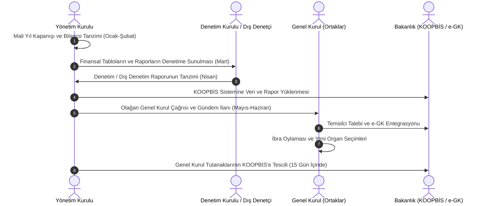

# Etkileşimli Mevzuat Atölyesi: Quiz, Bilgi Kartları, Slaytlar ve Podcast

**Etkileşimli Mevzuat Atölyesi**, Türkiye kooperatifçilik mevzuatını (1163, 1581, 4572 sayılı kanunlar, KOOPBİS, dış denetim, vergi muafiyetleri ve intibak kuralları) öğrenmek, pekiştirmek ve denetim standartlarına uyumu test etmek amacıyla geliştirilmiş interaktif eğitim ve değerlendirme merkezidir.

---

  
İçindekiler

  <ol>
    <li><a href="#1-etkilesimli-mevzuat-sinavi-ve-testi">Etkileşimli Mevzuat Sınavı ve Testi (16 Soru)</a></li>
    <li><a href="#2-etkilesimli-bilgi-kartlari-flashcards">Etkileşimli Bilgi Kartları (Flashcards - 16 Kart)</a></li>
    <li><a href="#3-zihin-haritalari-ve-surec-diyagramlari">Zihin Haritaları ve Süreç Diyagramları</a></li>
    <li><a href="#4-kooperatif-turleri-ve-mevzuati-ozet-slaytlari">Kooperatif Türleri ve Mevzuatı Özet Slaytları</a></li>
  </ol>

---

## 1. Etkileşimli Mevzuat Sınavı ve Testi

Kooperatif yöneticileri, denetçileri ve ortakları için hazırlanan, anında geri bildirimli ve yasal gerekçeli 12 soruluk interaktif yeterlilik testi:

  

    
🧠 Kooperatif Hukuku Yeterlilik ve Uyum Testi

    
Soru 1 / 12

  

  

    <!-- JavaScript dinamik olarak soru ve seçenekleri buraya yükler -->
  

  

  

    <button id="quiz-hint-btn" class="wiki-btn-icon" style="padding: 6px 14px; font-size: 13px;">💡 İpucu Göster</button>
    

      Puan: 0 / 12
      <button id="quiz-next-btn" class="wiki-btn-icon" style="padding: 6px 18px; background: var(--wiki-link); color: #fff; font-weight: 600;">Sonraki Soru ➡️</button>
    

  

  

---

## 2. Etkileşimli Bilgi Kartları (Flashcards)

Kooperatif organlarının, mali müşavirlerin ve ortakların temel yasal terimleri ve yaptırımları hızla tekrar edebilmesi için hazırlanan etkileşimli kart seti:

  

    🎴 Temel Mevzuat ve Yaptırım Kartları
    Kart 1 / 12
  

  

    

      

        
KAVRAM / YASAL DÜZENLEME

        
Yükleniyor...

        
(Hukuki cevabı ve kanun dayanağını görmek için karta tıklayın 🔄)

      

      

        
HUKUKİ SONUÇ VE KANUN MADDESİ

        
Yükleniyor...

      

    

  

  

    <button onclick="prevFlashcard()" class="wiki-btn-icon" style="padding: 6px 14px;">⬅️ Önceki</button>
    <button onclick="flipFlashcard()" class="wiki-btn-icon" style="padding: 6px 16px; font-weight: 600;">🔄 Kartı Çevir</button>
    <button onclick="nextFlashcard()" class="wiki-btn-icon" style="padding: 6px 14px;">Sonraki ➡️</button>
  

---

## 3. Zihin Haritaları ve Süreç Diyagramları

### A. Tarım ve Tarım Dışı Kooperatifler Hukuki Ayrım Matrisi

```mermaid
graph TD
    Root["TÜRKİYE KOOPERATİFÇİLİK MEVZUATI"] --> Tarim["TARIM KOOPERATİFLERİ (Tarım ve Orman Bak.)"]
    Root --> TarimDisi["TARIM DIŞI KOOPERATİFLER (Ticaret Bak.)"]
    Root --> Ortak["ORTAK DİJİTAL VE DENETİM REJİMİ"]

    Tarim --> TKK["Tarım Kredi (1581 SK) - Düşük Faizli Hazine Kredisi"]
    Tarim --> TSK["Tarım Satış (4572 SK) - DFİF & Üretici Örgütü"]
    Tarim --> Sulama["Sulama (6172/6200 SK) - Tesis Devirleri"]
    Tarim --> SuUrun["Su Ürünleri (1380 SK) - Barınak ve Av Sahası"]
    Tarim --> Orkop["ORKÖY (6831 SK) - Dikili Ağaç Tahsisi"]
    Tarim --> Toprak["Tarım Reformu (3083 SK) & 5403 SK Koruma"]

    TarimDisi --> Yapi["Konut Yapı (7579 SK) - Mülkiyet Devir Kısıtı"]
    TarimDisi --> ESKKK["ESKKK (5362/4603 SK) - Halkbank Kredisi & İpotek"]
    TarimDisi --> Kadin["Kadın Girişimi - KOOP-DES Hibesi & Bld. m.75"]
    TarimDisi --> Lojistik["Taşıyıcılar (Motorlu Taşıt) & OSB İştiraki"]
    TarimDisi --> Tuketim["Tüketim & Tedarik (6585 SK / 6502 SK)"]

    Ortak --> KOOPBIS["KOOPBİS Veri Entegrasyonu"]
    Ortak --> Egitim["40 Saatlik Zorunlu Eğitim"]
    Ortak --> DisDenetim["Dış Denetim (Yön. 39331 & SBDS 2400)"]
    Ortak --> Intibak["Örnek Anasözleşme İntibakı (Geçici m.9)"]
```

### B. Kooperatif Yönetim ve Denetim Kurulu Yıllık Uyum Takvimi

---

## 4. Kooperatif Türleri ve Mevzuatı Özet Slaytları

  

    
Slayt 1 / 5

    <h3>🏛️ 1. Temel Kanuni Çerçeve ve Hukuki Nitelik</h3>
    <ul>
      <li><strong>Ticaret Şirketi Niteliği:</strong> TTK m. 124 uyarınca kooperatifler ticaret şirketidir; ancak değişir ortaklı ve değişir sermayelidir.</li>
      <li><strong>Özel Kanunlar Önceliği:</strong> 1581 (Tarım Kredi), 4572 (Tarım Satış) ve 1163 sayılı Kanun hükümleri öncelikle uygulanır.</li>
      <li><strong>Yetki Devri:</strong> 700 sayılı KHK ile kanunlardaki Bakanlar Kurulu yetkileri Cumhurbaşkanı makamına devredilmiştir.</li>
    </ul>
  

  

    
Slayt 2 / 5

    <h3>🚜 2. Tarımsal Destekler ve Hukuki Güvenceler</h3>
    <ul>
      <li><strong>Hazine Faiz Destekli Krediler:</strong> Ziraat Bankası ve TKK üzerinden sübvansiyonlu işletme ve yatırım kredileri.</li>
      <li><strong>Tarımsal Derecelendirme (Yön. 40451):</strong> A-B-C sınıflandırması ile KKYDP hibe projelerinde ilave puanlama ve prim avantajı.</li>
      <li><strong>Hobi Bahçesi Yasağı (5403 SK m. 23 & 7584 SK):</strong> Tarım arazilerinin kooperatif hissesi yoluyla bölünmesi ve yapılaşması kesinlikle yasaktır, hisse devirleri batıldır.</li>
    </ul>
  

  

    
Slayt 3 / 5

    <h3>🏢 3. Tarım Dışı Sektörler ve Kamu İmkânları</h3>
    <ul>
      <li><strong>Konut Yapı (7579 SK):</strong> İskan alınmadan hisse devri yasaklanmış; mahalli idarelerin kooperatif kurması Cumhurbaşkanı iznine bağlanmıştır.</li>
      <li><strong>ESKKK & Halkbank:</strong> Esnaf ve sanatkârların düşük faizli finansmana erişimi için kefalet ve tapuda doğrudan ipotek tesis hakkı.</li>
      <li><strong>Kadın Kooperatifleri & KOOP-DES:</strong> Makine, ekipman ve nitelikli istihdam için karşılıksız hibe ve belediye mülk tahsisi.</li>
    </ul>
  

  

    
Slayt 4 / 5

    <h3>💰 4. Kurumlar Vergisi Muafiyetinin 4 Altın Şartı</h3>
    <ul>
      <li><strong>1. Münhasıran Ortak İçi İşlem:</strong> Faaliyetlerin yalnızca ortaklarla yürütülmesi (ortak dışı işlem yapılmaması).</li>
      <li><strong>2. Sermaye Üzerinden Kazanç Dağıtmama:</strong> Ortaklara hisse payı oranında faiz veya kâr payı dağıtılmaması.</li>
      <li><strong>3. Yönetim Kurulu Pay Yasağı:</strong> Yönetim ve denetim organlarına kârdan hisse aktarılmaması.</li>
      <li><strong>4. Yedek Akçelerin Dağıtılmaması:</strong> Akçelerin anasözleşme gereği ortaklar arasında paylaştırılmaması.</li>
      <li><em>Risturn:</em> Ortak içi işlem hacmine göre maliyet farkı iadesi olup kâr payı sayılmaz ve muafiyeti bozmaz.</li>
    </ul>
  

  

    
Slayt 5 / 5

    <h3>💻 5. Dijitalleşme, Denetim ve Yaptırımlar</h3>
    <ul>
      <li><strong>KOOPBİS:</strong> Ortaklar, yönetim, mali tablolar ve genel kurul evrakının dijital sisteme kaydı zorunludur (TCK adli sorumluluk).</li>
      <li><strong>40 Saatlik Zorunlu Eğitim:</strong> Yönetim/denetim kurulu üyelerinin 9 ay içinde eğitimi tamamlaması şarttır; aksi halde üyelik kendiliğinden düşer.</li>
      <li><strong>Dış Denetim (SBDS 2400):</strong> Belirlenen ciro ve ortak eşiğini aşan kooperatifler bağımsız dış denetime tabidir; raporsuz genel kurul ibra kararları hükümsüzdür.</li>
    </ul>
  

  

    <button onclick="changeSlide(-1)" class="wiki-btn-icon" style="padding: 6px 14px;">⬅️ Önceki Slayt</button>
    Slayt 1 / 5
    <button onclick="changeSlide(1)" class="wiki-btn-icon" style="padding: 6px 14px;">Sonraki Slayt ➡️</button>
  

---
*Ayrıca bakınız: [[00_ana_sayfa]] • [[02_1163_sayili_kooperatifler_kanunu]] • [[15_koopbis_uygulama_rehberi]] • [[16_zorunlu_kooperatifcilik_egitimi_rehberi]] • [[17_dis_denetim_ve_bagimsiz_denetim]] • [[18_kurumlar_vergisi_muafiyeti_ve_risturn]] • [[25_ornek_anasozlesmeler_kutuphanesi]]*
