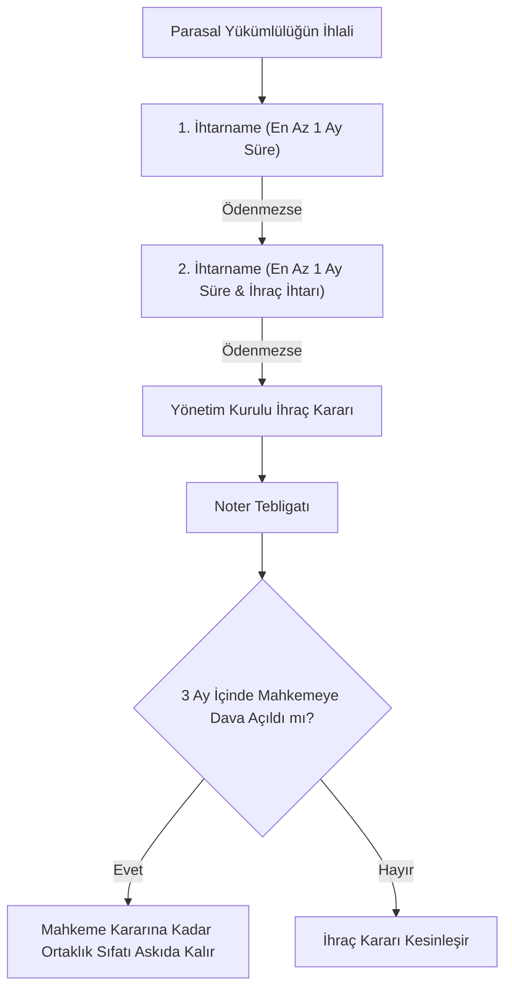

# Yargıtay ve Danıştay Emsal İçtihatları Rehberi

  
Kooperatif İçtihat Hukuku

  <table>
    <tr><th>Temel Adli Yargı</th><td>Yargıtay 11. Hukuk Dairesi & HGK (Eski 23. HD)</td></tr>
    <tr><th>Temel İdari Yargı</th><td>Danıştay Vergi Dava Daireleri Kurulu (VDDK)</td></tr>
    <tr><th>Kritik Dava Türleri</th><td>İhraç İptali, GK İptali, Sorumluluk, Faiz İtirazı</td></tr>
    <tr><th>Temel Kanunlar</th><td>1163 SK, 6102 SK (TTK), 6098 SK (TBK), 5520 SK (KVK)</td></tr>
    <tr><th>Hak Düşürücü Süreler</th><td>İhraçta 3 Ay / Genel Kurulda 1 Ay</td></tr>
  </table>

**Kooperatiflerde Yargıtay ve Danıştay emsal içtihatları**; 1163 sayılı Kooperatifler Kanunu'nun soyut hükümlerinin somut uyuşmazlıklara tatbikinde yüksek mahkemelerin oluşturduğu bağlayıcı ilkeler, ortaklık haklarının korunması sınırları, yöneticilerin sorumluluk kriterleri ve mali muafiyet denetim standartları bütünüdür.

---

## İçindekiler
1. [Ortaklıktan Çıkarma (İhraç) Kararlarının İptali Davaları (Madde 16)](#1-ortaklıktan-çıkarma-ihraç-kararlarının-iptali-davaları-madde-16)
2. [Genel Kurul Kararlarının İptali ve Butlan Davaları (Madde 53)](#2-genel-kurul-kararlarının-iptali-ve-butlan-davaları-madde-53)
3. [Yönetim Kurulu Üyelerine Karşı Sorumluluk Davaları (Madde 62)](#3-yönetim-kurulu-üyelerine-karşı-sorumluluk-davaları-madde-62)
4. [Aidat Borçlarında Gecikme Zammı ve TBK Faiz Sınırları Tartışması](#4-aidat-borçlarında-gecikme-zammı-ve-tbk-faiz-sınırları-tartışması)
5. [Yapı Kooperatiflerinde Şerefiye ve Eşitlik İlkesi](#5-yapı-kooperatiflerinde-şerefiye-ve-eşitlik-ilkesi)
6. [Danıştay İçtihatları: Vergi Muafiyeti ve Risturn Denetimleri](#6-danıştay-içtihatları-vergi-muafiyeti-ve-risturn-denetimleri)
7. [Kaynakça ve Emsal Karar Künyeleri](#7-kaynakça-ve-emsal-karar-künyeleri)

---

## 1. Ortaklıktan Çıkarma (İhraç) Kararlarının İptali Davaları (Madde 16)

Kooperatifler hukukunda adli yargıya en çok yansıyan uyuşmazlık türü ortaklıktan çıkarma kararlarıdır:

### Yargıtay'ın Yerleşik İçtihat Kuralları:
* **İki Haklı İhtar Şartı:** Parasal yükümlülüklerini yerine getirmeyen ortağa, anasözleşme uyarınca aralarında en az birer ay bulunacak şekilde iki ayrı ihtarname gönderilmelidir.
* **Borcun Ayrıntılı Kalemleri:** İhtarnamede istenen borcun anapara, işlemiş faiz ve dönemleri açıkça kalem kalem gösterilmelidir. Soyut veya dökümsüz borç bildirimleri Yargıtayca ihtarı geçersiz kılar (Yargıtay 11. HD, E. 2021/4112, K. 2022/3105).
* **3 Aylık Hak Düşürücü Süre:** İhraç kararı ortağa noter aracılığıyla tebliğ edilmelidir. Tebliğden itibaren **3 ay içinde** kooperatif merkezinin bulunduğu yer Asliye Ticaret Mahkemesinde iptal davası açılmalıdır. Bu süre hak düşürücü olup mahkemece re'sen gözetilir.
* **Askı Durumu:** İptal davası açılması halinde, davanın kesinleşmesine kadar ortaklık sıfatı askıda kalır; kooperatif ortağın hissesini üçüncü bir kişiye devredemez.

---

## 2. Genel Kurul Kararlarının İptali ve Butlan Davaları (Madde 53)

1163 sayılı Kanun'un 53. maddesi, genel kurulda alınan kararların kanuna, anasözleşmeye ve dürüstlük kurallarına aykırı olması halinde iptal davası açılabilmesini düzenler.

* **1 Aylık Hak Düşürücü Süre:** İptal davası genel kurul toplantı tarihinden itibaren **1 ay içinde** açılmak zorundadır.
* **Muhalefet Şerhi Şartı:** Toplantıda hazır bulunan ortağın iptal davası açabilmesi için; iptali istenen karara aykırı oy kullanmış olması ve bu muhalefetini **tutanağa şerh (itiraz) olarak yazdırmış olması** zorunludur. Tutanağa şerh düşürmeyen ortağın iptal davası aktif dava ehliyeti yokluğundan reddedilir.
* **Çağrı Usulsüzlüğü:** Genel kurula usulsüz çağrılan veya çağrı yapılmayan ortaklar, toplantıya katılmamış olsalar dahi 1 ay içinde iptal davası açabilirler.
* **Yokluk ve Butlan Ayrımı:** Kanunun emredici hükümlerine (örneğin eşit işlem ilkesi ihlali, organ seçimsiz yönetim yetkisi verilmesi) veya ahlaka aykırı kararlar butlanla maluldür; butlan davalarında 1 aylık hak düşürücü süre uygulanmaz, her zaman ileri sürülebilir.

---

## 3. Yönetim Kurulu Üyelerine Karşı Sorumluluk Davaları (Madde 62)

1163 sayılı Kanun m. 62 gereğince yöneticiler, kooperatif işlerinin yürütülmesinde basiretli bir tacir gibi özen göstermekle yükümlüdür.

* **İbra Edilmeme Ön Şartı:** Yönetim kuruluna karşı kooperatif adına tazminat ve sorumluluk davası açılabilmesi için, genel kurulda yöneticilerin **ibra edilmemiş olması** ve sorumluluk davası açılması yönünde genel kurul kararı alınmış olması şarttır.
* **Denetçilerin Dava Açma Görevi:** İbra edilmeyen yönetim kuruluna karşı davayı kooperatif adına Denetim Kurulu açmakla yasal olarak görevlidir.
* **Kamu Görevlisi Sayılma:** Yönetim kurulu üyeleri görevleri sebebiyle işledikleri zimmet, irtikap, rüşvet ve görevi kötüye kullanma fiillerinde Türk Ceza Kanunu uygulamasında **kamu görevlisi** gibi cezalandırılır (1163 SK Ek Madde 2).

---

## 4. Aidat Borçlarında Gecikme Zammı ve TBK Faiz Sınırları Tartışması

Kooperatif aidatlarının gecikmesi durumunda genel kurullarca belirlenen yüksek faiz/gecikme zammı oranlarının hukuki geçerliliği Yargıtay içtihatlarında uzun yıllar tartışılmıştır:

* **6098 sayılı TBK m. 88 ve 120:** Türk Borçlar Kanunu'nda akdi faiz ve temerrüt faizinin yasal faizin belirli katlarını aşamayacağı kurala bağlanmıştır.
* **Yargıtay Hukuk Genel Kurulu ve İçtihadı Birleştirme Yaklaşımı:** Kooperatif ortaklarının birbirleriyle olan ilişkisi ticari bir borçtan ziyade karşılıklı dayanışma esasına dayandığından, genel kurulca kabul edilen makul gecikme zammı oranları (ortakların tamamına eşit uygulandığı sürece) cezai şart niteliğindedir. Ancak fahiş oranlar mahkemelerce dürüstlük kuralı ve hakkaniyet (TMK m. 2) gereğince tenkis edilebilir (HGK, E. 2017/11-189, K. 2021/542).

---

## 5. Yapı Kooperatiflerinde Şerefiye ve Eşitlik İlkesi

Yapı kooperatiflerinde kat irtifakı veya mülkiyet tahsisinde yaşanan daire büyüklüğü, kat konumu, cephe ve manzara farklılıkları:
* **Eşit Masraf - Farklı Değer İlkesi:** Ortaklar inşaat süresince eşit aidat ödemiş olsalar dahi, bağımsız bölümler arasındaki değer farkları **şerefiye tespiti** ile dengelenmek zorundadır.
* **Bilirkişi ve Genel Kurul Yetkisi:** Şerefiye cetveli uzman teknik heyetlerce hazırlanıp genel kurulda onaylanmalıdır. Şerefiye farkı ödenmeksizin ferdi mülkiyete geçilmesi eşitlik ilkesine aykırılık teşkil eder ve iptal davasına konu olur.

---

## 6. Danıştay İçtihatları: Vergi Muafiyeti ve Risturn Denetimleri

Danıştay Vergi Dava Daireleri Kurulu (VDDK), 5520 sayılı KVK m. 4/1-k kapsamındaki muafiyet uyuşmazlıklarında katı kriterler uygulamaktadır:

1. **Atıl Fonların Değerlendirilmesi:** Kooperatifin faaliyetleri için topladığı nakit varlıkları mevduat hesabında veya repo/devlet tahvilinde değerlendirmesi, ortak dışı işlem sayılmaz ve muafiyeti bozmaz (Danıştay VDDK, E. 2019/412).
2. **Kira ve Reklam Gelirleri:** Kooperatif binasına reklam panosu asılması veya atıl dükkanların üçüncü kişilere kiraya verilmesi durumunda, 7061 sayılı Kanun öncesinde tüm muafiyet kaldırılmaktaydı. Güncel içtihatta ise yalnızca bu gelirler için bağlı iktisadi işletme nezdinde kurumlar vergisi tarh edilmektedir.
3. **Risturn Dağıtımı:** Gelir-gider müspet farkının ortaklara iş hacimleri oranında dağıtılması temettü kâr payı sayılmaz; dolayısıyla stopaj tarhiyatı yapılamaz.

---

## 7. Kaynakça ve Emsal Karar Künyeleri

1. Yargıtay 11. Hukuk Dairesi E. 2021/4112, K. 2022/3105 (Kooperatiften İhraçta İki Haklı İhtar Kuralı).
2. Yargıtay Hukuk Genel Kurulu E. 2017/11-189, K. 2021/542 (Genel Kurul Kararlarının İptali ve Gecikme Zammı).
3. Yargıtay 23. Hukuk Dairesi E. 2018/1420, K. 2019/3211 (Muhalefet Şerhinin Tutanakta Gösterilmesi Zorunluluğu).
4. Danıştay Vergi Dava Daireleri Kurulu E. 2019/412, K. 2020/115 (Mevduat Faizi ve Kooperatif Muafiyeti).
5. Danıştay 4. Dairesi E. 2020/3811, K. 2022/1944 (Risturn İadesinde Kurumlar Vergisi İstisnası).

---
*Ayrıca bakınız: [[02_1163_sayili_kooperatifler_kanunu]] • [[05_kooperatif_mali_ve_vergi_hukuku]] • [[18_kurumlar_vergisi_muafiyeti_ve_risturn]]*
