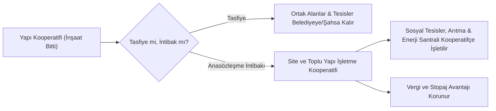
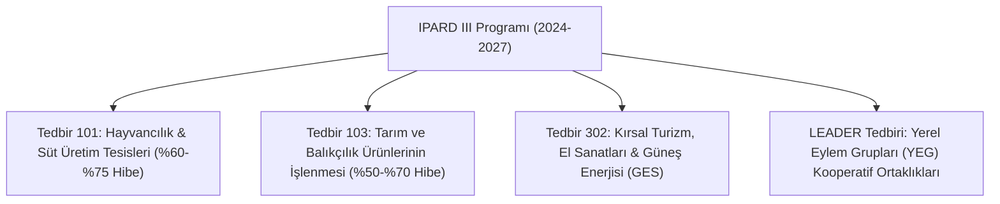

# Kentsel Dönüşüm, Sosyal ve Platform Kooperatifçiliği

  
Modern ve Yenilikçi Kooperatifçilik

  <table>
    <tr><th>Kentsel Dönüşüm Yasası</th><td>6306 Sayılı Afet Riski Altındaki Alanlar Kanunu</td></tr>
    <tr><th>İşletme Modeli</th><td>Site / Toplu Yapı İşletme Kooperatifi</td></tr>
    <tr><th>Sosyal Modeller</th><td>Sosyal Kooperatifler & Platform Kooperatifleri</td></tr>
    <tr><th>Uluslararası Fonlar</th><td>IPARD III (TKDK), LEADER Tedbiri, FAO</td></tr>
    <tr><th>Hedef Kitle</th><td>Dönüşüm Hak Sahipleri, Freelance Çalışanlar, Üreticiler</td></tr>
  </table>

**Kentsel dönüşüm, sosyal ve platform kooperatifçiliği**; geleneksel kooperatif yapılarını çağımızın kentsel yenilenme ihtiyaçlarına, sosyal içerme modellerine ve dijitalleşen emek piyasasına uyarlayan modern kooperatifçilik uygulamalarıdır.

---

## İçindekiler
1. [Yapı Kooperatifleri ve 6306 Sayılı Kentsel Dönüşüm Kanunu](#1-yapı-kooperatifleri-ve-6306-sayılı-kentsel-dönüşüm-kanunu)
2. [Tasfiye Yerine "Site ve Toplu Yapı İşletme Kooperatifi"ne Dönüşüm](#2-tasfiye-yerine-site-ve-toplu-yapı-işletme-kooperatifine-dönüşüm)
3. [Sosyal Kooperatifçilik Modeli ve İstihdam Politikaları](#3-sosyal-kooperatifçilik-modeli-ve-istihdam-politikaları)
4. [Dijital Platform Kooperatifçiliği: Gig-Ekonomisine Dayanışma Alternatifi](#4-dijital-platform-kooperatifçiliği-gig-ekonomisine-dayanışma-alternatifi)
5. [Uluslararası Fonlar ve Kırsal Hibe Destekleri (IPARD III & LEADER)](#5-uluslararası-fonlar-ve-kırsal-hibe-destekleri-ipard-iii--leader)
6. [Kaynakça ve Notlar](#6-kaynakça-ve-notlar)

---

## 1. Yapı Kooperatifleri ve 6306 Sayılı Kentsel Dönüşüm Kanunu

Türkiye'de 1980-2000 yılları arasında inşa edilen binlerce konut yapı kooperatifi sitesi bugün ekonomik ömrünü tamamlamış veya deprem riski altındadır:

* **Riskli Yapı Tespiti:** 6306 sayılı Kanun uyarınca kooperatif mülkiyetindeki veya ferdileşmiş binalar için tek bir malikin dahi başvurusuyla riskli yapı tespiti yaptırılabilir.
* **Kooperatifin Müteahhitlik Rolü:** Yapı kooperatifleri, Çevre, Şehircilik ve İklim Değişikliği Bakanlığı'ndan uygun yetki belgesi grubu almak kaydıyla kendi ortaklarının kentsel dönüşüm binalarını "kendi nam ve hesabına" yeniden inşa edebilirler. Bu yöntem, üçüncü şahıs müteahhitlerin kâr marjını ortadan kaldırarak maliyeti %30-40 oranında düşürür.
* **Karar Nisapları:** 6306 sayılı Kanun'da yapılan son reformlarla, kentsel dönüşüm kararlarında aranan çoğunluk **hisse sahiplerinin salt çoğunluğuna (%50+1)** indirilmiştir.

---

## 2. Tasfiye Yerine "Site ve Toplu Yapı İşletme Kooperatifi"ne Dönüşüm

Konut yapı kooperatiflerinde yapılar tamamlanıp kat mülkiyeti kurulduktan sonra çoğunlukla doğrudan tasfiye yoluna gidilmektedir. Ancak tasfiye yerine anasözleşme değişikliği ile **"Site İşletme Kooperatifi"ne intibak edilmesi** ortaklara büyük avantajlar sağlar:

### Site İşletme Kooperatifinin Avantajları:
1. **Ortak Tesislerin Mülkiyeti:** Sitede yer alan yüzme havuzu, spor salonu, güneş enerjisi santrali (GES), arıtma tesisi ve ticari alanlar kooperatif mülkiyetinde kalır.
2. **Hukuki Tüzel Kişilik Gücü:** Kat Mülkiyeti Kanunu (KMK) site yönetimleri tüzel kişiliğe sahip değilken, kooperatif tam bir tüzel kişiliktir; sözleşme yapabilir, personel istihdam edebilir ve dava açabilir.
3. **Mali Muafiyetler:** Ortak içi hizmetlerde (güvenlik, peyzaj, temizlik) KDV ve kurumlar vergisi muafiyetleri belirli koşullarda korunabilir.

---

## 3. Sosyal Kooperatifçilik Modeli ve İstihdam Politikaları

Sosyal kooperatifler; kâr maksimizasyonunu değil, sosyal amaçları (dezavantajlı bireylerin topluma kazandırılması, kadın ve genç istihdamı, çocuk ve yaşlı bakımı, geri dönüşüm) hedefleyen yenilikçi yapılardır:

* **İtalya ve Avrupa Örnekleri (Tip A ve Tip B):**
  * *Tip A:* Sağlık, eğitim ve sosyal bakım hizmeti sunan kooperatifler.
  * *Tip B:* Engelli veya dezavantajlı kişilerin işgücüne katılımını sağlayan üretim kooperatifleri.
* **Türkiye'deki Gelişimi:** Ticaret Bakanlığı koordinasyonunda "Sosyal Kooperatifçilik Çalışma Grubu" oluşturulmuş ve çocuk bakım, eğitim, geri dönüşüm ve kültür-sanat alanlarında örnek tip anasözleşmeler hazırlanmıştır.

---

## 4. Dijital Platform Kooperatifçiliği: Gig-Ekonomisine Dayanışma Alternatifi

Geleneksel teknoloji platformlarında (kurye, taşımacılık, freelance pazar yerleri) kârın tamamı sermayedarlara aktarılırken, çalışanlar güvencesiz ve algoritmik baskı altında çalışmaktadır.

* **Platform Kooperatifi Nedir?:** Ortakları (yazılımcılar, motokuryeler, grafik tasarımcılar, çevirmenler) tarafından sahip olunan ve demokratik olarak yönetilen dijital platformlardır.
* **İşleyiş Mantığı:**
  1. Platformun mobil uygulamasının ve sunucularının mülkiyeti kooperatife aittir.
  2. Komisyon oranları asgari düzeyde tutulur; elde edilen kâr fazlalığı (risturn) çalışan ortaklara yaptıkları teslimat/iş hacmine göre iade edilir.
  3. Algoritmaların çalışma kuralları ve ücret politikaları genel kurulda şeffafça belirlenir.
* **Uluslararası Örnekler:** *Fairmondo* (adil e-ticaret platformu), *The Drivers Cooperative* (New York lisanslı taksi kooperatifi), *Stocksy United* (fotoğraf sanatçıları kooperatifi).

---

## 5. Uluslararası Fonlar ve Kırsal Hibe Destekleri (IPARD III & LEADER)

Tarımsal ve kırsal kalkınma kooperatiflerinin finansmana erişiminde Avrupa Birliği Katılım Öncesi Kırsal Kalkınma Aracı (IPARD) ve Tarım ve Kırsal Kalkınmayı Destekleme Kurumu (TKDK) fonları hayati rol oynamaktadır:

* **Kooperatiflere Pozitif Ayrımcılık:** TKDK proje değerlendirme kriterlerinde, başvuru sahibinin üretici örgütü veya tarımsal kooperatif olması durumunda **ek sıralama puanı (+10 ila +15 puan)** verilir.
* **LEADER Yaklaşımı:** Kırsal bölgelerde yerel eylem grupları (YEG) çatısı altında kadın kooperatifleri, çiftçiler ve belediyelerin ortaklaşa hazırladığı kalkınma projelerine %100 oranında karşılıksız fon tahsis edilmektedir.
* **FAO ve IFAD Projeleri:** Birleşmiş Milletler Tarım ve Gıda Örgütü (FAO) ile Tarımsal Kalkınma Uluslararası Fonu (IFAD), özellikle kuraklıkla mücadele ve kadın kooperatiflerinin kapasite artırımı projelerine teknik ve ayni ekipman hibeleri sağlamaktadır.

---

## 6. Kaynakça ve Notlar

1. 6306 Sayılı Afet Riski Altındaki Alanların Dönüştürülmesi Hakkında Kanun ve Uygulama Yönetmeliği.
2. 634 Sayılı Kat Mülkiyeti Kanunu ve 1163 Sayılı Kanun İşletme Kooperatifi Dönüşüm Hükümleri.
3. Ticaret Bakanlığı Sosyal Kooperatifçilik Raporu ve Vizyon Belgesi.
4. Scholz, Trebor (2016). *Platform Cooperativism: Challenging the Corporate Sharing Economy*, Rosa Luxemburg Stiftung.
5. Tarım ve Kırsal Kalkınmayı Destekleme Kurumu (TKDK) IPARD III Başvuru Çağrı Rehberleri.

---
*Ayrıca bakınız: [[04_tarim_disi_kooperatifler]] • [[12_konut_yapi_kooperatifleri_ve_tapu_mevzuati]] • [[07_uluslararasi_kooperatifcilik_ilkeleri_ica]]*
