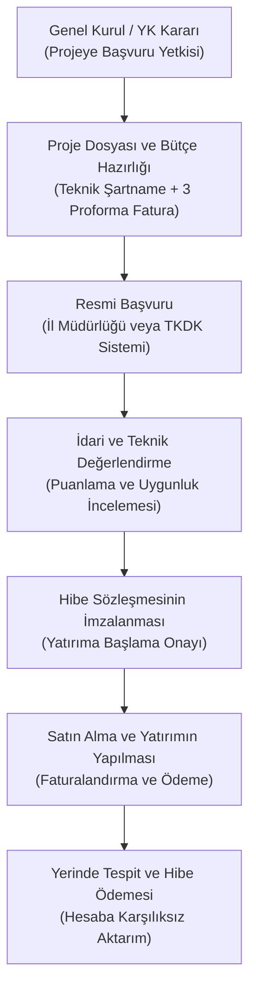

# KOOP-DES, Kırsal Kalkınma ve Devlet Hibe Destekleri Rehberi

**Kooperatif Hibe ve Destekler Rehberi**, Türkiye'de faaliyet gösteren kooperatiflerin ve üst kuruluşlarının yararlanabileceği güncel devlet desteklerini, hibe programlarını, finansman imkanlarını ve başvuru stratejilerini içeren kapsamlı yol haritasıdır.

---

  
İçindekiler

  <ol>
    <li><a href="#1-ticaret-bakanligi-koop-des-programi">Ticaret Bakanlığı KOOP-DES Programı</a></li>
    <li><a href="#2-koop-des-destek-kalemleri-ve-hibe-oranlari">KOOP-DES Destek Kalemleri ve Hibe Oranları</a></li>
    <li><a href="#3-tarim-ve-orman-bakanligi-kkydp-hibeleri-50-karsiliksiz">Tarım ve Orman Bakanlığı KKYDP Hibeleri (%50 Karşılıksız)</a></li>
    <li><a href="#4-ab-ipard-iii-programi-tkdk-hibeleri-65---75">AB IPARD III Programı (TKDK) Hibeleri (%65 - %75)</a></li>
    <li><a href="#5-teskomb-ve-halkbank-hazine-faiz-destekli-kredileri">TESKOMB ve Halkbank Hazine Faiz Destekli Kredileri</a></li>
    <li><a href="#6-basvuru-sureci-gerekli-belgeler-ve-sik-yapilan-hatalar">Başvuru Süreci, Gerekli Belgeler ve Sık Yapılan Hatalar</a></li>
  </ol>

---

## 1. Ticaret Bakanlığı KOOP-DES Programı

**KOOP-DES (Kooperatiflerin Desteklenmesi Programı)**, 1163 sayılı Kooperatifler Kanunu Ek Madde 5 ve ilgili Uygulama Usul ve Esasları çerçevesinde Ticaret Bakanlığı bütçesinden kooperatiflere sağlanan doğrudan, karşılıksız hibe mekanizmasıdır.

### Kimler Başvurabilir?
1. **Kadın Girişimi Üretim ve İşletme Kooperatifleri:** Ortaklarının çoğunluğunu (en az %50+1) kadınların oluşturduğu ve kadın emeğini değerlendirmeyi amaçlayan kooperatifler.
2. **Engelli ve Genç Girişimcilerin Ortak Olduğu Kooperatifler:** Ortaklarının çoğunluğu engelli veya 30 yaş altı genç girişimcilerden oluşan kooperatifler.
3. **Üretim ve Hizmet Kooperatifleri:** Sanayi, zanaat, tüketim ve tarım dışı üretim alanında faaliyet gösteren ve ortaklarına iş veya pazar imkanı sağlayan kooperatifler.
4. **Üst Kuruluşlar (Birlikler ve Merkez Birlikleri):** Kooperatif birlikleri de eğitim ve kurumsal kapasite geliştirme projelerinde hibe kapsamındadır.

> [!NOTE]
> **Kalkınmada Öncelikli Yöre Avantajı:**
> KOOP-DES kapsamında genel illerde hibe oranı **%75** iken; kalkınmada öncelikli yöreler ve afet bölgelerinde hibe oranı **%90**'a kadar yükseltilmektedir. Kalan kısım kooperatif tarafından eş-finansman (özkaynak) olarak karşılanır.

---

## 2. KOOP-DES Destek Kalemleri ve Hibe Oranları

Program kapsamında desteklenen ana harcama kalemleri ve tavan limitler:

| Destek Alanı | Kapsam ve Nitelik | Hibe Oranı | Koşullar |
| :--- | :--- | :---: | :--- |
| **Makine & Ekipman Alımı** | Üretim tesisi, paketleme, etiketleme, işleme makineleri, soğuk hava deposu tefrişatı | %75 - %90 | Sıfır (kullanılmamış) makine şartı, yerli malı belgesine öncelik |
| **Nitelikli Personel İstihdamı** | Kooperatifte tam zamanlı çalıştırılacak lisans veya önlisans mezunu en fazla 2 personel | %75 - %90 | 1 yıl boyunca brüt asgari ücret üzerinden maaş ve SGK desteği |
| **Sergi ve Fuar Katılımı** | Yurtiçi ihtisas fuarlarında stant kirası, nakliye ve tanıtım harcamaları | %75 - %90 | Yılda en fazla 2 fuar katılımı |
| **E-Ticaret ve Pazarlama** | E-ticaret web sitesi, barkod tescili, ambalaj tasarımı, dijital pazarlama altyapısı | %75 - %90 | Tek seferlik proje bütçesi dahilinde |

---

## 3. Tarım ve Orman Bakanlığı KKYDP Hibeleri (%50 Karşılıksız)

Kırsal Kalkınma Yatırımlarının Desteklenmesi Programı (KKYDP), tarımsal kalkınma, sulama ve orman köyleri kooperatiflerine yöneliktir:

1. **Tarımsal Ürün İşleme, Kurutma ve Paketleme:**
   - Zeytinyağı sıkım tesisleri, bakliyat eleme ve paketleme tesisleri, süt işleme ve peynir mandıraları, meyve kurutma tesisleri.
   - Bütçenin **%50'si hibe**, kalan %50'si kooperatif özkaynağıdır.
2. **Tarımsal Sulamada Güneş Enerjisi (GES) Yatırımları:**
   - Sulama kooperatiflerinin elektrik faturalarını sıfırlamak amacıyla kuracakları arazi ve çatı tipi Güneş Enerji Santralleri (GES) hibe kapsamındadır.
3. **Basınçlı ve Damla Sulama Altyapısı:**
   - Açık kanal sulamadan modern kapalı borulu sisteme geçiş projelerine hibe ve sıfır faizli yatırım kredisi sağlanır.

---

## 4. AB IPARD III Programı (TKDK) Hibeleri (%65 - %75)

Avrupa Birliği Katılım Öncesi Yardım Kırsal Kalkınma Aracı (IPARD III), 2024–2027 döneminde Türkiye genelinde **81 ilin tamamında** uygulanmaktadır:

* **Kooperatiflere Pozitif Ayrımcılık:** Bireysel işletmelere %50 hibe verilirken, üretici örgütlerine ve tarımsal kooperatiflere **+%10 ila +%20 ek puan** ve **%65 - %75'e varan hibe oranı** uygulanır.
* **KDV ve Gümrük Vergisi Muafiyeti:** IPARD projeleri kapsamında yurt içinden veya yurt dışından satın alınan tüm makine, ekipman ve inşaat harcamaları **%100 KDV'den muaftır** (KDV İstisna Sertifikası verilir).
* **Desteklenen Sektörler:** Süt toplama ve işleme, kırmızı/beyaz et kesimhaneleri, su ürünleri işleme, meyve-sebze soğuk hava depoları, zanaatkarlık, kırsal turizm ve yenilenebilir enerji.

---

## 5. TESKOMB ve Halkbank Hazine Faiz Destekli Kredileri

Esnaf ve Sanatkarlar Kredi ve Kefalet Kooperatifleri (ESKKK), ortaklarına doğrudan nakit kredi vermez; Hazine ve Maliye Bakanlığı'nın faiz sübvansiyonu sağladığı kredilere **kefil olur**:

* **Kredi Kullandıran Banka:** Türkiye Halk Bankası A.Ş.
* **Faiz Oranı:** Hazine sübvansiyonu sayesinde piyasa ticari kredi faizlerinin yaklaşık yarısı düzeyindedir.
* **Üst Limitler:** İşletme kredilerinde ortak başına 750.000 TL – 1.500.000 TL; ticari araç ve işyeri edindirme kredilerinde 2.500.000 TL'ye kadar çıkabilmektedir.
* **Geri Ödeme:** 1, 3 veya 6 aylık dönemler halinde, azami 36 ila 60 ay vade imkanı.

---

## 6. Başvuru Süreci, Gerekli Belgeler ve Sık Yapılan Hatalar

### Başvuru Sırasında İstenen Temel Belgeler:
1. Kooperatif genel kurulunun yönetim kuruluna hibe projesi başvurusu ve taahhütname verme yetkisi tanıdığı karar tutanağı.
2. Güncel Ticaret Sicili Tasdiknamesi ve İmza Sirküleri.
3. Vergi dairesinden ve SGK'dan alınmış "Vadesi Geçmiş Borcu Yoktur" yazıları (Borç varsa hibe sözleşmesi imzalanamaz).
4. Alınacak makine ve ekipmanlar için en az 3 farklı yetkili satıcıdan alınmış piyasa fiyat araştırması (Proforma Faturalar).
5. İstihdam desteği için personelin mezuniyet belgesi ve adli sicil kaydı.

### Başvurularda En Sık Yapılan 5 Hata:
1. ❌ **Genel Kurul Yetkisinin Eksik Olması:** Yönetim kurulunun genel kuruldan izin almadan doğrudan projeye başvurması (1163 SK m. 42'ye aykırılık gerekçesiyle hibe iptal edilir).
2. ❌ **Proforma Fatura Akrabalık İlişkisi:** Fatura alınan şirketlerin kooperatif yöneticileri veya yakınlarına ait olması (çıkar çatışması sebebiyle diskalifiye nedeni).
3. ❌ **İkinci El / Kullanılmış Ekipman Satın Alımı:** Hibelerde kesinlikle kullanılmış veya faturasız makine alımına izin verilmez.
4. ❌ **Vergi veya SGK Borcu:** Başvuru anında veya hibe ödeme talebi anında borç çıkması ödemeleri bloke eder.
5. ❌ **Sözleşme Öncesi Harcama Yapmak:** Hibe sözleşmesi resmi olarak imzalanmadan önce yapılan satın almalar hibe kapsamına dahil edilmez.
