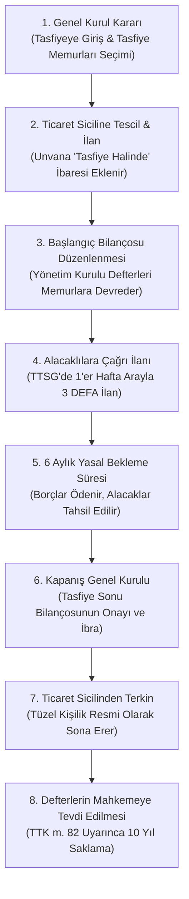

# Kooperatif Tasfiyesi, Kapanış ve Sicilden Terkin Yol Haritası

**Kooperatif Tasfiyesi Rehberi**, 1163 sayılı Kooperatifler Kanunu (m. 81–98) ve Türk Ticaret Kanunu hükümleri uyarınca kooperatif tüzel kişiliğinin sona erdirilmesi, alacaklıların tatmini, tasfiye memurlarının hukuki sorumluluğu ve ticaret sicilinden terkin işlemlerini adım adım açıklayan resmi rehberdir.

---

  
İçindekiler

  <ol>
    <li><a href="#1-dagilma-ve-tasfiye-sebepleri">Dağılma (İnfitah) ve Tasfiye Sebepleri</a></li>
    <li><a href="#2-adim-adim-tasfiye-sureci-yol-haritasi">Adım Adım Tasfiye Süreci Yol Haritası</a></li>
    <li><a href="#3-alacaklilara-cagri-ve-6-aylik-yasal-bekleme-suresi">Alacaklılara Çağrı ve 6 Aylık Yasal Bekleme Süresi</a></li>
    <li><a href="#4-tasfiye-memurlarinin-yetki-ve-sorumluluklari">Tasfiye Memurlarının Yetki ve Hukuki Sorumlulukları</a></li>
    <li><a href="#5-tasfiye-artiginin-dagitimi-ve-vergilendirme">Tasfiye Artığının Dağıtımı ve Vergilendirme</a></li>
    <li><a href="#6-sicilden-terkin-ve-defterlerin-10-yil-saklanmasi">Sicilden Terkin ve Defterlerin 10 Yıl Saklanması</a></li>
    <li><a href="#7-tasfiyeden-donus-ihya-davasi">Tasfiyeden Dönüş ve Ek Tasfiye (İhya Davası)</a></li>
  </ol>

---

## 1. Dağılma (İnfitah) ve Tasfiye Sebepleri

1163 sayılı Kanun m. 81 gereğince kooperatifler aşağıdaki hallerde dağılır ve tasfiye sürecine girer:

1. **Anasözleşmede Gösterilen Sürenin Bitmesi:** Anasözleşmede süre belirtilmiş ve bu süre genel kurulca uzatılmamışsa.
2. **Genel Kurul Kararı:** Anasözleşmede daha ağır bir nisap öngörülmemişse, genel kurulda temsil edilen oyların **en az 2/3 çoğunluğunun** tasfiye kararı alması.
3. **Amacın Gerçekleşmesi veya İmkansızlaşması:** Örneğin yapı kooperatiflerinde konutların tamamlanıp kat mülkiyeti tapularının ortaklara dağıtılması veya amacın fiilen imkansız hale gelmesi.
4. **İflasın Açılması:** Kooperatifin borca batık olması ve mahkemece iflas kararı verilmesi.
5. **Mahkeme Kararı ile Fesih:** İlgili Bakanlığın talebiyle (örneğin 3 yıl üst üste olağan genel kurul yapılmaması veya mevzuata aykırı faaliyetlerin sürmesi halinde).
6. **Kanun Gereği İnfisah (7511 SK İntibak Yaptırılmaması):** 26 Ekim 2026 tarihine kadar anasözleşmesini intibak ettirmeyen kooperatifler kanun gereği kendiliğinden dağılmış sayılır.

---

## 2. Adım Adım Tasfiye Süreci Yol Haritası

---

## 3. Alacaklılara Çağrı ve 6 Aylık Yasal Bekleme Süresi

Tasfiyenin en kritik yasal aşaması alacaklıların haklarının korunmasıdır (1163 SK m. 82):

* **3 Defa İlan Zorunluluğu:** Tasfiye memurları, Türkiye Ticaret Sicili Gazetesi'nde ve anasözleşmede öngörülen mahalli gazetelerde **birer hafta arayla 3 defa** alacaklılara çağrı ilanı yayımlatmak zorundadır.
* **6 Aylık Koruma Süresi:** Alacaklılara yapılan **üçüncü ilanın yayımlandığı tarihten itibaren en az 6 ay geçmedikçe**, kooperatifin kalan varlığı ortaklar arasında paylaştırılamaz.
* **Bilinmeyen Alacaklılar İçin Tevdi:** Adresi bilinmeyen veya alacağını istemeyen alacaklıların tutarları notere veya yetkili bir bankaya depo edilmek zorundadır.

---

## 4. Tasfiye Memurlarının Yetki ve Hukuki Sorumlulukları

* **Seçim ve Temsil:** Genel kurul tasfiye memurlarını seçer; seçilmemişse yönetim kurulu tasfiye memurluğu görevini yürütür. Memurlardan en az birinin Türk vatandaşı olması ve Türkiye'de ikamet etmesi şarttır.
* **Yetki Alanı:** Tasfiye memurları yalnızca tasfiye amacının gerektirdiği işlemleri yapabilir. Yeni iş ve taahhütlere giremezler; sadece başlamış işleri tamamlayabilirler.
* **Hukuki ve Cezai Sorumluluk:** Tasfiye memurları görevlerini kusurlu yapmaları halinde ortaklara ve üçüncü kişilere karşı müteselsilen sorumludur (TTK m. 553 kıyasen).

---

## 5. Tasfiye Artığının Dağıtımı ve Vergilendirme

1. **Borçların Ödenmesi:** Kooperatifin tüm kamu borçları (vergi, harç, SGK primi) ve ticari borçları tamamen ödenir.
2. **Ortakların Sermaye Paylarının İadesi:** Ortakların ödemiş oldukları pay bedelleri nominal tutarları üzerinden iade edilir.
3. **Kalan Artığın Paylaştırılması:** Anasözleşmede aksine bir hüküm bulunmadığı takdirde, kalan tasfiye artığı ortaklar arasında eşit olarak veya sermaye payları oranında paylaştırılır (1163 SK m. 83).
4. **Vergisel Durum:** Dağıtılan tasfiye fazlası kurumlar vergisi muafiyeti bulunmayan kooperatiflerde kurum kazancı sayılır ve stopaja tabi tutulabilir.

---

## 6. Sicilden Terkin ve Defterlerin 10 Yıl Saklanması

Tasfiye süreci tamamlandığında:
1. **Kapanış Genel Kurulu:** Tasfiye memurları tarafından düzenlenen kesin bilanço genel kurul onayına sunulur ve tasfiye memurları ibra edilir.
2. **Sicilden Terkin:** Genel kurul tutanağı ile birlikte Ticaret Sicil Müdürlüğü'ne başvurularak kooperatifin kaydı sicilden silinir (terkin edilir).
3. **Defterlerin Saklanması (TTK m. 82):** Kooperatifin yevmiye, kebir, envanter, karar ve pay defterleri **10 yıl süreyle** saklanmalıdır. Tasfiye memurları Sulh Hukuk Mahkemesi'ne başvurarak defterlerin saklanmak üzere mahkeme arşivine veya memura tevdiine dair karar almalıdır.

---

## 7. Tasfiyeden Dönüş ve Ek Tasfiye (İhya Davası)

### Tasfiyeden Geri Dönüş:
Genel kurul kararıyla tasfiyeye girmiş bir kooperatif, tasfiye artığı henüz ortaklara dağıtılmamış olmak kaydıyla, genel kurulun alacağı yeni bir kararla tasfiyeden vazgeçip faaliyetine geri dönebilir.

### Kooperatifin İhyası (Ek Tasfiye):
Sicilden terkin edilmiş bir kooperatif adına sonradan tapuda bir gayrimenkul çıkması, bankada unutulmuş para bulunması veya derdest bir davanın devam ettiğinin anlaşılması halinde; ilgililer Asliye Ticaret Mahkemesi'nde **"Kooperatifin İhyası Davası"** açarak tüzel kişiliği yalnızca bu işlemlerin tamamlanması amacıyla yeniden canlandırabilir.
