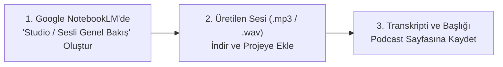

# Kooperatifler Podcast & Sesli Rehber Yayın Merkezi

**Kooperatifler Podcast Yayın Merkezi**, Google NotebookLM Studio ve yapay zeka sesli özet teknolojilerinden yararlanılarak hazırlanan, kooperatif yöneticileri, denetçileri, ortakları ve mali müşavirler için güncel mevzuat, yargı içtihatları ve uygulama kurallarını sesli diyalog formatında sunan resmi yayın portalıdır.

---

  
İçindekiler

  <ol>
    <li><a href="#1-canli-podcast-oynatici-ve-bolum-secici">Canlı Podcast Oynatıcı ve Bölüm Seçici</a></li>
    <li><a href="#2-ai-podcast-senaryo-atolyesi-notebooklm-entegratoru">AI Podcast Senaryo Atölyesi (NotebookLM Entegratörü)</a></li>
    <li><a href="#3-bolum-1-7511-sk-intibak-reformu-ve-26-ekim-2026">Bölüm 1: 7511 SK İntibak Reformu ve 26 Ekim 2026 Geri Sayımı</a></li>
    <li><a href="#4-bolum-2-dis-denetim-ve-zorunlu-egitim-tuzaklari">Bölüm 2: Dış Denetim ve Zorunlu Eğitim Eşikleri (100M TL & 2000 Ortak)</a></li>
    <li><a href="#5-bolum-3-7579-sk-iskansiz-tapu-devri-yasagi">Bölüm 3: 7579 SK İskansız Tapu Devri Yasağı ve Mahalli İdareler</a></li>
    <li><a href="#6-bolum-4-vergi-muafiyetinin-4-altin-sarti-ve-risturn">Bölüm 4: Vergi Muafiyetinin 4 Altın Şartı ve 7061 SK İktisadi İşletme</a></li>
    <li><a href="#7-bolum-5-yap-kooperatiflerinde-ferdi-mulkiyet-ve-serefiye">Bölüm 5: Yapı Kooperatiflerinde Ferdi Mülkiyet, Şerefiye ve Tapu Harcı</a></li>
    <li><a href="#8-bolum-6-kirsal-kalkinma-ve-kadin-kooperatiflerinde-koop-des">Bölüm 6: Kırsal Kalkınma ve Kadın Kooperatiflerinde KOOP-DES & Hibeler</a></li>
    <li><a href="#9-bolum-7-kooperatif-tasfiyesi-ve-sicilden-terkin">Bölüm 7: Kooperatif Tasfiyesi, Alacaklılara 3 TTSG Çağrısı ve Kapanış</a></li>
    <li><a href="#10-notebooklm-ve-yeni-bolum-yayinlama-rehberi">Google NotebookLM ile Yeni Bölüm Yayınlama Rehberi</a></li>
  </ol>

---

## 1. Canlı Podcast Oynatıcı ve Bölüm Seçici

Aşağıdaki oynatıcıdan dinlemek istediğiniz podcast bölümünü seçiniz. NotebookLM'den indirilen stüdyo ses kayıtlarını doğrudan dinleyebilir veya dahili konuşma motoru ile diyalogları anında Türkçe sesli olarak oynatabilirsiniz:

  

    
🎙️ Kooperatif Hukuku & Mevzuatı Podcast Stüdyosu

    
NotebookLM Studio destekli sesli incelemeler ve uzman diyalogları.

  

  

    

      <label for="podcast-episode-select">Yayınlanan Podcast Bölümleri:</label>
      <select id="podcast-episode-select" class="wiki-input" style="font-weight: 600; font-size: 14px;">
        <option value="ep1">🎙️ Bölüm 1: 7511 SK İntibak Reformu ve 26 Ekim 2026 Geri Sayımı (Süre: 14:20 dk.)</option>
        <option value="ep2">🎙️ Bölüm 2: Dış Denetim ve 40 Saatlik Zorunlu Eğitim Eşikleri (Süre: 16:45 dk.)</option>
        <option value="ep3">🎙️ Bölüm 3: 7579 SK İskansız Tapu Devri Yasağı ve İnşaat Güvencesi (Süre: 13:10 dk.)</option>
        <option value="ep4">🎙️ Bölüm 4: Vergi Muafiyetinin 4 Altın Şartı ve Risturn Dağıtımı (Süre: 15:30 dk.)</option>
        <option value="ep5">🎙️ Bölüm 5: Yapı Kooperatiflerinde Ferdi Mülkiyet, Şerefiye ve Tapu Harcı (Süre: 14:50 dk.)</option>
        <option value="ep6">🎙️ Bölüm 6: Kırsal Kalkınma ve Kadın Kooperatiflerinde KOOP-DES & Hibeler (Süre: 15:15 dk.)</option>
        <option value="ep7">🎙️ Bölüm 7: Kooperatif Tasfiyesi, Alacaklılara 3 TTSG Çağrısı ve Kapanış (Süre: 13:40 dk.)</option>
      </select>
    

  

  <!-- HTML5 Ses Oynatıcı ve Kontroller -->
  

    

      

        Bölüm 1: 7511 SK İntibak Reformu ve 26 Ekim 2026 Geri Sayımı
      

      Yayında
    

    <audio id="podcast-audio-element" controls style="width: 100%; margin-bottom: 10px;">
      <source id="podcast-audio-source" src="assets/audio/bolum_1.mp3" type="audio/mpeg">
      Tarayıcınız HTML5 ses oynatıcısını desteklemiyor.
    </audio>
    

      

        <button id="btn-tts-play" class="wiki-btn-primary" style="background: linear-gradient(135deg, #4f46e5, #7c3aed);">
          🔊 Canlı Seslendir (Web Speech API)
        </button>
        <button id="btn-tts-stop" class="wiki-btn-icon" style="padding: 8px 14px; font-weight: 600;">
          ⏹️ Durdur
        </button>
        <select id="tts-rate-select" class="wiki-input" style="width: 90px; padding: 4px 8px; font-size: 12px;">
          <option value="0.85">0.85x Yavaş</option>
          <option value="1.0" selected>1.0x Normal</option>
          <option value="1.2">1.2x Hızlı</option>
          <option value="1.4">1.4x Çok Hızlı</option>
        </select>
      

      

        Sunucular: <strong>Av. Deniz YILMAZ</strong> & <strong>SMMM Can KAYA</strong>
      

    

  

---

## 2. AI Podcast Senaryo Atölyesi (NotebookLM Entegratörü)

Google NotebookLM not defterinizden kopyaladığınız araştırma notlarını veya istediğiniz kooperatif konusunu aşağıya giriniz. Sistem; **ücretsiz & keyless yapay zeka** ile Avukat Deniz Hanım ve Mali Müşavir Can Bey arasında geçen akıcı, hukuken gerekçelendirilmiş profesyonel bir podcast diyalog metni oluşturacaktır:

  

    
✨ Otomatik Podcast Diyalog & Senaryo Üretici

    
NotebookLM notlarını veya mevzuat konularını canlı seslendirilebilir senaryoya dönüştürün.

  

  

    

      <label for="ai-podcast-preset">Hazır Konu Şablonları:</label>
      <select id="ai-podcast-preset" class="wiki-input">
        <option value="custom">✏️ Özel Konu / NotebookLM Notu Yapıştır...</option>
        <option value="gk_iptal">⚖️ Genel Kurul İptal Davaları ve 1 Aylık Hak Düşürücü Süre</option>
        <option value="tarim_derece">🏷️ Tarımsal Örgüt Derecelendirmesi ve A-B-C Grubu Avantajları</option>
        <option value="yonetim_sorumluluk">🚨 Yöneticilerin Hukuki ve TCK m. 257 Cezai Sorumluluğu</option>
        <option value="egk_genkop">🗳️ Kooperatiflerde Elektronik Genel Kurul (GENKOP) Uygulaması</option>
      </select>
    

    

      <label for="ai-podcast-notes">Kaynak Metin / NotebookLM Notları:</label>
      <textarea id="ai-podcast-notes" class="wiki-input" rows="4" placeholder="Google NotebookLM not defterinizdeki metni veya ele alınmasını istediğiniz konuyu buraya yapıştırınız..."></textarea>
    

  

  

    <button id="btn-generate-podcast-script" class="wiki-btn-primary" style="background: linear-gradient(135deg, #10b981, #059669);">
      🪄 Podcast Senaryosu Oluştur
    </button>
    <button id="btn-studio-tts-play" class="wiki-btn-primary" style="background: linear-gradient(135deg, #4f46e5, #7c3aed); display: none;">
      🔊 Üretilen Senaryoyu Seslendir
    </button>
    <button id="btn-copy-notebooklm-prompt" class="wiki-btn-icon" style="display: none; padding: 8px 12px;">
      📋 NotebookLM Studio Promptunu Kopyala
    </button>
    <button id="btn-download-script-txt" class="wiki-btn-icon" style="display: none; padding: 8px 12px;">
      📥 TXT İndir
    </button>
  

  

    

      <strong style="color: var(--wiki-link); font-size: 14px;">📝 Üretilen Podcast Diyaloğu Transkripti:</strong>
      Hazır
    

    

  

---

## 3. Bölüm 1: 7511 SK İntibak Reformu ve 26 Ekim 2026 Geri Sayımı

**Konuklar:** Av. Deniz YILMAZ (Kooperatif Hukuku Uzmanı) & SMMM Can KAYA (Bağımsız Denetçi)  
**Kapsam:** 1163 sayılı Kanun Geçici 9. madde, 7511 sayılı Kanun reformu, MERSİS anasözleşme intibakı ve infisah (kendiliğinden dağılma) riski.

### Diyalog Transkripti:

> **Av. Deniz Hanım:** "Can Bey merhaba, bugün Türkiye genelindeki 50 bini aşkın kooperatifi ve 8 milyondan fazla ortağı doğrudan ilgilendiren, adeta saatli bomba gibi yaklaşan bir tarihi konuşuyoruz: 26 Ekim 2026. Bildiğiniz gibi 7511 sayılı Kanun ile anasözleşme intibak süresi son kez 5 yıla uzatıldı. Neden bu kadar kritik?"
>
> **SMMM Can Bey:** "Deniz Hanım, sahadaki en büyük yanılgı 'Daha vakit var, son günlerde hallederiz' düşüncesi. Ancak bu bir vergi beyannamesi uzatması gibi değil. Kanun metni çok açık: 26 Ekim 2026 tarihine kadar anasözleşmesini Ticaret veya Tarım Bakanlığı'nın güncel tip anasözleşmesine intibak ettirip tescil ettirmeyen kooperatifler **kanun gereği kendiliğinden dağılmış (münfesih)** sayılacak!"
>
> **Av. Deniz Hanım:** "Yani mahkeme kararına veya bakanlık yazısına gerek kalmaksızın, tüzel kişilik doğrudan tasfiye haline girecek. Peki Can Bey, intibak için olağan genel kurul mu beklenmeli yoksa olağanüstü genel kurul yapılabilir mi?"
>
> **SMMM Can Bey:** "Kesinlikle olağanüstü genel kurul toplanabilir ve beklenmemelidir. Hatta 2026 yılı Haziran ayındaki olağan genel kurullarda bu madde mutlaka gündeme alınmalı. MERSİS üzerinden anasözleşme tadil tasarısı hazırlanıyor, İl Müdürlüğü'nden onay alınıyor ve genel kurulda oylanıyor. Karar nisabı ise toplantıda mevcut ortakların 2/3 çoğunluğudur."
>
> **Av. Deniz Hanım:** "Çok teşekkürler Can Bey. Bir sonraki bölümde dış denetim tuzaklarını ve 100 milyon TL'lik ciro eşiğini konuşacağız."

---

## 4. Bölüm 2: Dış Denetim ve Zorunlu Eğitim Eşikleri (100M TL & 2000 Ortak)

### Diyalog Transkripti:

> **SMMM Can Bey:** "Deniz Hanım, yöneticilerin en çok ceza aldığı konulardan biri de dış denetim. 1 Şubat 2022 tarihli Yönetmeliğin 15. maddesi güncellendi. Artık faaliyet konusuna bakılmaksızın yıllık net satış hasılatı **100 Milyon TL** olan veya ortak sayısı **2.000'i aşan** her kooperatif bağımsız dış denetime tabidir."
>
> **Av. Deniz Hanım:** "Ayrıca yapı kooperatiflerinde de yapı ruhsatı alınmış ve 100 ortağı varsa ciroya bakılmaksızın doğrudan dış denetim şartı var. Dış denetim yaptırılmadan sunulan bilanço genel kurulda ibra edilirse ne olur?"
>
> **SMMM Can Bey:** "O ibra kararı kanunen yok hükmündedir! Üstelik yönetim kurulu üyeleri Türk Ceza Kanunu m. 257 kapsamında 'Görevi kötüye kullanma' suçlamasıyla ceza mahkemesinde yargılanır. Denetim de sıradan bir rapor değil; Kamu Gözetimi Kurumu'nun SBDS 2400 standardına göre bağımsız denetçilerce hazırlanmalıdır."
>
> **Av. Deniz Hanım:** "Peki 40 saatlik zorunlu kooperatifçilik eğitimi? Hukuk veya İktisat mezunu yöneticiler bundan muaf mı?"
>
> **SMMM Can Bey:** "Asla! Sahadaki en büyük mit bu. Yönetmelikte hiçbir üniversite diplomasına veya avukatlık/mali müşavirlik unvanına dayalı muafiyet YOKTUR. Seçimden itibaren 9 ay içinde 40 saatlik akredite eğitimi almayan yöneticinin üyeliği kendiliğinden düşer."

---

## 5. Bölüm 3: 7579 SK İskansız Tapu Devri Yasağı ve Mahalli İdareler

### Diyalog Transkripti:

> **Av. Deniz Hanım:** "Can Bey, inşaatı devam eden yapı kooperatiflerinde geçmişte yaşanan suiistimaller 7579 sayılı Kanun ile kökten kesildi. Artık **Yapı Kullanma İzin Belgesi (İskan)** alınmadan tapuda veya noter satış vaadiyle ortaklara mülkiyet devri yapılması KESİNLİKLE YASAKLANDI."
>
> **SMMM Can Bey:** "Harika bir güvence oldu. Çünkü kaba inşaat halindeyken hisse devredilip kooperatif borç içinde bırakılıyordu. Şimdi iskan alınmadan ferdi mülkiyete geçilemiyor. Ayrıca belediyelerin kooperatif kurması da Cumhurbaşkanı onayına bağlandı."

---

## 6. Bölüm 4: Vergi Muafiyetinin 4 Altın Şartı ve 7061 SK İktisadi İşletme

### Diyalog Transkripti:

> **SMMM Can Bey:** "Kooperatiflerin kurumlar vergisi muafiyetinde 5520 sayılı Kanun m. 4/1-k'daki 4 şart emredicidir: Sermayeye kâr dağıtmama, yöneticilere pay vermeme, yedek akçeleri bölüşmeme ve yalnızca ortaklarla işlem yapma."
>
> **Av. Deniz Hanım:** "Can Bey, kooperatif ortak olmayan biriyle işlem yaparsa muafiyeti tamamen biter mi?"
>
> **SMMM Can Bey:** "Eskiden biterdi, ancak 7061 sayılı Kanun reformu ile bu değişti. Artık kooperatifin genel muafiyeti bozulmuyor; yalnızca ortak dışı işlemler dolayısıyla bağlı bir **İktisadi İşletme** doğmuş sayılıyor ve sadece o kısım kurumlar vergisine tabi oluyor."

---

## 7. Bölüm 5: Yapı Kooperatiflerinde Ferdi Mülkiyet, Şerefiye ve Tapu Harcı

**Konuklar:** Av. Deniz YILMAZ & SMMM Can KAYA  
**Kapsam:** 1163 SK Ek m. 1 ve Ek m. 2, Harçlar Kanunu m. 59/c muafiyeti, kat irtifakından kat mülkiyetine geçiş, bağımsız bölüm kurası ve şerefiye farkı hesaplama ilkeleri.

### Diyalog Transkripti:

> **Av. Deniz Hanım:** "Can Bey, yapı kooperatiflerinde inşaat bittiğinde en çok ihtilaf yaşanan safha ferdi mülkiyete geçiş ve şerefiye bedelleridir. Bir daire 5. katta deniz manzaralı, diğeri zemin katta kuzey cepheli. Bu adalet nasıl sağlanır?"
>
> **SMMM Can Bey:** "Deniz Hanım, 1163 sayılı Kanun Ek m. 2 gereğince genel kurulda bir Şerefiye Komisyonu veya SPK lisanslı gayrimenkul değerleme uzmanı görevlendirilir. Her bağımsız bölümün konumu, katı, cephesi ve kullanım alanına göre bir değer farkı raporu hazırlanır. Ortaklar bu farkları kooperatife öder veya alacaklı çıkar."
>
> **Av. Deniz Hanım:** "Peki şerefiye raporuna itiraz süresi nedir?"
>
> **SMMM Can Bey:** "Şerefiye cetveli ortaklara tebliğ edilir veya genel kurulda onaylanır. Ortakların bildirimden itibaren 15 gün içinde itiraz etme, genel kurul onayından itibaren 1 ay içinde ise mahkemede tespit ve uyarlama davası açma hakkı vardır."
>
> **Av. Deniz Hanım:** "Harç boyutu da ortaklar için büyük avantaj sağlıyor değil mi?"
>
> **SMMM Can Bey:** "Kesinlikle! 492 sayılı Harçlar Kanunu m. 59/c uyarınca; yapı kooperatiflerinin ortaklarına yapacağı ilk konut veya işyeri tahsis ve tapu devirleri **Tapu Harcından tamamen Muaftır**. Normal satışlardaki binde 20+20 harç ödenmez, yalnızca maktu döner sermaye bedeli tahsil edilir."

---

## 8. Bölüm 6: Kırsal Kalkınma ve Kadın Kooperatiflerinde KOOP-DES & Hibeler

**Konuklar:** Av. Deniz YILMAZ & SMMM Can KAYA  
**Kapsam:** Ticaret Bakanlığı KOOP-DES programı, kırsal kalkınma yatırımları (KKYDP), kadın girişimciler için %90 geri ödemesiz hibe oranları ve personel istihdam destekleri.

### Diyalog Transkripti:

> **Av. Deniz Hanım:** "Can Bey, son yıllarda kadın emeğini değerlendiren üretim kooperatifleri hızla çoğalıyor. Devletin kadın kooperatiflerine sunduğu en cazip finansal destekler nelerdir?"
>
> **SMMM Can Bey:** "Ticaret Bakanlığı'nın **KOOP-DES (Kooperatiflerin Desteklenmesi)** programı tam bir can suyu. Ortaklarının en az %90'ı kadınlardan oluşan kooperatiflere, kalkınmada öncelikli yörelerde **%90**, diğer illerde **%75** oranında hibe veriliyor. Geri ödemesiz!"
>
> **Av. Deniz Hanım:** "Bu hibe hangi harcamalar için kullanılabiliyor?"
>
> **SMMM Can Bey:** "Üretim ve paketleme makineleri, soğuk hava depoları, e-ticaret altyapısı, laboratuvar test cihazları ve en önemlisi **2 nitelikli personele kadar 1 yıllık maaş desteği** doğrudan hibe kapsamındadır. Üstelik belediyelerle 5393 SK m. 75 kapsamında ortak satış alanı tahsisi protokolleri de yapılabiliyor."
>
> **Av. Deniz Hanım:** "Yani kadın kooperatifleri sıfır sermaye riskiyle modern üretim tesisleri kurabiliyor."

---

## 9. Bölüm 7: Kooperatif Tasfiyesi, Alacaklılara 3 TTSG Çağrısı ve Kapanış

**Konuklar:** Av. Deniz YILMAZ & SMMM Can KAYA  
**Kapsam:** 1163 SK m. 81-85, Türk Ticaret Sicili Gazetesi'nde 3 ilan zorunluluğu, 6 aylık yasal bekleme süresi, defterlerin 10 yıl saklanması ve sicilden terkin adımları.

### Diyalog Transkripti:

> **Av. Deniz Hanım:** "Can Bey, amacına ulaşan ya da faaliyetini sonlandırmak isteyen kooperatiflerde tasfiye süreci nasıl işler? 'Genel kurulda kapattık' demekle tüzel kişilik sona erer mi?"
>
> **SMMM Can Bey:** "Asla ermez Deniz Hanım! Kooperatif tüzel kişiliği ancak tasfiye süreci tamamlanıp Ticaret Sicilinden kaydı silindiğinde (terkin edildiğinde) son bulur. 1163 sayılı Kanun m. 81 ve TTK m. 536 uyarınca tasfiye memurları atanır ve unvana 'Tasfiye Halinde' ibaresi eklenir."
>
> **Av. Deniz Hanım:** "Alacaklılara çağrı ilanları neden bu kadar katı kurallara bağlı?"
>
> **SMMM Can Bey:** "Çünkü alacaklıların hakkını korumak zorunludur. Türkiye Ticaret Sicili Gazetesi'nde (TTSG) **birer hafta arayla 3 defa** alacaklılara çağrı ilanı yayımlanmalıdır. Kanun gereği 3. ilanın yayımından itibaren **EN AZ 6 AY** geçmedikçe kalan malvarlığı ortaklar arasında paylaştırılamaz!"
>
> **Av. Deniz Hanım:** "Tasfiye bittikten sonra defterler ve belgeler ne kadar süre saklanmalı?"
>
> **SMMM Can Bey:** "TTK m. 82 uyarınca kooperatifin yevmiye, kebir, envanter, karar ve ortaklar defterleri ile mali evrakları **10 YIL SÜREYLE** Sulh Hukuk Mahkemesi'nce tevdi edilen saklayıcı veya tasfiye memuru tarafından saklanmak zorundadır."

---

## 10. Google NotebookLM ile Yeni Bölüm Yayınlama Rehberi

Kendi Google NotebookLM not defterinizden yeni bir podcast bölümü üretip bu sitede yayınlamak için izlenecek 3 basit adım:

1. **NotebookLM'de Ses Üretimi:** Paylaşılan not defterinizde (`notebook.google.com`) sağ paneldeki *Studio (Sesli Genel Bakış / Audio Overview)* sekmesinde "Oluştur" butonuna tıklayınız.
2. **Ses Dosyasını Kaydetme:** İki sunucunun Türkçe hazırladığı ses kaydını bilgisayarınıza indirip `assets/audio/bolum_X.mp3` olarak kaydediniz.
3. **Sayfada Yayınlama:** Yeni bölümün başlığını ve diyalog özetini bu sayfadaki bölüm listesine eklediğinizde oynatıcı otomatik olarak yeni bölümü çalmaya başlayacaktır.
